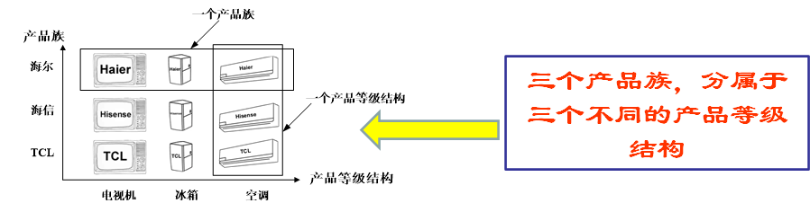

# 抽象工厂模式

抽象工厂模式是一种软件设计模式，它定义了一个接口来创建一组相关或者相互依赖的对象，而不需要明确指定具体的类。

在 Go 语言中，抽象工厂模式可以通过定义一个接口来实现。

> 概念
- 产品等级结构：产品等级结构即产品的继承结构
- 产品族：产品族是指由同一个工厂生产的，位于不同产品等级结构中的一组产品

优点: 增加新的产品族很方便，无须修改已有系统，符合开闭原则

缺点: 增加新的产品等级结构麻烦，需要对原有系统进行较大的修改，甚至需要修改抽象层代码，这显然会带来较大的不便，违背了开闭原则