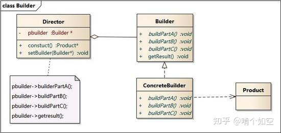
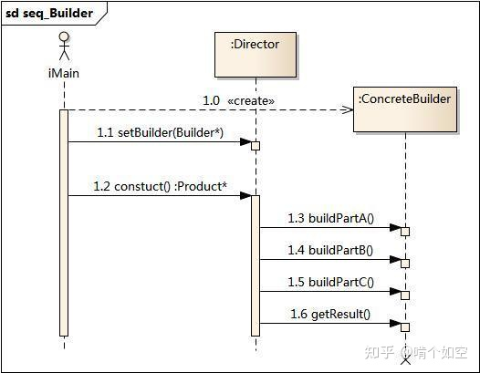

# 建造者模式

建造者模式可以将部件本身和它们的组装过程分开，关注如何一步步创建一个包含多个组成部分的复杂对象，用户只需要指定复杂对象的类型即可得到该对象，而无须知道其内部的具体构造细节。

它是将一个复杂的对象分解为多个简单的对象，然后一步一步构建而成。它将变与不变相分离，即产品的组成部分是不变的，但每一部分是可以灵活选择的。


通常，建造者模式由以下几个部分组成：
- Builder 接口：它是一个包含创建产品各个子部件的抽象方法的接口，通常还包含一个返回复杂产品的方法 getResult()。
- ConcreteBuilder 类：现 Builder 接口，完成复杂产品的各个部件的具体创建方法。
- Director 类：它调用建造者对象中的部件构造与装配方法完成复杂对象的创建，在指挥者中不涉及具体产品的信息。
- Product 类：它是包含多个组成部件的复杂对象，由具体建造者来创建其各个零部件。


> 类图 && 时序图




(图源网络)

从上面两张图可以看出建造者模式的使用流程:

1. 创建大型产品建造者
2. 创建指挥者
3. 将建造者传入指挥者对象中
4. 由指挥者指挥建造者创建对象，并返回

> 定义

**建造者模式：将一个复杂对象的构建与它的表示分离，使得同样的构建过程可以创建不同的表示。**

- 将客户端与包含多个部件的复杂对象的创建过程分离，客户端无须知道复杂对象的内部组成部分与装配方式，只需要知道所需建造者的类型即可
- 关注如何逐步创建一个复杂的对象，不同的建造者定义了不同的创建过程


建造者模式唯一区别于工厂模式的是针对复杂对象的创建。也就是说，如果创建简单对象，通常都是使用工厂模式进行创建，而如果创建复杂对象，就可以考虑使用建造者模式。**当需要创建的产品具备复杂创建过程时，可以抽取出共性创建过程，然后交由具体实现类自定义创建流程，使得同样的创建行为可以生产出不同的产品，分离了创建与表示，使创建产品的灵活性大大增加。**


> 优点：

- 封装性好，构建和表示分离.
- 扩展性好，各个具体的建造者相互独立，有利于系统的解耦.
- 客户端不必知道产品内部组成的细节，建造者可以对创建过程逐步细化，而不对其它模块产生任何影响，便于控制细节风险,这相当于对外屏蔽细节,对内自由调整.

> 缺点：

- 产品的组成部分必须相同，这限制了其使用范围。
- 如果产品的内部变化复杂，如果产品内部发生变化，则建造者也要同步修改，后期维护成本较大。


##  生成器模式适合应用场景

> 使用生成器模式可避免 “重叠构造函数 （telescoping constructor）” 的出现。

假设你的构造函数中有十个可选参数， 那么调用该函数会非常不方便； 因此， 你需要重载这个构造函数， 新建几个只有较少参数的简化版。 但这些构造函数仍需调用主构造函数， 传递一些默认数值来替代省略掉的参数。

```java
class Pizza {
    Pizza(int size) { …… }
    Pizza(int size, boolean cheese) { …… }
    Pizza(int size, boolean cheese, boolean pepperoni) { …… }
    // ……

// 只有在 C# 或 Java 等支持方法重载的编程语言中才能写出如此复杂的构造函数。
```

生成器模式让你可以分步骤生成对象， 而且允许你仅使用必须的步骤。 应用该模式后， 你再也不需要将几十个参数塞进构造函数里了。

> 如果你需要创建的各种形式的产品， 它们的制造过程相似且仅有细节上的差异， 此时可使用生成器模式。

基本生成器接口中定义了所有可能的制造步骤， 具体生成器将实现这些步骤来制造特定形式的产品。 同时， 主管类将负责管理制造步骤的顺序。


> 使用生成器构造组合树或其他复杂对象。


> 初始化一个对象特别复杂，参数多，而且很多参数都具有默认值。

> 


## 建造者模式和工厂模式的区别

- 建造者模式更加注重方法的调用顺序，工厂模式注重创建对象。
- 创建对象的力度不同，建造者模式创建复杂的对象，由各种复杂的部件组成，工厂模式创建出来的对象都一样
- 关注重点不一样，工厂模式只需要把对象创建出来就可以了，而建造者模式不仅要创建出对象，还要知道对象由哪些部件组成。
- 建造者模式根据建造过程中的不一样，最终对象部件组成也不一样。
- 抽象工厂模式和建造者模式类似，两者都是用来构建复杂的对象，但前者的侧重点是构建对象/产品族，后者的侧重点是对象的分步构建过程。


##  模式的扩展

建造者（Builder）模式在应用过程中可以根据需要改变，如果创建的产品种类只有一种，只需要一个具体建造者，这时可以省略掉抽象建造者，甚至可以省略掉指挥者角色。

