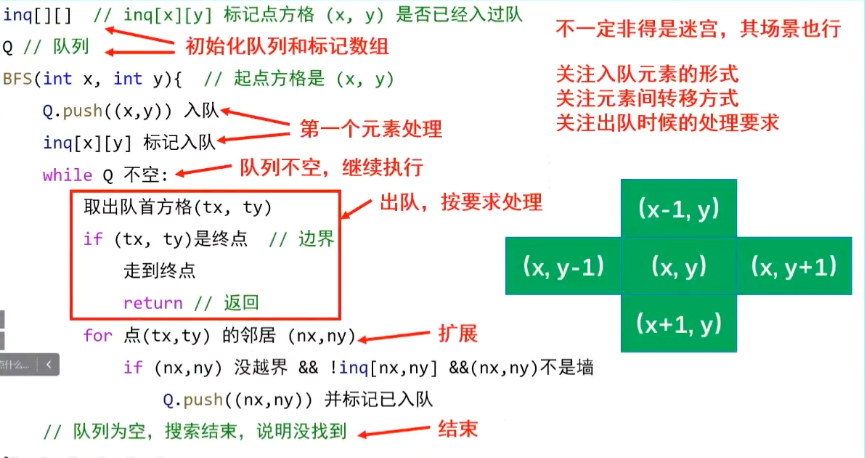

# 广度优先搜索Breadth-First Search

BFS是一种暴力搜索算法,目的是系统地展开并检查图中的所有节点，以找寻结果。换句话说，它并不考虑结果的可能位置，彻底地搜索整张图，直到找到结果为止。

从算法的观点，所有因为展开节点而得到的子节点都会被加进一个先进先出的队列中。一般的实验里，其邻居节点尚未被检验过的节点会被放置在一个被称为 open 的容器中（例如队列或是链表），而被检验过的节点则被放置在被称为 closed 的容器中。（open-closed表）


- 基本逻辑



```
广度优先搜索使用队列（queue）来实现，整个过程也可以看做一个倒立的树形：
1、把根节点放到队列的末尾。
2、每次从队列的头部取出一个元素，查看这个元素所有的下一级元素，把它们放到队列的末尾。并把这个元素记为它下一级元素的前驱。
3、找到所要找的元素时结束程序。
4、如果遍历整个树还没有找到，结束程序。
```