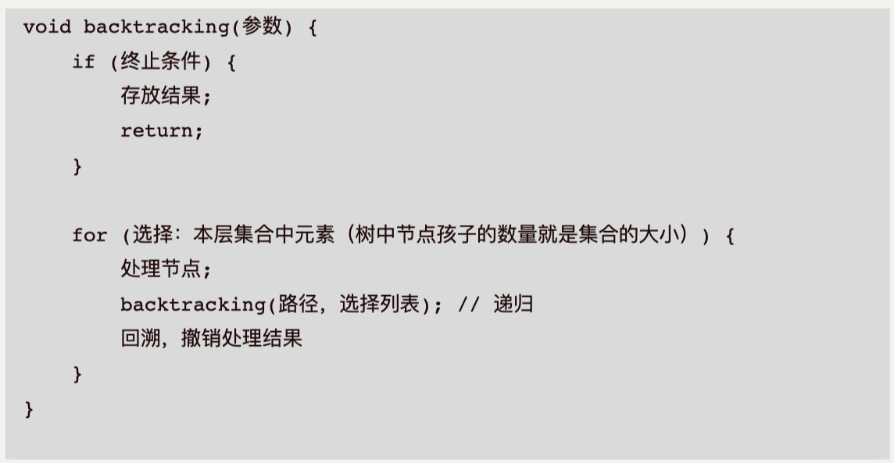

# 回溯算法Back Tracking

> what?
```
回溯算法实际上一个类似枚举的搜索尝试过程，主要是在搜索尝试过程中寻找问题的解，当发现已不满足求解条件时，就“回溯”返回，尝试别的路径。回溯法是一种选优搜索法，按选优条件向前搜索，以达到目标。但当探索到某一步时，发现原先选择并不优或达不到目标，就退回一步重新选择，这种走不通就退回再走的技术为回溯法，而满足回溯条件的某个状态的点称为“回溯点”。
```


```
回溯算法也叫试探法，它是一种系统地搜索问题的解的方法。
用回溯算法解决问题的一般步骤：
    1、 针对所给问题，定义问题的解空间，它至少包含问题的一个（最优）解。
    2 、确定易于搜索的解空间结构,使得能用回溯法方便地搜索整个解空间 。
    3 、以深度优先的方式搜索解空间，并且在搜索过程中用剪枝函数避免无效搜索。
确定了解空间的组织结构后，回溯法就从开始结点（根结点）出发，以深度优先的方式搜索整个解空间。
这个开始结点就成为一个活结点，同时也成为当前的扩展结点。在当前的扩展结点处，搜索向纵深方向移至一个新结点。
这个新结点就成为一个新的活结点，并成为当前扩展结点。如果在当前的扩展结点处不能再向纵深方向移动，则当前扩展结点就成为死结点。
此时，应往回移动（回溯）至最近的一个活结点处，并使这个活结点成为当前的扩展结点。
回溯法即以这种工作方式递归地在解空间中搜索，直至找到所要求的解或解空间中已没有活结点时为止。
```


- 回溯与递归的相辅相成的,只要有递归就会有回溯.
- **调用完递归函数后的部分,就是回溯的逻辑.**
- 回溯函数一定是一个递归函数.
- 回溯算法是一个暴力算法(暴力搜索)
  - 组合问题(组合内元素是无序的)
  - 切割问题
  - 子集问题
  - 排列问题(排列是有序的)
  - 棋盘问题
  - 等
- 如何理解回溯法? 图形.二叉树


- 回溯模版




- 回溯算法3个重要步骤
1. 确定递归函数参数及返回值(回溯算法一般没有返回值)
2. 确定终止条件
3. 确定单层处理逻辑


递归、回溯和DFS的区别

  - 递归是一种算法结构，回溯是一种算法思想。
  - 一个递归就是在函数中调用函数本身来解决问题。
  - 回溯就是通过不同的尝试来生成问题的解，有点类似于穷举，但是和穷举不同的是回溯会“剪枝”。
- 回溯搜索是深度优先搜索（DFS）的一种。对于某一个搜索树来说（搜索树是起记录路径和状态判断的作用），回溯和DFS，其主要的区别是，回溯法在求解过程中不保留完整的树结构，而深度优先搜索则记下完整的搜索树。
- 为了减少存储空间，在深度优先搜索中，用标志的方法记录访问过的状态，这种处理方法使得深度优先搜索法与回溯法没什么区别了。


```
回溯是借助递归实现的暴力搜索，它考察了所有的可能。
基于当前的选择展开出分支，展开了一棵包含解的空间树。
在这棵树上做DFS搜索，找出所有的解，加入解集，DFS结束后，返回解集。
基于上一次选择，而来到的节点可能有不同的选择，用 for 枚举出来，结合约束条件剪枝，被剪掉的是选项，是不可能产生合法解的搜索分支，避免了不必要的搜索。
每一次迭代没被剪枝的话，会作出一个选择，基于这个选择，继续递归下去。
上面这个递归结束时，不管由于什么原因，是找到合法解而返回，还是走完for循环而自然结束。
都意味着，基于这个选择的所有可能性都考察完了，基于这个选择所展开的树都搜索完了。
无需再考察这个选择，撤销这个选择，回到选择前的状态，去作另一个选择，即切到另一个迭代
正是因为这么一回溯，才能做到每一个节点所展开的分支都搜索到。
总结一下，回溯问题抓住三个要点：
1.选择，当前你有什么选择，一个选择代表一个分支，基于一种选择，又会展开出一些选择
2.约束条件，利用它去做剪枝，减少不必要的搜索，让你的搜索树“瘦身”
3.目标，明确了何时将部分解加入解集，结束当前的递归
模板 choose -- explore -- unchoose：

1.用 for 循环枚举出当前的选择
2.作出一个选择，基于这个选择，继续递归
3.递归结束了，撤销这个选择，进入下一轮迭代
```
