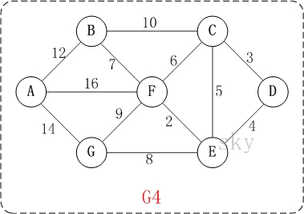
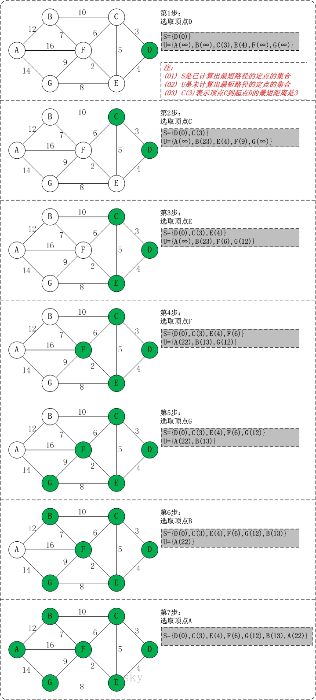

# dijkstra(迪杰斯特拉) 算法

https://www.cnblogs.com/skywang12345/p/3711512.html
https://www.bilibili.com/video/BV1zz4y1m7Nq?vd_source=9746270160e480fdc8816c338ace382d

迪杰斯特拉(Dijkstra)算法是典型最短路径算法，用于计算一个结点到其他结点的最短路径。 它的主要特点是以起始点为中心向外层层扩展(广度优先搜索思想)，直到扩展到终点为止

> 迪杰斯特拉(Dijkstra)算法过程

设置出发顶点为v，顶点集合V{v1,v2,vi...}，v到V中各顶点的距离构成距离集合Dis，Dis{d1,d2,di...}，Dis集合记录着v到图中各顶点的距离(到自身可以看作0，v到vi距离对应为di)

- 从Dis中选择值最小的di并移出Dis集合，同时移出V集合中对应的顶点vi，此时的v到vi即为最短路径

- 更新Dis集合，更新规则为：比较v到V集合中顶点的距离值，与v通过vi到V集合中顶点的距离值，保留值较小的一个(同时也应该更新顶点的前驱节点为vi，表明是通过vi到达的)

- 重复执行上面两步骤，直到最短路径顶点为目标顶点即可结束

> 基本思想

通过Dijkstra计算图G中的最短路径时，需要指定起点s(即从顶点s开始计算)。

此外，引进两个集合S和U。S的作用是记录已求出最短路径的顶点(以及相应的最短路径长度)，而U则是记录还未求出最短路径的顶点(以及该顶点到起点s的距离)。

初始时，S中只有起点s；U中是除s之外的顶点，并且U中顶点的路径是"起点s到该顶点的路径"。然后，从U中找出路径最短的顶点，并将其加入到S中；接着，更新U中的顶点和顶点对应的路径。 然后，再从U中找出路径最短的顶点，并将其加入到S中；接着，更新U中的顶点和顶点对应的路径。 ... 重复该操作，直到遍历完所有顶点。

> 操作步骤

- 初始时，S只包含起点s；U包含除s外的其他顶点，且U中顶点的距离为"起点s到该顶点的距离"[例如，U中顶点v的距离为(s,v)的长度，然后s和v不相邻，则v的距离为∞]
- U中选出"距离最短的顶点k"，并将顶点k加入到S中；同时，从U中移除顶点k
- 更新U中各个顶点到起点s的距离。之所以更新U中顶点的距离，是由于上一步中确定了k是求出最短路径的顶点，从而可以利用k来更新其它顶点的距离；例如，(s,v)的距离可能大于(s,k)+(k,v)的距离
- 重复步骤(2)和(3)，直到遍历完所有顶点

> 迪杰斯特拉算法图解

以上图G4为例，来对迪杰斯特拉进行算法演示(以第4个顶点D为起点)：
