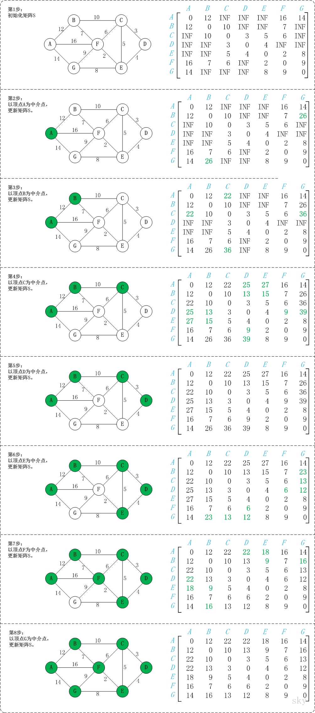

# Floyd 算法

Floyd算法又称为插点法，是一种利用动态规划的思想寻找给定的加权图中多源点之间最短路径的算法.

- 弗洛伊德算法(Floyd)计算图中各个顶点之间的最短路径
- 迪杰斯特拉算法用于计算图中某一个顶点到其他顶点的最短路径。
- 弗洛伊德算法 VS 迪杰斯特拉算法：迪杰斯特拉算法通过选定的被访问顶点，求出从出发访问顶点到其他顶点的最短路径；弗洛伊德算法中每一个顶点都是出发访问点，所以需要将每一个顶点看做被访问顶点，求出从每一个顶点到其他顶点的最短路径

> 基本思想

通过Floyd计算图G=(V,E)中各个顶点的最短路径时，需要引入一个矩阵S，矩阵S中的元素a[i][j]表示顶点i(第i个顶点)到顶点j(第j个顶点)的距离。

假设图G中顶点个数为N，则需要对矩阵S进行N次更新。初始时，矩阵S中顶点a[i][j]的距离为顶点i到顶点j的权值；
如果i和j不相邻，则a[i][j]=∞。 接下来开始，对矩阵S进行N次更新。
第1次更新时，如果"a[i][j]的距离" > "a[i][0]+a[0][j]"(a[i][0]+a[0][j]表示"i与j之间经过第1个顶点的距离")，
则更新a[i][j]为"a[i][0]+a[0][j]"。 同理，第k次更新时，如果"a[i][j]的距离" > "a[i][k]+a[k][j]"，
则更新a[i][j]为"a[i][k]+a[k][j]"。更新N次之后，操作完成！

> 原理

## 图解

以上图G4为例，来对弗洛伊德进行算法演示。

初始状态：S是记录各个顶点间最短路径的矩阵。
第1步：初始化S。
    矩阵S中顶点a[i][j]的距离为顶点i到顶点j的权值；如果i和j不相邻，则a[i][j]=∞。实际上，就是将图的原始矩阵复制到S中。
    注:a[i][j]表示矩阵S中顶点i(第i个顶点)到顶点j(第j个顶点)的距离。

第2步：以顶点A(第1个顶点)为中介点，若a[i][j] > a[i][0]+a[0][j]，则设置a[i][j]=a[i][0]+a[0][j]。
    以顶点a[1][6]，上一步操作之后，a[1][6]=∞；而将A作为中介点时，(B,A)=12，(A,G)=14，因此B和G之间的距离可以更新为26。

同理，依次将顶点B,C,D,E,F,G作为中介点，并更新a[i][j]的大小。