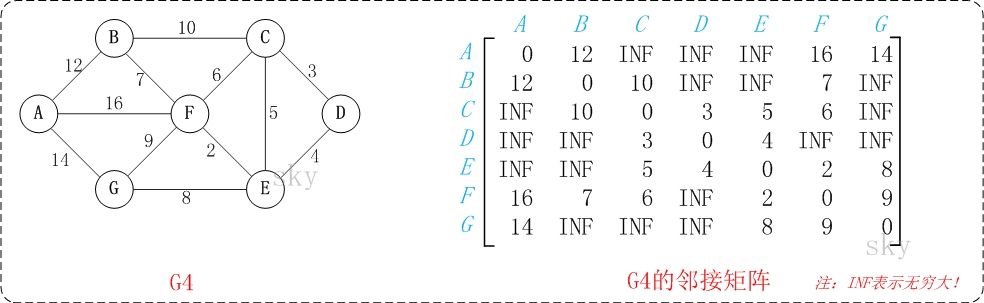

# Floyd 算法

Floyd算法又称为插点法，是一种利用动态规划的思想寻找给定的加权图中多源点之间最短路径的算法.

Floyd算法只能在不存在负权环的情况下使用，因为其并不能判断负权环，上面也说过，如果有负权环，那么最短路将无意义，因为我们可以不断走负权环，这样最短路径值便成为了负无穷。

但是其可以处理带负权边但是无负权环的情况。

- 弗洛伊德算法(Floyd)计算图中各个顶点之间的最短路径
- 迪杰斯特拉算法用于计算图中某一个顶点到其他顶点的最短路径。
- 弗洛伊德算法 VS 迪杰斯特拉算法：迪杰斯特拉算法通过选定的被访问顶点，求出从出发访问顶点到其他顶点的最短路径；弗洛伊德算法中每一个顶点都是出发访问点，所以需要将每一个顶点看做被访问顶点，求出从每一个顶点到其他顶点的最短路径


> dp思想:

Floyd算法是一个经典的动态规划算法。用通俗的语言来描述的话，首先我们的目标是寻找从点i到点j的最短路径。
从动态规划的角度看问题，我们需要为这个目标重新做一个诠释（这个诠释正是动态规划最富创造力的精华所在）
从任意节点i到任意节点j的最短路径不外乎2种可能，1是直接从i到j，2是从i经过若干个(k)节点到j。
所以，我们假设Dis(i,j)为节点u到节点v的最短路径的距离，对于每一个节点(0...k)，我们检查Dis(i,k) + Dis(k,j) < Dis(i,j)是否成立，
如果成立，证明从i到k再到j的路径比i直接到j的路径短，我们便设置Dis(i,j) = Dis(i,k) + Dis(k,j)，
这样一来，当我们遍历完所有节点(1...k)时，Dis(i,j)中记录的便是i到j的最短路径的距离


> 算法描述:

通过Floyd计算图G=(V,E)中各个顶点的最短路径时，需要引入一个矩阵S，矩阵S中的元素a[i][j]表示顶点i(第i个顶点)到顶点j(第j个顶点)的距离。

假设图G中顶点个数为N，则需要对矩阵S进行N次更新。初始时，矩阵S中顶点a[i][j]的距离为顶点i到顶点j的权值；
如果i和j不相邻，则a[i][j]=∞。 接下来开始，对矩阵S进行N次更新。
第1次更新时，如果"a[i][j]的距离" > "a[i][0]+a[0][j]"(a[i][0]+a[0][j]表示"从i到0再到j的路径距离比直接从i到j的路径距离短.")，
则更新a[i][j]为"a[i][0]+a[0][j]"。 同理，第k次更新时，如果"a[i][j]的距离" > "a[i][k]+a[k][j]"，
则更新a[i][j]为"a[i][k]+a[k][j]"。更新N次之后，操作完成！


> 过程

对于每个顶点v,和任意顶点对(i,j),i!=j,v!=i,v!=j,如果A[i][j] > A[i][v]+A[v][j],
则将A[i][j]的值更新为A[i][v]+A[v][j],并且将path[i][j] 改为v.

> 原理


## 正确性分析

我们从动态规划的角度考虑，解动态规划题目的重点就是合理的定义状态，划分阶段，我们定义 f[k][i][j] 为经过前k的节点，从i到j所能得到的最短路径，f[k][i][j]可以从f[k-1][i][j]转移过来，即不经过第k个节点，也可以从f[k-1][i][k]+f[k-1][k][j]转移过来，即经过第k个节点。

观察一下这个状态的定义，满足不满足最优子结构和无后效性原则。

- 最优子结构

图结构中一个显而易见的定理：

最短路径的子路径仍然是最短路径, 这个定理显而易见，比如一条从a到e的最短路a->b->c->d->e 那么 a->b->c 一定是a到c的最短路c->d->e一定是c到e的最短路，反过来，如果说一条最短路必须要经过点k，那么i->k的最短路加上k->j的最短路一定是i->j 经过k的最短路，因此，最优子结构可以保证。

- 无后效性

状态f[k][i][j]由f[k-1][i][j]，f[k-1][i,k] 以及f[k-1][k][j]转移过来，很容易可以看出，f[k] 的状态完全由f[k-1]转移过来，只要我们把k放倒最外层循环中，就能保证无后效性。

满足以上两个要求，我们即证明了Floyd算法是正确的。

我们最后得出一个状态转移方程：`f[k][i][j] = min(f[k-1][i][k],f[k-1][i][k],f[k-1][k][j])` ，可以观察到，这个三维的状态转移方程可以使用滚动数组进行优化。

- K 为什么要放在最外层

采用动态规划思想，f[k][i][j] 表示 i 和 j 之间可以通过编号为 1…k 的节点的最短路径。

f[0][i][j] 初值为原图的邻接矩阵。

f[k][i][j]则可以从f[k-1][i][j]转移来，表示 i 到 j 不经过 k 这个节点。

也可以 f[k-1][i][k]+f[k-1][k][j] 从转移过来，表示经过 k 这个点。

意思即 f[k][i][j]=min(f[k-1][i][j], f[k-1][i][k]+f[k-1][k][j])

然后你就会发现 f 最外层一维空间可以省略，因为 f[k] 只与 f[k-1] 有关。

虽然这个算法非常简单，但也需要找点时间理解这个算法，就不会再有这种问题啦。

Floyd算法的本质是DP，而k是DP的阶段，因此要写最外面。

想象一个图，讨论的是要从1点到达3点，是直接走还是经过中间点2，从而确定两点之间的最短路径。

## 滚动数组优化

滚动数组是一种动态规划中常见的降维优化的方式，应用广泛（背包dp等），可以极大的减少空间复杂度。

在我们求出的状态转移方程中，我们在更新f[k]层状态的时候，用到f[k-1]层的值，f[k-2] f[k-3]层的值就直接废弃了。

所以我们大可让第一层的大小从n变成2,再进一步，我们在f[k]层更新f[k][i][j]的时候，f[k-1][i][k] 和 f[k-1][k][j] 我们如果能保证，在更新k层另外一组路径m->n的时候，不受前面更新过的f[k][i][j]的影响，就可以把第一维度去掉了。

我们现在去掉第一个维度，写成我们在代码中的那样，就是f[i][j] 依赖 f[i][k] + f[k][j] 我们在更新f[m][n]的时候，用到了f[m][k] + f[k][n] 假设f[i][j]的更新影响到了f[m][k] 或者 f[k][m] 即 {m=i,k=j} 或者 {k=i,n=j} 这时候有两种情况，j和k是同一个点，或者i和k是同一个点，那么 f[i][j] = f[i][j] + f[j][j]，或者f[i][j] = f[i][i]+f[i][j] 这时候，我们所谓的“前面更新的点对”还是这两个点本来的路径，也就是说，唯一两种在某一层先更新的点，影响到后更新的点的情况，是完全合理的，所以说，我们即时把第一维去掉，也满足无后效性原则。

因此可以用滚动数组优化。

优化之后的状态转移方程即为：f[i][j] = min(f[i][j],f[i][k]+f[k][j])。

## 求具体路径

我们上面仅仅是知道了最短路径的长度，实际应用中我们常常是需要知道具体的路径，在Floyd算法中怎么求具体路径呢，很简单，我们只需要记录下来在更新f[i][j]的时候，用到的中间节点是哪个就可以了。

假设我们用path[i][j]记录从i到j松弛的节点k，那么从i到j,肯定是先从i到k，然后再从k到j， 那么我们在找出path[i][k] , path[k][j]即可。

即 i到k的最短路是 `i -> path[i][k] -> k -> path[k][j] -> j ` 然后求path[i][k]和path[k][j] ，一直到某两个节点没有中间节点为止，代码如下：
在更新路径的时候：
```go
if(a[i][k]>temp){
    a[i][j] = temp;
    path[i][j] = k;
}
```
求路径的时候：
```java
public String getPath(int[][] path, int i, int j) {
    if (path[i][j] == -1) {
        return " "+i+" "+j;
    } else {
        int k = path[i][j];
        return getPath(path, i, k)+" "+getPath(path, k, j)+" ";
    }
}
```


## 图解



以上图G4为例，来对弗洛伊德进行算法演示。


初始状态：S是记录各个顶点间最短路径的矩阵。
第1步：初始化S。
    矩阵S中顶点a[i][j]的距离为顶点i到顶点j的权值；如果i和j不相邻，则a[i][j]=∞。实际上，就是将图的原始矩阵复制到S中。
    注:a[i][j]表示矩阵S中顶点i(第i个顶点)到顶点j(第j个顶点)的距离。

第2步：以顶点A(第1个顶点)为中介点，若a[i][j] > a[i][0]+a[0][j]，则设置a[i][j]=a[i][0]+a[0][j]。
    以顶点a[1][6]，上一步操作之后，a[1][6]=∞；而将A作为中介点时，(B,A)=12，(A,G)=14，因此B和G之间的距离可以更新为26。

同理，依次将顶点B,C,D,E,F,G作为中介点，并更新a[i][j]的大小。


## 优缺点:

Floyd算法适用于APSP(All Pairs Shortest Paths，多源最短路径)，是一种动态规划算法，稠密图效果最佳，边权可正可负。此算法简单有效，由于三重循环结构紧凑，对于稠密图，效率要高于执行|V|次Dijkstra算法，也要高于执行|V|次SPFA算法。
- 优点：容易理解，可以算出任意两个节点之间的最短距离，代码编写简单。
- 缺点：时间复杂度比较高，不适合计算大量数据。

## 时间复杂度与空间复杂度

- 时间复杂度:O(n^3)
- 空间复杂度:O(n^2)