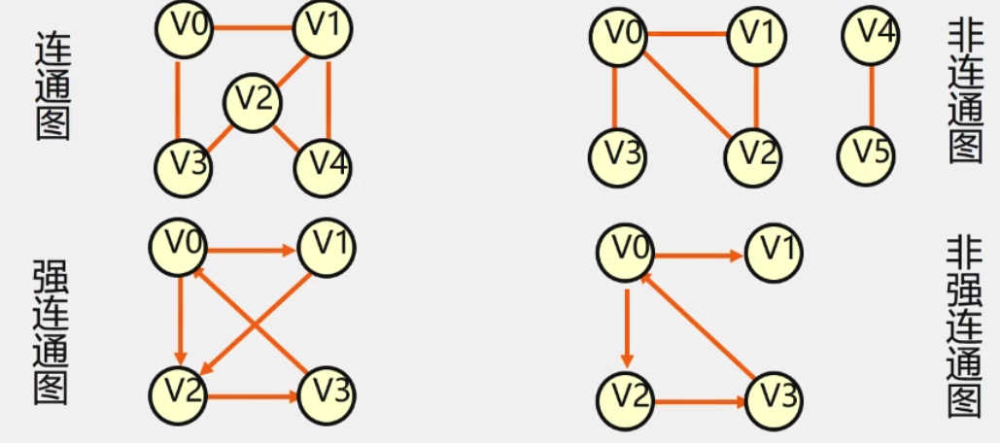
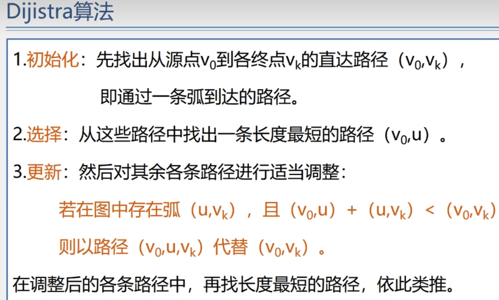

[TOC]

# 数据的逻辑结构

# 图(graph)

## 定义和术语

- 图
G = (V,E). Graph = (Vertex,Edge)
    - V: 顶点(数据元素)的有穷非空集合.
    - E: 边的有穷集合.
- 无向图: 每条边都是无方向的
- 有向图: 每条边都是有方向的

- 完全图: 图中任意两个点都有一条边相连.

- 稀疏图: 有很少的边或弧的图(e<nlogn)
- 稠密图: 有较多边或弧的图
- 网: 边/弧带权的图. 
- 邻接: 有边/弧相连的两个顶点之间的关系.
    - 存在无向图(V~i~,V~j~),则称V~i~和V~j~互为邻接点;
    - 存在有向图<V~i~,V~j~>,则称V~i~**邻接到**V~j~,V~j~**邻接于**V~i~
- 关联(依附): 边/弧与顶点之间的关系.
    - 存在(V~i~,V~j~)/<V~i~,V~j~>,则称该边/弧关联于V~i~,V~j~
- 顶点的度: 与该顶点相关联的边的数目,记为TD(v)
    - 在有向图中,顶点的度等于该顶点的入度与出度之和.
- 顶点V的入度: 是以V为终点的有向边的条数,记作ID(v)
- 顶点V的出度: 是以V为始点的有向边的条数,记作OD(v)

- 路径: 接续的边构成的顶点序列
- 路径长度: 路径上边或弧的数目/权值之和.
- 回路(环): 第一个顶点和最后一个顶点相同的路径.
- 简单路径: 除路径起点和终点可以相同外,其他顶点均不相同的路径.
- 简单回路(简单环):除路径起点和终点相同外,其他顶点均不相同的路径.
- 连通图(无向图) 强连通图(有向图)
    - 在无(有)向图G = (V,{E})中,若对任何两个顶点v,u都存在从v到u的路径,则称G是连通图(强连通图) 

- 图中边或弧所具有的相关数称为权.表明从一个顶点到另一个顶点的距离或耗费.
- 子图: 

- 连通分量:无向图G的极大连通子图称为G的连通分量.
    - 极大连通子图意思是:该子图是G连通子图,将G的任何不在该子图中的顶点加入,子图不在连通.

- 强连通分量: 有向图G的极大连通子图称为G的连通分量.

- 极小连通子图:该子图是G的连通子团,在该子团中删除任何一条边后.子图不再连通.
- 生成树: 包含无向图G所有顶点的极小连通子图.
- 生成森林: 对非连通图,由各个连通分量的生成树的集合.

 

## 图的类型定义

### 图的抽象数据类型定义

### 图的基本操作

 

## 图的存储结构

### 数组表示法(邻接矩阵)

### 邻接表(链式)

 

### 邻接矩阵与邻接表表示法的关系

### 十字链表

 

### 邻接多重表

 

## 图的遍历

- 遍历定义:

### 深度优先搜索

### 广度度优先搜索

## 图的应用

### 最小生成树

### 最短路径

### 拓扑排序

### 关键路径

