# 散列表的基本概念
- hash表是一种数据结构.

- 基本思想: 记录的存储位置与关键字之间存在对应关系.
    对应关系---hash函数
    Loc(i)=Hash(keyi)

- Hash: 哈希. 翻译为:散列...

- 优点: 查找效率高
- 缺点: 空间效率低

- 例如:
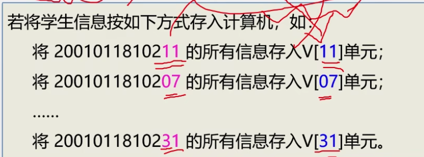
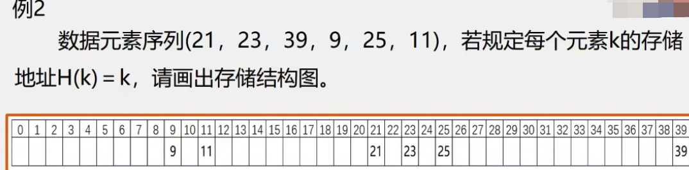
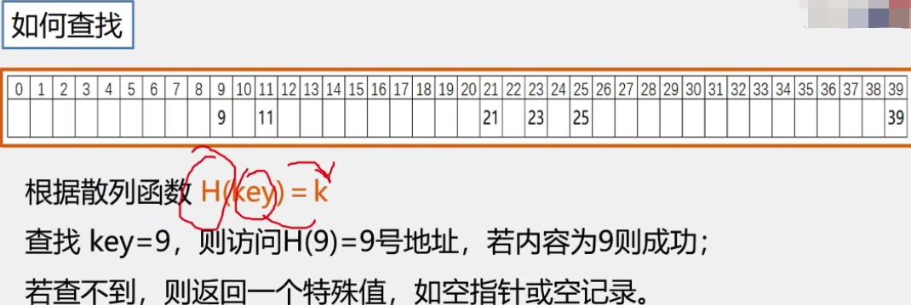

# 散列表的若干术语

- 散列方法:
    选取某个函数,依该函数按关键字计算元素的存储位置,并按此存放;
    查找时,由同一个函数对给定值K计算地址,将k与地址单元中元素关键码进行比对,确定查找是否成功.

- 散列函数: 散列方法中使用的转换函数.

- 散列表: 按上述思想构造的表.

- 冲突: 不同的关键码映射到同一散列地址
    key1!=key2,但是H(key1)=H(key2)
    - 例如:
    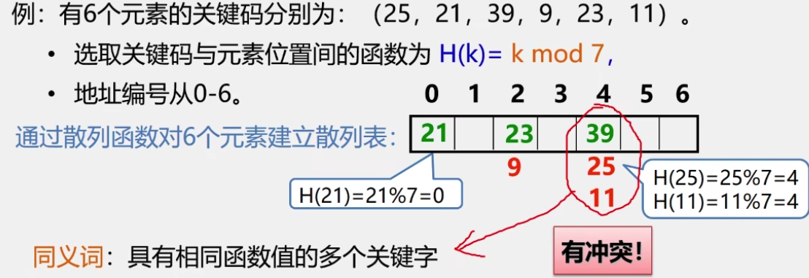

在散列表中,冲突是不可能避免的,只能尽可能减少.

# 散列函数的构造方法

使用散列表要解决好两个问题:
1. 构造好的散列函数
    - 所选函数尽可能简单,以便提高转换速度.
    - 所选函数对关键码计算出的地址,应在散列地址集中致均匀分布,以减少空间浪费.

2. 制定一个好的解决冲突的方案.
    查找时,如果从散列函数计算出的地址中查不到关键码,则应当依据解决冲突的规则,有规律地查询其他相关单元.

构造散列函数考虑的因素:
1. 执行速度(即计算散列函数所需时间)
2. 关键字的长度
3. 散列表的大小
4. 关键字的分布情况
5. 查找频率.

根据元素集合的特性构造
- 要求一: n个数据原仅占用n个地址,虽然散列查找是以空间换时间,但仍希望散列的地址空间尽量小.
- 要求二: 无论用什么方法存储,目的都是尽量均匀地存放元素,以避免冲突.

方法:
1. 直接定址法
2. 数字分析法
3. 平方取中法
4. 折叠法
5. 除留余数法
6. 随机数法
5. ...

## 直接定址法

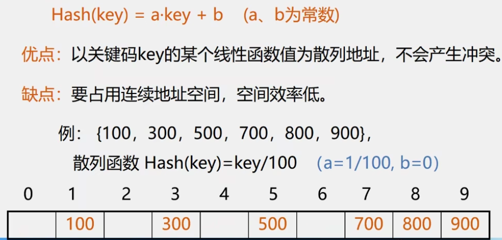

## 除留余数法

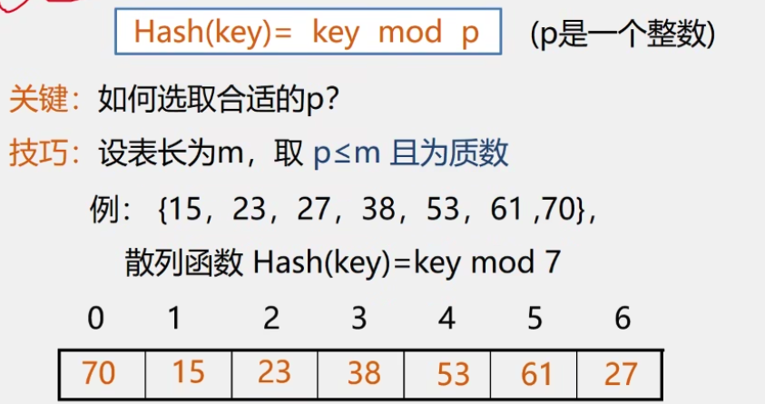

# 处理冲突的方法

1. 开放定址法(开地址法)
2. 链地址法(拉链法)
3. 在散列法(双散列函数法)
4. 建立一个公共溢出区
5. ...

## 开放定址法

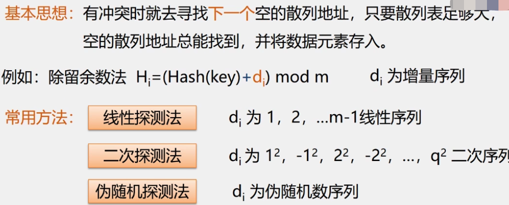
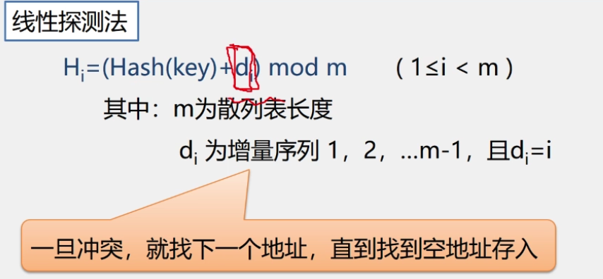
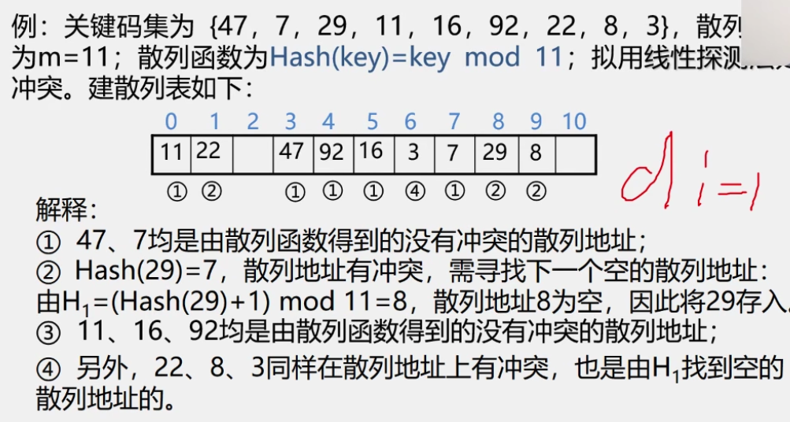
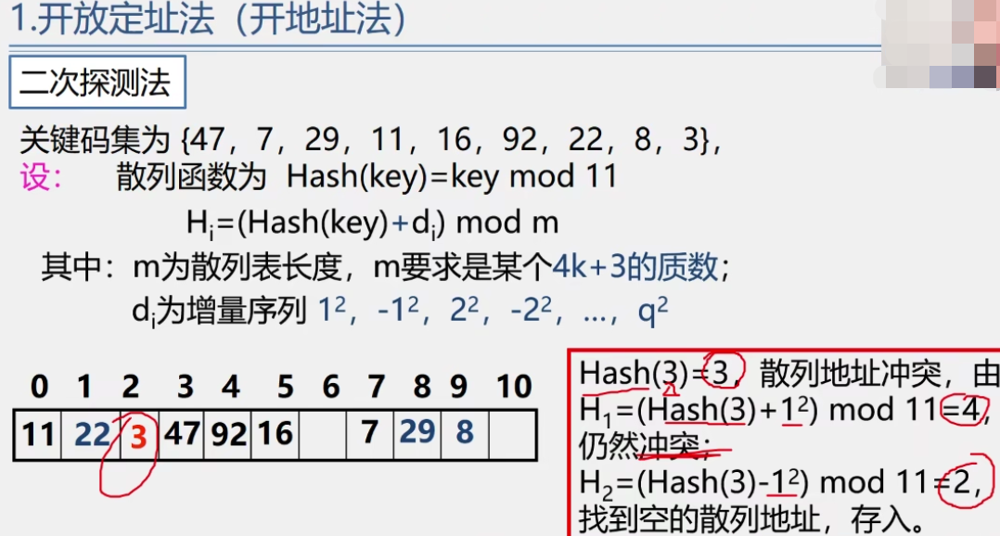
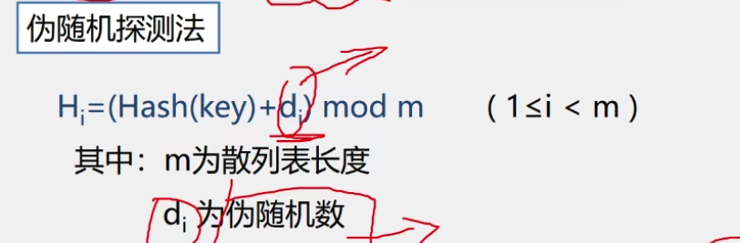

## 链地址法

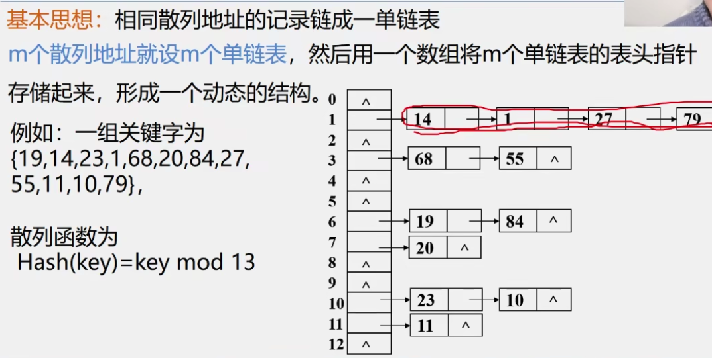
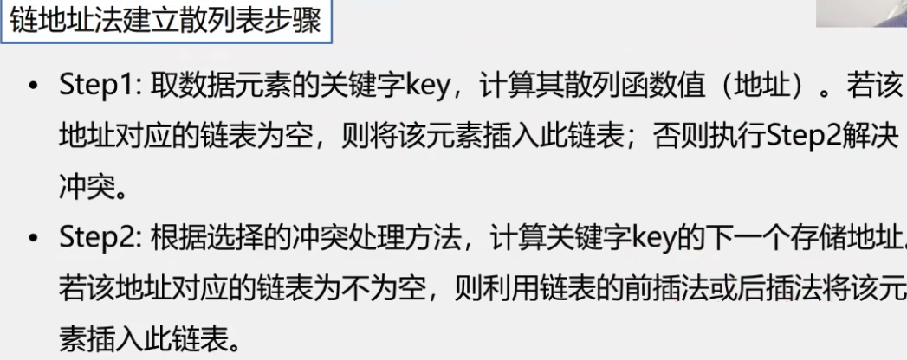
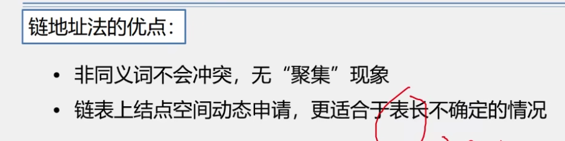

# 散列表的查找

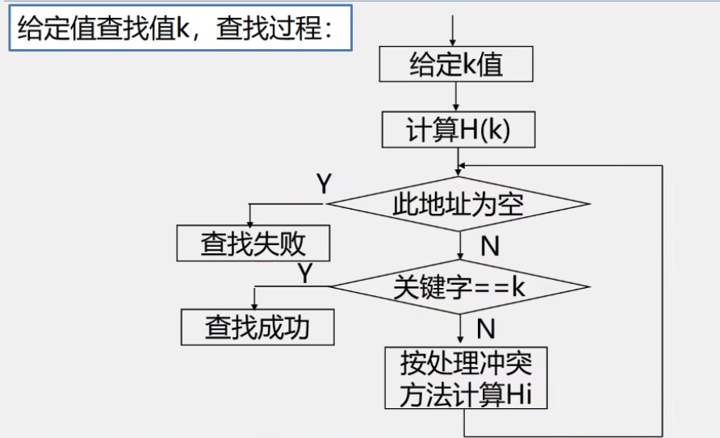
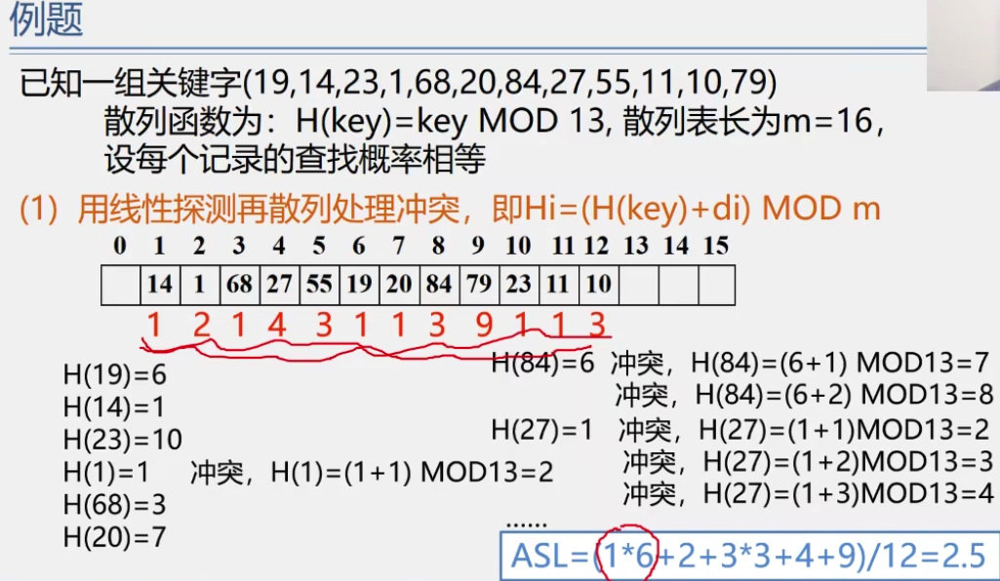

# 散列表的查找效率分析
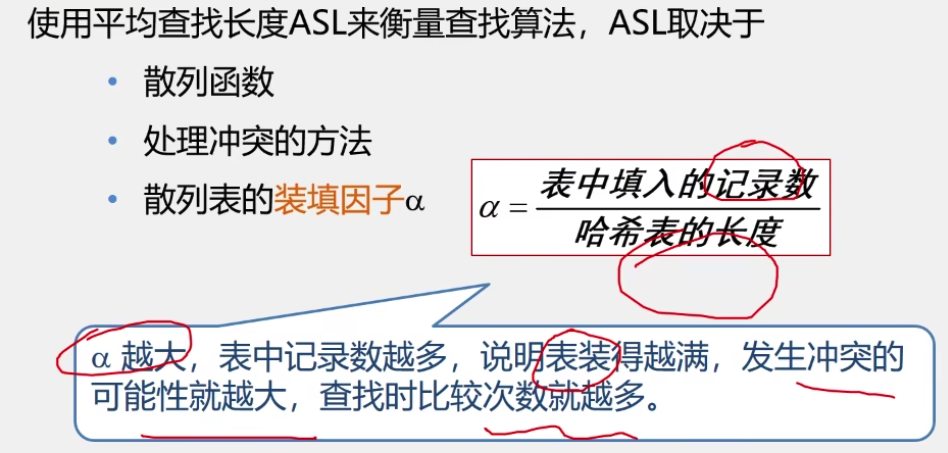
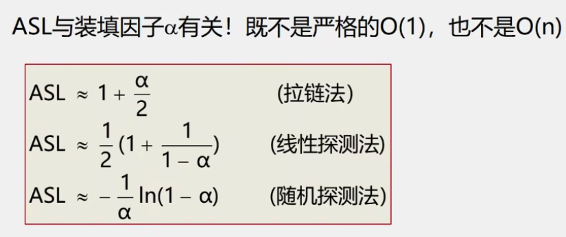

# 几点结论

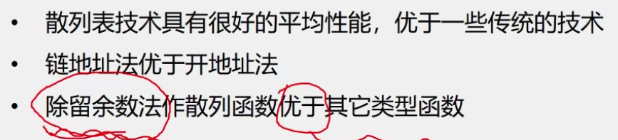