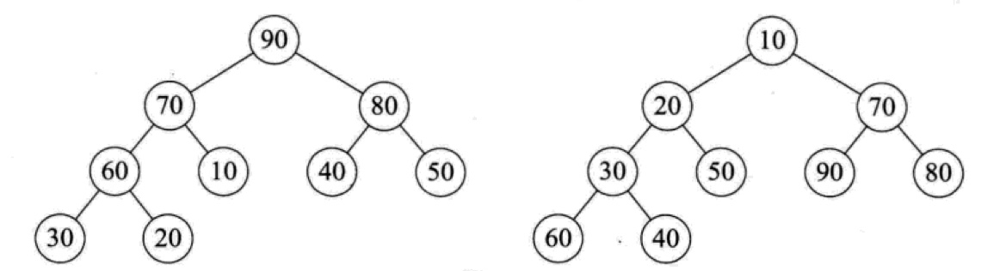
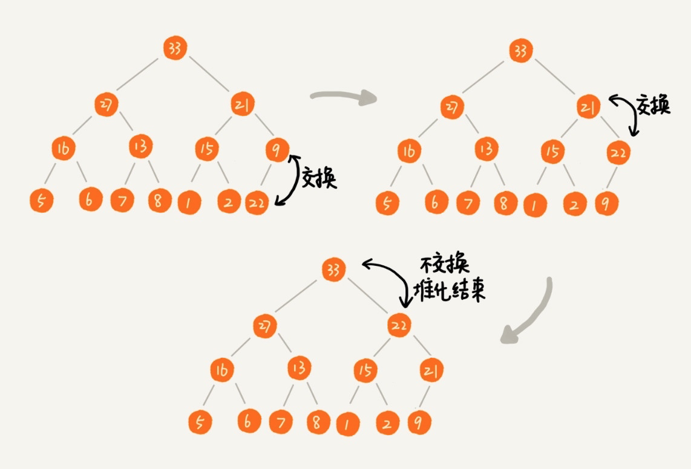

[TOC]

转载自: https://geekr.dev/posts/heap-and-heap-sorting

# 什么是堆?

堆是一种**特殊的二叉树**，具备以下特性：
- 堆是一个完全二叉树（不一定是二叉排序树）
- 每个节点的值都必须大于等于（或小于等于）其左右孩子节点的值
    - 如果每个节点的值都大于等于左右孩子节点的值，这样的堆叫大顶堆；
    - 如果每个节点的值都小于等于左右孩子节点的值，这样的堆叫小顶堆


上图中，左侧的堆是大顶堆，右侧的堆是小顶堆，我们还可以得出这个结论：**对应大顶堆，堆顶一定是最大值；对于小顶堆，堆顶一定是最小值。**

<br>

## 如何构建堆

我们在介绍二叉树的定义和存储的时候说到，由于完全二叉树的特殊性，可以通过数组来存储，堆也是完全二叉树，所以我们完全可以通过数组来存储。在使用数组存储堆的时候，把第一个索引位置留空，从第二个索引位置开始存储堆元素，这样，对于索引值为 i 的元素而言，其子节点索引分别为 2i 和 2i+1。

下面我们就来看如何在堆中插入新节点，以大顶堆为例，从叶子结点插入，如果比父级元素大，则与父级元素交换位置，依次类推，直到到达根节点（小顶堆恰好相反）：



> 构建堆的过程叫堆化。

实现代码:

下面是对应的 Go 堆化实现代码：
```go
package heap

// Heap 通过数组切片存储二叉树节点
type Heap []int

func NewHeap() *Heap {
	return new(Heap)
}

func NewHeapByArray(seq []int) *Heap {
	n := len(seq)
	h := (*Heap)(&seq)
	for i := n/2 - 1; i >= 0; i-- {
		h.down(i, n)
	}
	return h
}

func (h *Heap) Len() int {
	return len(*h)
}

func (h *Heap) Less(i, j int) bool {
	return (*h)[i] < (*h)[j]
}

func (h *Heap) Swap(i, j int) {
	(*h)[i], (*h)[j] = (*h)[j], (*h)[i]
}

func (h *Heap) Push(v any) {
	*h = append(*h, v.(int))
	i := h.Len() - 1 //新增元素位置
	h.up(i)
}

func (h *Heap) up(i int) {
	for {
		j := (i - 1) / 2 //父节点位置
		// 如果是根节点或者父节点值大于子节点值，则退出循环
		if i == j || !h.Less(i, j) {
			break
		}
		h.Swap(i, j) // 否则交换子节点与父节点，直到父节点值大于子节点
		i = j
	}
}

func (h *Heap) Pop() any {
	n := h.Len() - 1
	h.Swap(0, n)
	h.down(0, n)
	v := (*h)[h.Len()-1]
	*h = (*h)[:h.Len()-1]
	return v
}

func (h *Heap) down(i0, n int) bool {
	i := i0
	for {
		j1 := i*2 + 1 // 左孩子节点索引
		if j1 >= n {
			break
		}
		if j1+1 < n && h.Less(j1+1, j1) {
			j1++
		}
		if h.Less(i, j1) {
			break
		}
		h.Swap(i, j1)
		i = j1
	}
	return i > i0
}

// Remove removes and returns the element at index i from the heap.
// The complexity is O(log n) where n = h.Len().
func (h *Heap) Remove(i int) any {
	n := h.Len() - 1
	if n != i {
		h.Swap(i, n)
		if !h.down(i, n) {
			h.up(i)
		}
	}
	return h.Pop()
}

// Fix 在索引 i 处的元素更改其值后重新建立堆排序。
// 改变索引 i 处元素的值然后调用 Fix 等同于,
// 但比调用Remeve(h,i),然后调用Push(h,i)花销少.
// The complexity is O(log n) where n = h.Len().
func (h *Heap) Fix(i int) {
	if !h.down(i, h.Len()) {
		h.up(i)
	}
}
```

可以看到，上面构建的是一个小顶堆，接下来我们可以为这段代码编写测试用例：
```go
func Test(t *testing.T) {
	seq := []int{3, 1, 2, 5, 7, 9, 22, 8, 12, 0}
	hp := NewHeapByArray(seq)
	hp.Push(-1)

	fmt.Println(hp.Pop()) // -1
	fmt.Println(hp.Pop()) // 0
	fmt.Println(hp.Pop()) // 1

	for _, v := range *hp {
		fmt.Println(v)
	}
	hp.Remove(2)
	for _, v := range *hp {
		fmt.Println(v)
	}

	(*hp)[0] = 10
	hp.Fix(0)
	for _, v := range *hp {
		fmt.Println(v)
	}
}
```