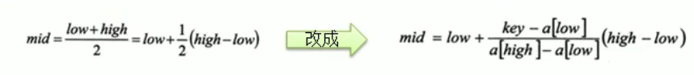

# 插值查找算法=(按比例查找)

插值查找，有序表的一种查找方式。插值查找是根据查找关键字与查找表中最大最小记录关键字比较后的查找方法。插值查找基于二分查找，将查找点的选择改进为自适应选择，提高查找效率。

插值查找除要求查找表是顺序存储的有序表外，还要求数据元素的关键字在查找表中均匀分布，这样，就可以按比例插值。

1. 插值查找算法类似于二分查找,不同的是插值查找每次从**自适应mid**处开始查找.
2. 将折半查找中的求mid索引的公式,low表示左边索引,high表示右边索引.
    

3. 注意事项
    - 对于数据量较大，关键字分布比较均匀的查找表来说，采用插值查找，速度较快
    - 关键字分布不均匀的情况下，该方法不一定比折半查找要好

