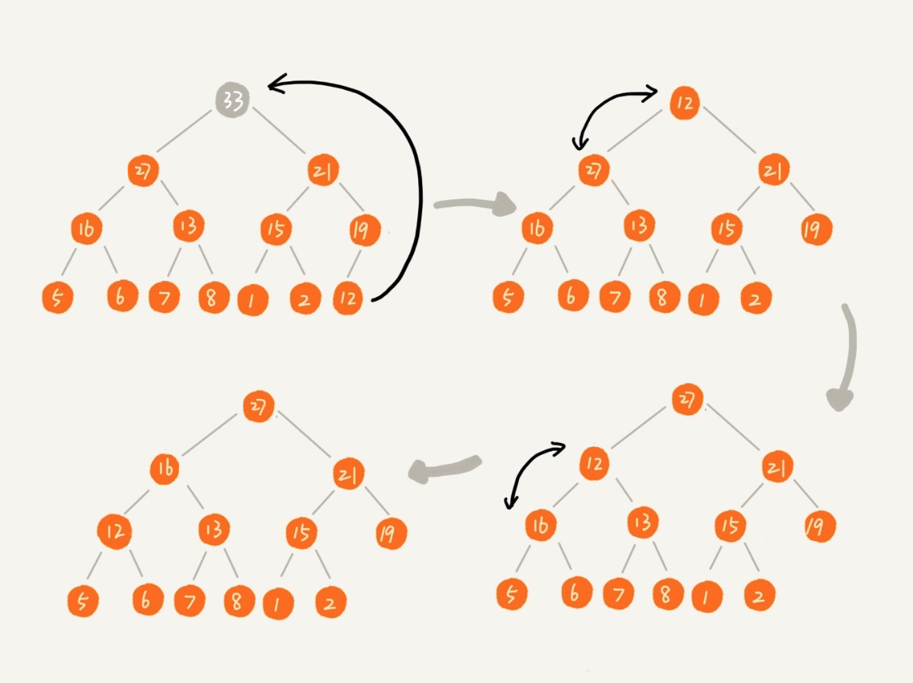

# 堆排序

堆排序的过程其实就是不断删除堆顶元素的过程。如果构建的是大顶堆，逐一删除堆顶元素后构成的序列是从大到小排序；如果构建的是小顶堆，逐一删除堆顶元素后构成的序列是从小到大排序。

而这其中的原理，就是：对于大顶堆，堆顶一定是最大值；对于小顶堆，堆顶一定是最小值。

但是这里有一个问题，每次从堆顶删除元素后，需要从子节点中取值补齐堆顶，依次类推，直到叶子节点，就会致使存储堆的数组出现「空洞」：

**解决办法是将数组中的最后一个元素（最右边的叶子节点）移到堆顶，再重新对其进行堆化**

这样，就完美解决了「数组空洞」的问题。

## 复杂度分析
我们先看时间复杂度，对堆排序而言，分为两个阶段，一个是堆的构建，一个是堆顶元素的删除。对于 n 个节点的堆化而言，通过数组存储，对应的时间复杂度是 O(n)，对于堆顶元素的删除而言，需要遍历 n 个节点，并且，每次删除后需要重新堆化，对应的平均时间复杂度是 O(nlogn)。所以综合下来，堆排序的时间复杂度和快速排序、归并排序一样，是 O(nlogn)。

堆排序的过程中，涉及到不相邻元素的交换（删除堆顶元素的时候），所以不是稳定的排序算法。