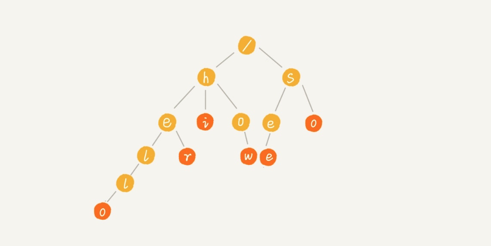

[TOC]

转载自: https://geekr.dev/posts/go-trie-tree-algorithm

# Trie树的定义

Trie 树，也叫「前缀树」或「字典树」，顾名思义，它是一个树形结构，专门用于处理字符串匹配，**用来解决在一组字符串集合中快速查找某个字符串的问题。**

<br>

> 注：Trie 这个术语来自于单词「retrieval」，你可以把它读作 tree，也可以读作 try。

<br>
Trie 树的本质，就是利用字符串之间的公共前缀，将重复的前缀合并在一起，比如我们有["hello","he","her","hi","how","see","so"] 这个字符串集合，可以将其构建成下面这棵 Trie 树：



每个节点表示一个字符串中的字符，从根节点到红色节点的一条路径表示一个字符串（红色节点表示是某个单词的结束字符，但不一定都是叶子节点）。
<br>

这样，我们就可以通过遍历这棵树来检索是否存在待匹配的字符串了，比如我们要在这棵 Trie 树中查询 her，只需从 h 开始，依次往下匹配，在子节点中找到 e，然后继续匹配子节点，在 e 的子节点中找到 r，则表示匹配成功，否则匹配失败。通常，我们可以通过 Trie 树来构建敏感词或关键词匹配系统。

<br>
<br>

## Trie树的实现

从刚刚 Trie 树的介绍来看，Trie 树主要有两个操作，一个是将字符串集合构造成 Trie 树。这个过程分解开来的话，就是一个将字符串插入到 Trie 树的过程。另一个是在 Trie 树中查询一个字符串。

**Trie 树是个多叉树，二叉树中，一个节点的左右子节点是通过两个指针来存储的，对于多叉树来说，我们怎么存储一个节点的所有子节点的指针呢？**

我们将 Trie 树的每个节点抽象为一个节点对象，对象包含的属性有节点字符、子节点字典和是否是字符串结束字符标志位：
```go
//Trie树节点
type TrieNode struct {
    char string     //Unicode字符
    isEnding bool   //是否是单词结尾
    children map[rune]*TrieNode //该结点的子节点字典.
}

// 初始化Trie树节点
func NewTrieNode(char string) *TrieNode{
    return &TrieNode{
        char: char,
        isEnding: false,
        children: make(map[rune]*TrieNode),
    }
}
```

**要构造一棵完整的 Trie 树，关键在于存储子节点字典的 children 属性的实现。借助散列表的思想，我们通过一个下标与字符一一映射的数组，来构造 children：将字符串中每个字符转化为 Unicode 编码作为字典键，将对应节点对象指针作为字典值，依次插入所有字符串，从而构造出 Trie 树**。

对应 Go 实现代码
```go

// Trie树结构
type Trie struct {
	root *TrieNode
}

// 初始化Trie树
func NewTrie() *Trie {
	return &Trie{NewTrieNode('/')}
}

// 往Trie树中插入一个单词
func (t *Trie) Insert(word string) {
	node := t.root              // 获取根节点
	for _, code := range word { // 以 Unicode 字符遍历该单词
		childNode, ok := node.children[code] // 获取 code 编码对应子节点
		if !ok {
			childNode = NewTrieNode(code)   // 不存在则初始化该节点
			node.children[code] = childNode // 然后将其添加到子节点字典
		}
		node = childNode // 当前节点指针指向当前子节点
	}
	node.isEnding = true // 一个单词遍历完所有字符后将结尾字符打上标记
}

// 在Trie树中查找一个单词
func (t *Trie) Search(word string) bool {
	node := t.root
	for _, code := range word {
		childNode, ok := node.children[code]
		if !ok {
			return false
		}
		node = childNode
	}
	// 如果isEngind=True,表示完全匹配到了
	// 否则说明不能完全匹配，只是前缀
	return node.isEnding
}
```

最后，我们可以编写一段简单的 Trie 树测试代码：
```go
func Test(t *testing.T) {
	words := []string{"hello", "he", "her", "hi", "how", "see", "so", "张三", "张三丰"}
	trie := NewTrie()
	for _, v := range words {
		trie.Insert(v)
	}
	target := "张三丰"
	if trie.Search(target) {
		fmt.Printf("包含词\"%s\"\n", target)
	} else {
		fmt.Printf("不包含词\"%s\"\n", target)
	}
}
```
<br>
<br>

## Trie树的复杂度

构建 Trie 树的过程比较耗时，对于有 n 个字符的字符串集合而言，需要遍历所有字符，对应的时间复杂度是 O(n)，但是一旦构建之后，查询效率很高，如果匹配串的长度是 k，那只需要匹配 k 次即可，与原来的主串没有关系，所以对应的时间复杂度是 O(k)，基本上是个常量级的数字。

Trie 树显然也是一种空间换时间的做法，构建 Trie 树的过程需要额外的存储空间存储 Trie 树，而且这个额外的空间是原来的数倍。

你会发现，通过 Trie 树进行字符串匹配和之前介绍的 BF 算法和 KMP 算法有所不同，BF 算法和 KMP 算法都是在给定主串中匹配单个模式串，而 Trie 树是将多个模式串与单个主串进行匹配，因此，**我们将 BF 和 KMP 这种匹配算法叫做单模式匹配算法，而将 Trie 树这种匹配算法叫做多模式匹配算法。**

<br>

## Trie树的应用

Trie 树适用于那些查找前缀匹配的字符串，比如敏感词过滤和搜索框联想功能。

1. 敏感词过滤系统
2016 年新广告法推出后，学院君为之前的公司商品库做过一个简单的敏感词过滤系统，就用到了 Trie 树来对敏感词进行搜索匹配：首先运营在后台手动更新敏感词，底层通过 Trie 树构建敏感词库，然后当商家发布商品时，以商品标题+详情作为主串，将敏感词库作为模式串，进行匹配，如果模式串和主串有匹配字符，则以此为起点，继续往后匹配，直到匹配出完整字符串，然后标记为匹配出该敏感词（如果想嗅探所有敏感词，继续往后匹配），否则将主串匹配起点位置往后移，从下一个字符开始，继续与模式串匹配。

2. 搜索框联想功能
另外，搜索框的查询关键词联想功能也是基于 Trie 树实现的：


**进而可以扩展到浏览器网址输入自动补全、IDE 代码编辑器自动补全、输入法自动补全功能等。**