# 平衡二叉树

> 看一个案例(说明二叉排序树可能的问题)

给你一个数列{1,2,3,4,5,6}，要求创建一颗二叉排序树(BST)，并分析问题所在.
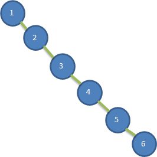

存在的问题分析:
- 左子树全部为空，从形式上看，更像一个单链表
- 插入速度没有影响
- 查询速度明显降低(因为需要依次比较)，不能发挥BST的优势，因为每次还需要比较左子树，其查询速度比单链表还慢


## 基本介绍

- 平衡二叉树也叫自平衡二叉搜索树（Self-balancing binary search tree）又被称为AVL树， 可以保证查询效率较高

- 具有以下特点：它是一 棵空树或它的左右两个子树的高度差的绝对值不超过1，并且左右两个子树都是一棵平衡二叉树
- 一棵AVL树有如下必要条件：
    - 条件一：它必须是二叉查找树。
    - 条件二：每个节点的左子树和右子树的高度差至多为1。
- 相比红黑树，平衡二叉树比较适用于没有删除的情况
- 平衡二叉树的常用实现方法有红黑树、AVL、替罪羊树、Treap、伸展树等。
- 举例说明，看看下面哪些AVL树，为什么?（第1、2个树是，第3个树不是）
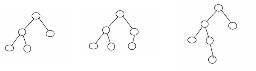
    - 这种左右子树的高度相差不超过 1 的树为平衡二叉树   

<br>
<br>

转载链接：https://blog.csdn.net/isunbin/article/details/81707606

AVL树的查找、插入、删除操作在平均和最坏的情况下都是O(logn)，这得益于它时刻维护着二叉树的平衡。如果我们需要查找的集合本身没有顺序，在频繁查找的同时也经常的插入和删除，AVL树是不错的选择。不平衡的二叉查找树在查找时的效率是很低的，因此，AVL如何维护二叉树的平衡是学习重点。
<br>

### AVL树相关概念
1. 平衡因子：将二叉树上节点的左子树高度减去右子树高度的值称为该节点的平衡因子BF(Balance Factor)。
    - 对于平衡二叉树，BF的取值范围为[-1,1]。如果发现某个节点的BF值不在此范围，则需要对树进行调整。

2. 最小不平衡子树：距离插入节点最近的，且平衡因子的绝对值大于1的节点为根的子树.
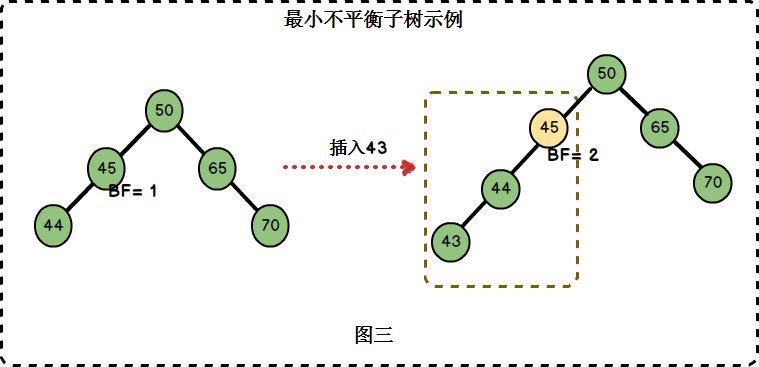
在图三中，左边二叉树的节点45的BF = 1，插入节点43后，节点45的BF = 2。节点45是距离插入点43最近的BF不在[-1,1]范围内的节点，因此以节点45为根的子树为最小不平衡子树。

<br>

### 平衡二叉树的实现原理
转载链接：https://geekr.dev/posts/self-balancing-binary-search-tree

平衡二叉树的基本实现思路，是在构建二叉排序树的时候，每插入一个节点，都要检查这个节点的插入是否破坏了原有的平衡性，如果是的话，则找出最小不平衡子树，在保证整体二叉排序树的前提下，通过左旋或者右旋的方式将其调整为平衡子树。从而动态维护这棵平衡二叉树。

<br>

左旋/右旋操作:
- 所谓左旋和右旋指的是最小不平衡子树旋转的方向。
    - 如果平衡因子小于 -1，即右子树高度值比较大，则需要左旋
    - 反之，如果平衡因子大于1，即左子树高度值比较大，则需要右旋

- 旋转的时候以最小不平衡子树为单位


<br>


### AVL树的平衡调整

定义平衡二叉树节点结构：

```c++
typedef struct Node
{
    int key;
    struct Node *left;
    struct Node *right;
    int height;
}BTNode;
```

整个实现过程是通过在一棵平衡二叉树中依次插入元素(按照二叉排序树的方式)，若出现不平衡，则要根据新插入的结点与最低不平衡结点的位置关系进行相应的调整。

分为LL型、RR型、LR型和RL型4种类型，各调整方法如下(下面用A表示最低不平衡结点)：

1. LL型调整(右旋)：
> 由于在A的左孩子(L)的左子树(L)上插入新结点，使原来平衡二叉树变得不平衡，此时A的平衡因子由1增至2。下面图1是LL型的最简单形式。显然，按照大小关系，结点B应作为新的根结点，其余两个节点分别作为左右孩子节点才能平衡，A结点就好像是绕结点B顺时针旋转一样。


> LL型调整的一般形式如下图2所示，表示在A的左孩子B的左子树BL(不一定为空)中插入结点(图中阴影部分所示)而导致不平衡( h 表示子树的深度)。这种情况调整如下：
①将A的左孩子B提升为新的根结点；
②将原来的根结点A降为B的右孩子；
③各子树按大小关系连接(BL和AR不变，BR调整为A的左子树)。


代码实现：
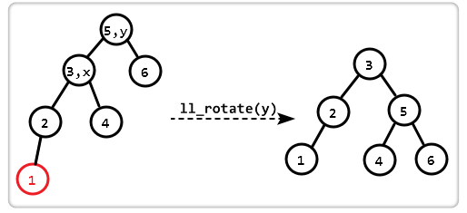
```c++
BTNode *ll_rotate(BTNode *y)
{
    BTNode *x = y->left;
    y->left = x->right;
    x->right = y;   
 
    y->height = max(height(y->left), height(y->right)) + 1;
    x->height = max(height(x->left), height(x->right)) + 1;
 
    return x;
}
```

<br>
<br>

2. RR型调整(左旋)
> 由于在A的右孩子(R)的右子树(R)上插入新结点，使原来平衡二叉树变得不平衡，此时A的平衡因子由-1变为-2。图3是RR型的最简单形式。显然，按照大小关系，结点B应作为新的根结点，其余两个节点分别作为左右孩子节点才能平衡，A结点就好像是绕结点B逆时针旋转一样。

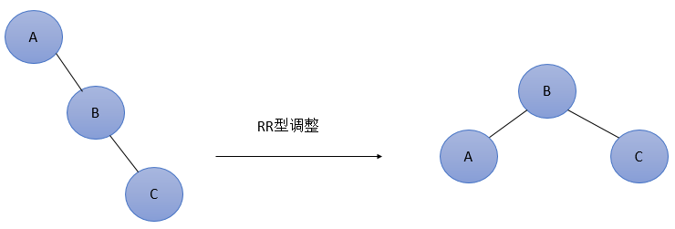

> RR型调整的一般形式如下图4所示，表示在A的右孩子B的右子树BR(不一定为空)中插入结点(图中阴影部分所示)而导致不平衡( h 表示子树的深度)。这种情况调整如下：
- 将A的右孩子B提升为新的根结点；
- 将原来的根结点A降为B的左孩子
- 各子树按大小关系连接(AL和BR不变，BL调整为A的右子树)。

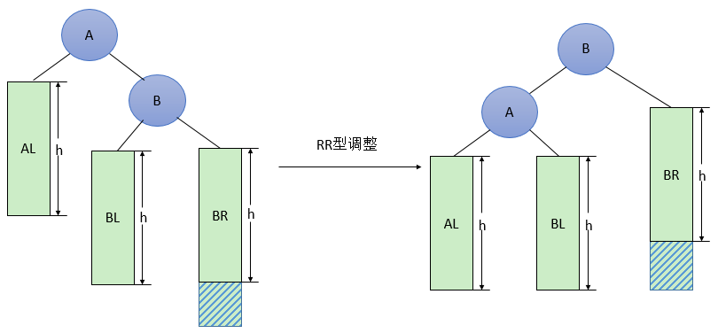

代码实现:
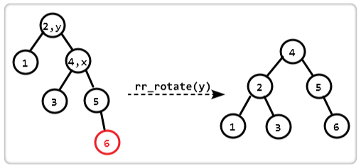
```c++
BTNode *rr_rotate(struct Node *y)
{
    BTNode *x = y->right;
    y->right = x->left;
    x->left = y;
    
    y->height = max(height(y->left), height(y->right)) + 1;
    x->height = max(height(x->left), height(x->right)) + 1;
 
    return x;
}

```

<br>
<br>

3. LR型调整
> 由于在A的左孩子(L)的右子树(R)上插入新结点，使原来平衡二叉树变得不平衡，此时A的平衡因子由1变为2。图5是LR型的最简单形式。显然，按照大小关系，结点C应作为新的根结点，其余两个节点分别作为左右孩子节点才能平衡。

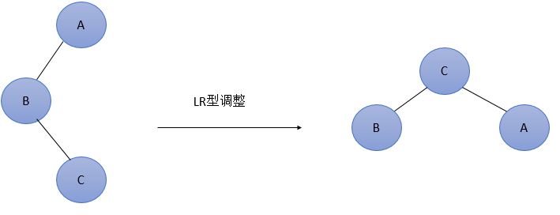

> LR型调整的一般形式如下图6所示，表示在A的左孩子B的右子树(根结点为C，不一定为空)中插入结点(图中两个阴影部分之一)而导致不平衡( h 表示子树的深度)。这种情况调整如下：
①将B的左孩子C提升为新的根结点；
②将原来的根结点A降为C的右孩子；
③各子树按大小关系连接(BL和AR不变，CL和CR分别调整为B的右子树和A的左子树)。

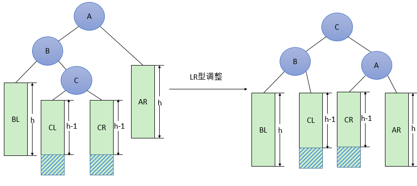
3.1 代码实现：

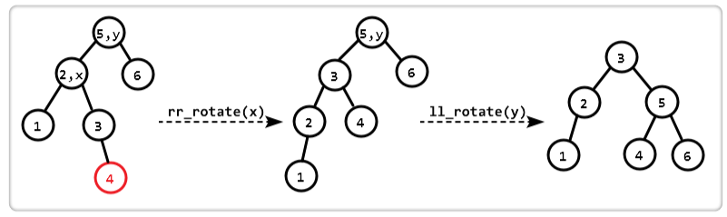
```c
BTNode* lr_rotate(BTNode* y)
{
    BTNode* x = y->left;
    y->left = rr_rotate(x);
    return ll_rotate(y);
}
```


<br>
<br>


4. RL型调整：
> 由于在A的右孩子(R)的左子树(L)上插入新结点，使原来平衡二叉树变得不平衡，此时A的平衡因子由-1变为-2。图7是RL型的最简单形式。显然，按照大小关系，结点C应作为新的根结点，其余两个节点分别作为左右孩子节点才能平衡。

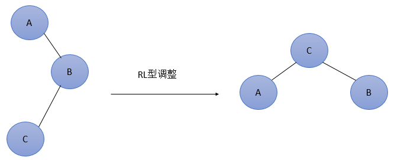

> RL型调整的一般形式如下图8所示，表示在A的右孩子B的左子树(根结点为C，不一定为空)中插入结点(图中两个阴影部分之一)而导致不平衡( h 表示子树的深度)。这种情况调整如下：
①将B的左孩子C提升为新的根结点；
②将原来的根结点A降为C的左孩子；
③各子树按大小关系连接(AL和BR不变，CL和CR分别调整为A的右子树和B的左子树)。


代码实现
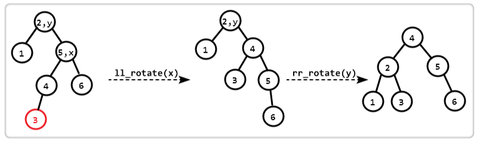
```c
Node* rl_rotate(Node* y)
{
    Node * x = y->right;
    y->right = ll_rotate(x);
    return rr_rotate(y);
}
```

<br>
<br>

### 总结
二叉排序树的插入、删除、查找时提到，最理想的情况下，时间复杂度是 O(logn)，而平衡二叉树就是这种理想情况，虽然平衡二叉树性能是最好的，也是最稳定的，**但是这套算法实现起来比较复杂，每次插入节点和删除节点都需要判断剩下节点构成的二叉排序树是否满足平衡二叉树的要求，如果不满足需要做相应的左旋右旋处理，维护成本高，因此，在工程实践上，我们更多时候使用的是红黑树这种二叉排序树，它是一种不严格的平衡二叉树，实现起来更加简单，性能也接近严格的平衡二叉树**