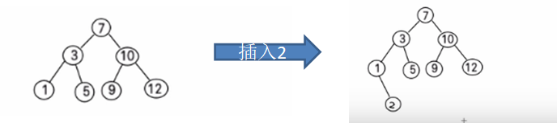

# 二叉排序树

> 需求: 给你一个数列(7, 3, 10, 12, 5, 1, 9),要求能够高效的完成对数据的查询和添加.
1. 数组:
    - 数组未排序
        - 优点：直接在数组尾添加，速度快
        - 缺点：查找速度慢
    - 数组排序
        - 优点：可以使用二分查找，查找速度快
        - 缺点：为了保证数组有序，在添加新数据时，找到插入位置后，后面的数据需整体移动，速度慢
2. 链表
    - 不管链表是否有序，查找速度都慢，添加数据速度比数组快，不需要数据整体移动

 

3. 使用二叉排序树

BST: (Binary Sort(Search) Tree)，对于二叉排序树的任何一个非叶子节点，要求左子节点的值比当前节点的值小，右子节点的值比当前节点的值大
> 特别说明：如果有相同的值，可以将该节点放在左子节点或右子节点

比如针对数据 (7, 3, 10, 12, 5, 1, 9) ，对应的二叉排序树为：

## 基本介绍

理想情况下，二叉排序树的插入、删除、查找时间复杂度都是 O(logn)，非常高效，而且它是一种动态的数据结构，插入删除性能和查找一样好，不像之前提到的二分查找，虽然查找性能也是 O(logn)，但是需要先对线性表进行排序，而排序的最好时间复杂度也是 O(nlogn)，所以二分查找不适合动态结构的排序。

但是如果二叉排序树构造的不好的话就会退化成斜树(链表).

此时按照之前的实现算法性能退化成了 O(n)，所以如何构造二叉排序树很重要，我们的理想情况是满二叉树和完全二叉树，它们的性能都是 O(logn)