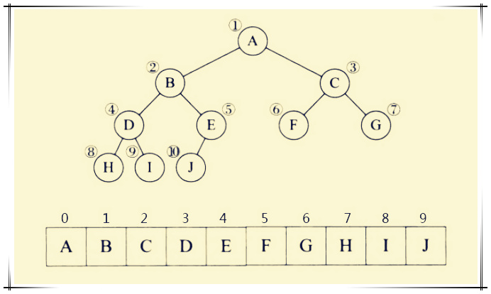
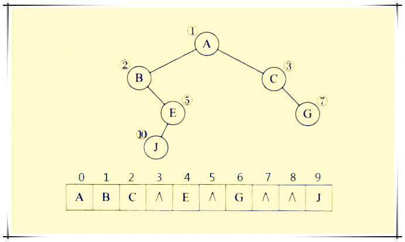

> 在程序设计语言中能用多种方法来构造二叉树。

1. 顺序存储表示
- 按满二叉树的结点层次编号,依次存放二叉树中的数据元素.

二叉树的顺序存储结构是指用一组地址连续的存储单元依次自上而下、自左至右存储完全二叉树上的结点元素，即将完全二叉树上编号为 i 的结点元素存储在一维数组下标为 i-1 的分量中。

依据二叉树的性质，完全二叉树和满二叉树采用顺序存储比较合适，树中结点的序号可以唯一地反映结点之间的逻辑关系，这样既能最大地节省存储了空间，又能利用数组元素的下标值确定结点在二叉树中的位置，以及结点之间的关系。

 

2. 完全二叉树

完全二叉树由于其结构上的特点，通常采用顺序存储方式存储。
一棵有n个结点的完全二叉树的所有结点从1到n编号，就得到结点的一个线性序列。
如下图：完全二叉树除最下面一层外，各层都被结点充满了，每一层结点的个数恰好是上一层结点个数的2倍，因此通过一个结点的编号就可以推知它的双亲结点及左，右孩子结点的编号：
① 当 2i ≤ n 时，结点 i 的左孩子是 2i，否则结点i没有左孩子；

② 当 2i+1 ≤ n 时，结点i的右孩子是 2i+1，否则结点i没有右孩子；

③ 当 i ≠ 1 时，结点i的双亲是结点 i/2；

注意：由于数组下标从0开始，因此数组元素的下标等于结点在完全二叉树中的序号减1。

 

3. 一般二叉树：

对于一般的二叉树，如果仍按照从上至下，从左到右的顺序将树中的结点顺序存储在一维数组中，则数组元素下标之间的关系不能够反映二叉树中结点之间的逻辑关系。

这时假设将一般二叉树进行改造，增添一些并不存在的空结点，使之成为一棵完全二叉树的形式，然后再用一维数组顺序存储。在二叉树中假设增添的结点在数组中所对应的元素值为"空"用^表示。

在最糟糕的情况下，如果深度为h的二叉树其每个节点都只有右孩子，则该存储结构需要占用2^h^-1的空间，实际上却只有h个节点，浪费了不少空间，是顺序存储结构的一大缺点。

