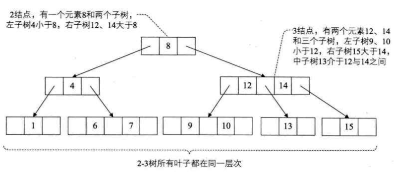
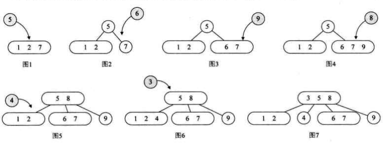
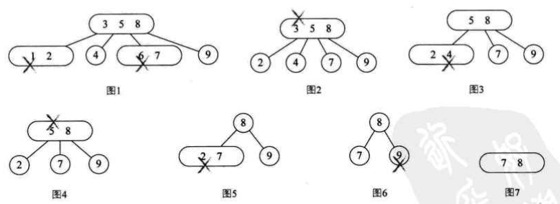
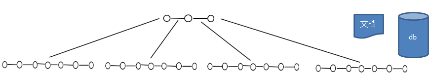
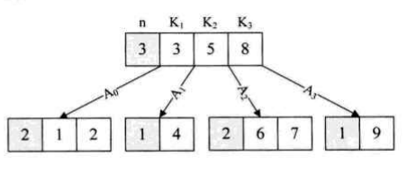
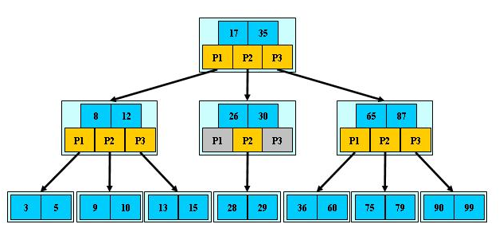

[TOC]

# 多路查找树

之前的树都是一个结点可以有多个孩子，但是它自身只存储一个元素，二叉树限制更多，结点最多只能有两个孩子。一个结点只能存储一个元素，在元素非常多的时候，就使得要么树的度非常大（结点拥有子树的个数的最大值），要么树的高度非常大，甚至两者都必须足够大才行。这就使得内存存取外存次数非常多，这显然成了时间效率上的瓶颈，因此，需要打破每一个结点只存储一个元素的限制。

**多路查找树（muiti-way search tree），其每一个结点的孩子树可以多于两个，且每一个结点处可以存储多个元素。**

## 多路查找树的背景

前面所讨论的查找算法都是在内存中进行的，它们适用于较小的文件，而对于较大的、存放在外存储器上的文件就不合适了，对于此类大规模的文件，即使是采用了平衡二叉树，在查找效率上仍然较低。

如果要操作的数据集非常大，大到内存已经没办法处理了，这种情况下，对数据的处理需要不断从硬盘等存储设备中调入或调出内存页面。一旦涉及到这样的外部设备，关于时间复杂度的计算就会发生变化，访问该集合元素的时间已经不仅仅是寻找该元素所需比较次数的函数，必须考虑对硬盘等外部存储设备的访问时间以及将会对该设备做出多少次的单独访问。

如果二叉树的节点少没什么问题，但是如果二叉树的节点很多(比如1亿)就存在如下问题:
- 问题1：在构建二叉树时，需要多次进行i/o操作(海量数据存在数据库或文件中)，节点海量，构建二叉树时，速度有影响
- 问题2：节点海量，也会造成二叉树的高度很大，会降低操作速度

# 多叉树

在二叉树中，每个节点有数据项，最多有两个子节点。如果允许每个节点可以有更多的数据项和更多的子节点，就是多叉树（multiway tree）

`2-3树`，`2-3-4树`就是多叉树，多叉树通过重新组织节点，减少树的高度，能对二叉树进行优化

## 2-3树

代码实现: https://github.com/Albertpv95/Tree23

2-3树的定义:
- 其中的每一个结点都有两个孩子（2结点）或三个孩子（3结点）。
- 一个2结点包含一个元素和两个孩子（或没有孩子），且与二叉排序树类似，左子树包含的元素小于该元素，右子树包含的元素大于该元素。不过，与二叉排序树不同的是，这个2结点要么没有孩子，要有就有两个，不能只有一个孩子。
- 一个3结点包含一小一大两个元素和三个孩子（或没有孩子），一个3结点要么没有孩子，要么具有3个孩子。如果某个3结点有孩子的话，左子树包含小于较小元素的元素，右子树包含大于较大元素的元素，中间子树包含介于两元素之间的元素。
- 2-3树中所有叶子都在同一层次上。

## 2-3-4树

2-3-4树就是2-3树的拓展，包括了4结点的使用。一个4结点包含小中大三个数据元素和四个孩子（或没有孩子），一个4结点要么没有孩子，要么有4个孩子。如果某个4结点有孩子的话，左子树包含小于最小元素的元素；第二子树包含大于最小元素，小于第二元素的元素；第三子树包含大于第二元素，小于最大元素的元素；右子树包含大于最大元素的元素。

2-3-4树的插入过程（插入顺序为{7,1,2,5,6,9,8,4,3}）：

　2-3-4树的删除过程（删除顺序为：{1,6,3,4,5,2,9}）：

## B树

### 基本介绍
B树通过重新组织节点，降低树的高度，并且减少i/o读写次数来提升效率

- 如图B树通过重新组织节点， 降低了树的高度
- 文件系统及数据库系统的设计者利用了磁盘预读原理，将一个节点的大小设为等于一个页(页得大小通常为4k)，这样每个节点只需要一次I/O就可以完全载入
- 将树的度M设置为1024，在600亿个元素中最多只需要4次I/O操作就可以读取到想要的元素，B树(B+)广泛应用于文件存储系统以及数据库系统中

### 结构

代码实现: https://github.com/biello/B-Tree

B-tree树即B树，B即Balanced，平衡的意思

B树（B-Tree）是一种平衡的多路查找树，2-3树和2-3-4树都是B树的特例。结点最大的孩子数目称为B树的阶（order），因此，2-3树是3阶B树，2-3-4树是4阶B树。

一个m阶的B树,它或者是空树，或者是满足下列性质的树：
- 如果根结点不是叶结点，则其至少有两个子树
- 每一个非根的分支结点都有k-1个元素和k个孩子，其中【m/2】≤k≤m。每一个叶子结点n都有k-1个元素，其中【m/2】≤k≤m。
- 所有叶子结点都位于同一层次
- 所有分支结点包含下列信息数据（n,A0,K1,A1,K2,A2,...,Kn,An），其中：Ki（i=1,2,...,n）为关键字，且Ki<Ki+1（i=1,2,...n-1）;Ai（i=0,1,2,...n）为指向子树根结点的指针，且指针A~i-1~所指子树中所有结点的关键字均小于Ki（i=1,2,...,n），An所指子树中所有结点的关键字均大于Kn，n（【m/2】- 1≤ n ≤m - 1）为关键字的个数（或n+1为子树的个数）。
- 关键字集合分布在整颗树中, 即叶子节点和非叶子节点都存放数据

在B树上查找的过程是一个顺时针查找结点和在结点中查找关键字的交叉过程。例如，要查找数字7，首先从外存（硬盘）中读取得到根结点3、5、8三个元素，发现7不在当中，但在5和8之间，因此就通过A2再读取外存的6、7结点，查找到所要的元素。

### 搜索 

在B树中查找给定关键字的方法是，首先把根结点取来，在根结点所包含的关键字K1,…,Kn查找给定的关键字（可用顺序查找或二分查找法），若找到等于给定值的关键字，则查找成功；否则，一定可以确定要查找的关键字在Ki与Ki+1之间，Pi为指向子树根节点的指针，此时取指针Pi所指的结点继续查找，直至找到，或指针Pi为空时查找失败。

## B+树

代码实现: GitHub地址：https://github.com/jiaguofang/b-plus-tree

- B+树是B树的变体，也是一种多路搜索树

## B*树

- B*树是B+树的变体，在B+树的非根和非叶子结点再增加指向兄弟的指针

