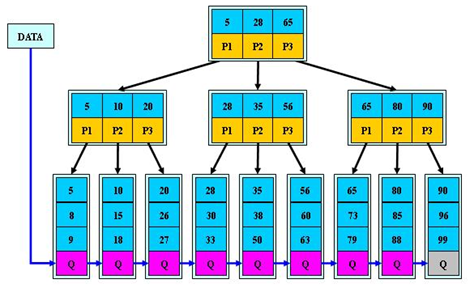
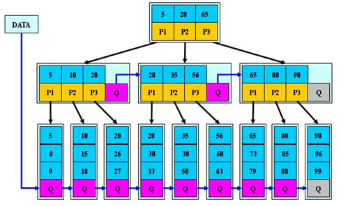

[TOC]

# 多路查找树

之前的树都是一个结点可以有多个孩子，但是它自身只存储一个元素，二叉树限制更多，结点最多只能有两个孩子。一个结点只能存储一个元素，在元素非常多的时候，就使得要么树的度非常大（结点拥有子树的个数的最大值），要么树的高度非常大，甚至两者都必须足够大才行。这就使得内存存取外存次数非常多，这显然成了时间效率上的瓶颈，因此，需要打破每一个结点只存储一个元素的限制。

**多路查找树（muiti-way search tree），其每一个结点的孩子树可以多于两个，且每一个结点处可以存储多个元素。**

## 多路查找树的背景

前面所讨论的查找算法都是在内存中进行的，它们适用于较小的文件，而对于较大的、存放在外存储器上的文件就不合适了，对于此类大规模的文件，即使是采用了平衡二叉树，在查找效率上仍然较低。

如果要操作的数据集非常大，大到内存已经没办法处理了，这种情况下，对数据的处理需要不断从硬盘等存储设备中调入或调出内存页面。一旦涉及到这样的外部设备，关于时间复杂度的计算就会发生变化，访问该集合元素的时间已经不仅仅是寻找该元素所需比较次数的函数，必须考虑对硬盘等外部存储设备的访问时间以及将会对该设备做出多少次的单独访问。

如果二叉树的节点少没什么问题，但是如果二叉树的节点很多(比如1亿)就存在如下问题:
- 问题1：在构建二叉树时，需要多次进行i/o操作(海量数据存在数据库或文件中)，节点海量，构建二叉树时，速度有影响
- 问题2：节点海量，也会造成二叉树的高度很大，会降低操作速度

# 多叉树

在二叉树中，每个节点有数据项，最多有两个子节点。如果允许每个节点可以有更多的数据项和更多的子节点，就是多叉树（multiway tree）

`2-3树`，`2-3-4树`就是多叉树，多叉树通过重新组织节点，减少树的高度，能对二叉树进行优化

## 2-3树

代码实现: https://github.com/Albertpv95/Tree23

2-3树的定义:
- 其中的每一个结点都有两个孩子（2结点）或三个孩子（3结点）。
- 一个2结点包含一个元素和两个孩子（或没有孩子），且与二叉排序树类似，左子树包含的元素小于该元素，右子树包含的元素大于该元素。不过，与二叉排序树不同的是，这个2结点要么没有孩子，要有就有两个，不能只有一个孩子。
- 一个3结点包含一小一大两个元素和三个孩子（或没有孩子），一个3结点要么没有孩子，要么具有3个孩子。如果某个3结点有孩子的话，左子树包含小于较小元素的元素，右子树包含大于较大元素的元素，中间子树包含介于两元素之间的元素。
- 2-3树中所有叶子都在同一层次上。

## 2-3-4树

2-3-4树就是2-3树的拓展，包括了4结点的使用。一个4结点包含小中大三个数据元素和四个孩子（或没有孩子），一个4结点要么没有孩子，要么有4个孩子。如果某个4结点有孩子的话，左子树包含小于最小元素的元素；第二子树包含大于最小元素，小于第二元素的元素；第三子树包含大于第二元素，小于最大元素的元素；右子树包含大于最大元素的元素。

2-3-4树的插入过程（插入顺序为{7,1,2,5,6,9,8,4,3}）：

　2-3-4树的删除过程（删除顺序为：{1,6,3,4,5,2,9}）：

## B树

概念: https://zh.m.wikipedia.org/zh-hans/B%E6%A0%91
### 基本介绍
B树通过重新组织节点，降低树的高度，并且减少i/o读写次数来提升效率

- 如图B树通过重新组织节点， 降低了树的高度
- 文件系统及数据库系统的设计者利用了磁盘预读原理，将一个节点的大小设为等于一个页(页得大小通常为4k)，这样每个节点只需要一次I/O就可以完全载入
- 将树的度M设置为1024，在600亿个元素中最多只需要4次I/O操作就可以读取到想要的元素，B树(B+)广泛应用于文件存储系统以及数据库系统中

### 结构

代码实现: 
- https://github.com/biello/B-Tree
- https://github.com/google/btree/blob/master/btree.go

B-tree树即B树，B即Balanced，平衡的意思

B树（B-Tree）是一种平衡的多路查找树，2-3树和2-3-4树都是B树的特例。结点最大的孩子数目称为B树的阶（order），因此，2-3树是3阶B树，2-3-4树是4阶B树。

一个m阶的B树,它或者是空树，或者是满足下列性质的树：
- 如果根结点不是叶结点，则其至少有两个子树
- 每一个非根的分支结点都有k-1个元素和k个孩子，其中【m/2】≤k≤m。每一个叶子结点n都有k-1个元素，其中【m/2】≤k≤m。
- 所有叶子结点都位于同一层次
- 所有分支结点包含下列信息数据（n,A0,K1,A1,K2,A2,...,Kn,An），其中：Ki（i=1,2,...,n）为关键字，且Ki<Ki+1（i=1,2,...n-1）;Ai（i=0,1,2,...n）为指向子树根结点的指针，且指针A~i-1~所指子树中所有结点的关键字均小于Ki（i=1,2,...,n），An所指子树中所有结点的关键字均大于Kn，n（【m/2】- 1≤ n ≤m - 1）为关键字的个数（或n+1为子树的个数）。
- 关键字集合分布在整颗树中, 即叶子节点和非叶子节点都存放数据

在B树上查找的过程是一个顺时针查找结点和在结点中查找关键字的交叉过程。例如，要查找数字7，首先从外存（硬盘）中读取得到根结点3、5、8三个元素，发现7不在当中，但在5和8之间，因此就通过A2再读取外存的6、7结点，查找到所要的元素。

B树结构可以减少内存与外存交换数据的次数，从而提高时间效率：外存比如硬盘是将所有的信息分割成相等大小的页面，每次硬盘读写的都是一个或多个完整的页面，对于一个硬盘来说，一页的长度可能是211到214个字节。在一个典型的B树应用中，要处理的硬盘数据量很大，因此无法一次全部装入内存。因此会对B树进行调整，使得B树的阶数（该结点的元素）与硬盘存储的页面大小相匹配。比如说一棵B树的阶为1001（即1个结点包含1000个关键字），高度为2，它可以存储超过10亿个关键字，只要让根结点持久地保存在内存中，那么在这棵树上，寻找某一个关键字至多需要两次硬盘的读取即可。

通过这种方式，在有限内存的情况下，每一次磁盘的访问都可以获得最大数量的数据。由于B树每结点可以具有比二叉树多得多的元素，所以与二叉树操作不同，它们减少了必须访问结点和数据块的数量，从而提高了性能。可以说，B树的数据结构就是为内外存的数据交互准备的。

### B树的查找算法 

在B树中查找给定关键字的方法是，首先把根结点取来，在根结点所包含的关键字K1,…,Kn查找给定的关键字（可用顺序查找或二分查找法），若找到等于给定值的关键字，则查找成功；否则，一定可以确定要查找的关键字在Ki与Ki+1之间，Pi为指向子树根节点的指针，此时取指针Pi所指的结点继续查找，直至找到，或指针Pi为空时查找失败。

将key与根结点的Ki逐个顺序比较：
- 若key=Ki，则查找成功；
- 若key<Ki，则沿着指针A~i-1~所指的子树继续查找；
- 若Ki < key < Ki+1，则沿着指针Ai所指的子树继续查找；
- 若key > Ki，则沿着指针An所指的子树继续查找。

### B树的插入算法
（1）利用B树的查找算法找出该数据元素结点应该插入的结点位置（B树的插入结点一定是叶结点）

（2）判断要插入的结点是否还有空位置，即判断该结点是否满足n<m-1（n为结点中关键字的个数，m为B树的阶，即所有结点的孩子结点个数最大值），

若该结点满足n<m-1，说明该结点还有空位置，直接把数据元素key插入到该结点的合适位置上（即插入后满足结点上的数据元素序列仍然保持有序）；

若该结点满足n=m-1，说明该结点已经没有空位置，要插入就要分裂该结点。

分裂的方法是：以中间数据元素为界把结点分为两个结点，并把中间数据元素向上插入到双亲结点上，若双亲结点未满，则把它插入到双亲结点的合适位置上，若双亲结点已满，则按同样的方法继续向上分裂。这个向上分裂的过程可以一直进行到根结点的分裂。若最终根结点进行了分裂，则B树的高度将增1。

以2-3树的插入过程为例（省略了n）:

- n<m-1有位置时：将3直接插入1结点中形成1-3结点

- n=m-1没有位置时，
　①双亲结点未满：去5-6-7中间数据元素6插入到双亲结点4中形成4-6结点

　②双亲结点已满，上一级未满时，由于9-10结点和12-14结点都满了，但是4-6结点和12-14结点的双亲没有满，所以讲9-10-11的中间元素10拿出，由于12-14结点满了，所以将12-14结点也拆分，将3结点变成2结点，从而让12到8中形成8-12结点。

③双亲结点已满，上一级已满时，由于1-3满，4-6满，8-12也满，所以讲1-3拆分，拿出2，将4-6拆分，拿出4，将8-12拆分，拿出8，然后将它们连接起来。由于根结点的分裂使得树的高度增加了。

### B树的删除操作

B树的删除操作分为两步：

　　（1）利用B树的查找算法找到该数据元素所在的结点

　　（2）在结点上删除数据元素key分为两种情况：一种是在叶结点上删除数据元素；另一种是在非叶结点上删除数据元素。

在非叶结点上删除数据元素的算法思想：假设要删除一个结点的数据元素Ki（1≤i≤n），首先寻找该结点Ai所指子树中的最小元素Kmin（Ai所指子树中的最小数据元素Kmin一定为叶结点上），然后用kmin覆盖要删除的数据元素Ki，最后再以指针Ai所指结点为根结点查找并删除Kmin（即再以Ai所指结点为B树的根结点，以Kmin为要删除数据元素再次调用B树上的删除算法）。这样就把非叶结点上的删除问题转化成了叶结点上的删除问题。

在B树的叶结点上删除数据元素共有以下三种情况：

①假如要删除的数据元素结点的数据元素个数n≥【m/2】，即说明删去该数据元素后，该结点仍满足B树的定义，则可以直接删去该数据元素。

②假如要删除的数据元素结点的数据元素个数n=【m/2】- 1，即说明删去该数据元素后，该结点将不满足B树的定义，并且该结点的左（或右）兄弟结点中有数据元素个数n＞【m/2】- 1，则把该结点的左（或右）兄弟结点中最大（或最小）的数据元素上移到双亲结点中，同时把双亲结点中大于（或小于）上移数据元素的数据元素下移到要删除数据元素的结点中，这样删去数据元素后该结点以及它的左（或右）兄弟结点都仍然满足B树的定义。

③假如要删除的数据元素结点的数据元素个数n=【m/2】- 1，即说明删去该数据元素后，该结点将不满足B树的定义，并且该结点的左（或右）兄弟结点中的数据元素个数n均等于【m/2】- 1，则把要删除数据元素的结点与其左（或右）兄弟结点以及双亲结点中分割二者的数据元素合并成一个结点。

　以2-3树的删除过程为例（省略了n，m=3，【m/2】= 2）:

　①在叶结点删除数据元素的情况①（所删除元素位于一个3结点的叶子结点上）：n=2，将数据元素9直接删除，不会影响整棵树的其他结构。

②在叶结点删除数据元素的情况②（所删除的元素位于一个2结点的叶子结点上，且此结点的双亲也是2结点，且拥有一个3结点的右孩子）：n=1，6-7结点个数为2＞【m/2】- 1，将6-7结点中最小的上移到4结点中，并将4下移到1结点中。

③在叶结点删除数据元素的情况③（所删除的元素位于一个2结点的叶子结点上，且此结点的双亲是3结点）：n=1，其右兄弟13结点和15结点的数据元素个数均为1=【m/2】- 1，则将右兄弟13结点和双亲结点中的12合并成一个结点12-13结点。

还有一种情况（所删除的元素位于一个2结点的叶子结点上，且当前树是一个满二叉树）：如果当前树是一个满二叉树，n=1，其左兄弟6结点的数据元素个数为1=【m/2】- 1，将其左兄弟6和双亲结点7合并成一个结点6-7，同时需要调整此时B树的结构，将此时6-7结点的右兄弟和其双亲9合并成一个结点9-14。

还有一种情况（所删除的元素位于一个2结点的叶子结点上，且此结点的双亲也是2结点，且拥有一个2结点的右孩子）：此时删除结点4，如果直接左旋会造成没有右孩子，因此需要对整棵树变形，目标就是让结点7变成3结点，于是让8下移，并且9上移补充8的位置，然后再删除结点4即可。

④在非叶结点上删除数据元素的情况（也可以将树按照中序遍历后得到此元素的前驱或后继元素，然后让它们来补位即可）：

　　（所删除的元素位于一个2结点的分支结点上）让1去覆盖4，然后以4为B树的根结点，删除叶结点中的1。

（所删除的元素位于一个3结点的分支结点上）让9去覆盖12，然后以9-14为B树的根结点，删除叶结点中的9。

 

## B+树

代码实现: GitHub地址：https://github.com/jiaguofang/b-plus-tree

- B+树是B树的变体，也是一种多路搜索树

B树还是有缺陷的，对于树结构来说，可以通过中序遍历来顺序查找树中的元素，这一切都是在内存中进行。但是在B树中，往返于每个结点就意味着，必须得在硬盘的页面之间进行多次访问，例如，遍历下面这棵B树，假设每个结点都属于硬盘的不同页面，中序遍历所有元素就需要访问：页面2→页面1→页面3→页面1→页面4→页面1→页面5。即每次经过结点遍历时，都会对结点中的元素进行一次遍历，如何让遍历时每个元素只访问一次就成了需要解决的问题。

B+树是在原有的B树结构基础上，加上了新的元素组织方式。B+树是应文件系统所需而出的一种B树的变形树，在B树中，每一个元素在该树中只出现一次，有可能在叶子结点上，也有可能在分支结点上。而在B+树中，出现在分支结点中的元素会被当做它们在该分支结点位置的中序后继者（叶子结点）中再次列出。另外，每一个叶子节点都会保存一个指向后一叶子结点的指针。

一棵m阶的B+树和m阶的B树的差异在于：

- 有n棵子树的节点中包含有n个关键字
- 所有的叶子结点包含全部关键字的信息，即指向含这些挂念自记录的指针，叶子结点本身按照关键字的大小自小到大顺序链接
- 所有分支结点可以看成索引，结点中仅含有其子树中的最大（或最小）关键字。

　　这样的数据结构最大的好处就在于，如果是要随机查找，就只需要从根结点出发，与B树的查找方式相同。只不过即使在分支结点找到了待查找的关键字，它也只是用来索引的，不能提供实际记录的访问，还是需要到达包含次关键字的终端结点。

　　如果需要从最小关键字进行从小到大的顺序查找，就可以从最左侧的叶子结点出发，不经过分支结点，而是延着指向下一叶子的指针就可以遍历所有的关键字。B+树的结构特别适合带有范围的查找，可以先从根结点出发找到要查找范围的最小值，然后再在叶子结点按顺序找到符合范围的所有记录即可。

## B*树

- B*树是B+树的变体，在B+树的非根和非叶子结点再增加指向兄弟的指针

