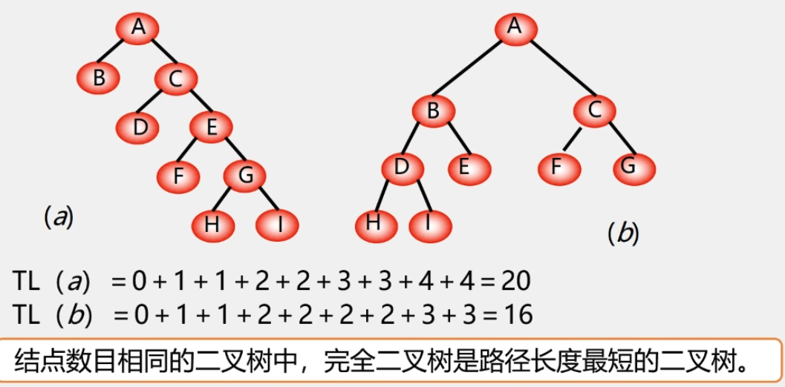
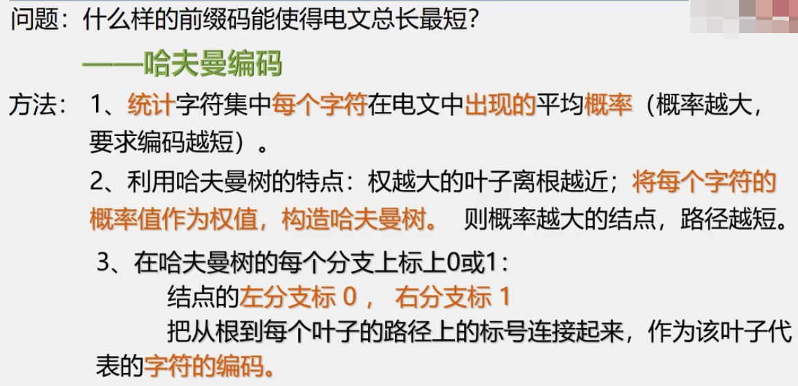

[TOC]

# 树
- 树是一种非线性数据结构，它是由n(n≥0)个有限节点组成一个具有层次关系的集合
- 特点:
  - 每个节点有零个或多个子节点；
  - 没有父节点的节点称为根节点；
  - 每一个非根节点有且只有一个父节点；
  - 除了根节点外，每个子节点可以分为多个不相交的子树。
  

<br>

1. 每个元素称为节点（node）
2. 有一个特定的节点被称为根节点或树根（root）
2. 除根节点之外的其余数据元素被分为m(m>=0)个互不相交的集合T1,T2,T3...Tm，其中每一个集合Ti(1<=i<=m)本身也是一棵树，被称作原树的子树（subtree）。

<br>

术语:
- 空集合也是树，称为空树。空树中没有节点；
- 孩子节点或子节点：一个节点含有的子树的根节点称为该节点的子节点；
- 节点的度：一个节点含有的子节点的个数称为该节点的度；
- 叶节点或终端节点：度为0的节点称为叶节点；
- 非终端节点或分支节点：度不为0的节点；
- 双亲节点或父节点：若一个节点含有子节点，则这个节点称为其子节点的父节点；
- 兄弟节点：具有相同父节点的节点互称为兄弟节点；
- 树的度：一棵树中，最大的节点的度称为树的度；
- 节点的层次：从根开始定义起，根为第1层，根的子节点为第2层，以此类推；
- 树的高度或深度：树中节点的最大层次；
- 堂兄弟节点：双亲在同一层的节点互为堂兄弟；
- 节点的祖先：从根到该节点所经分支上的所有节点；
- 子孙：以某节点为根的子树中任一节点都称为该节点的子孙；
- 森林：由m(m>=0)棵互不相交的树的集合称为森林。

<br>

种类:
- 无序树：树中任意节点的子结点之间没有顺序关系，这种树称为无序树,也称为自由树；
- 有序树：树中任意节点的子结点之间有顺序关系，这种树称为有序树；
  - 二叉树：每个节点最多含有两个子树的树称为二叉树；
    - 完全二叉树：除最后一层外，所有层都是满节点，且最后一层缺右边连续节点的二叉树称为完全二叉树；
      - 满二叉树：叶节点除外的所有节点均含有两个子树的树被称为满二叉树；
    - 哈夫曼树（最优二叉树）：带权路径最短的二叉树称为哈夫曼树或最优二叉树。
    - 线索二叉树
    - 二叉查找树（二叉搜索树、二叉排序树、BST）:解决了排序的基本问题，但是由于无法保证平衡，可能退化为链表
      - 平衡二叉树 (AVL树):：通过旋转解决了平衡的问题，但是旋转操作效率太低
        - 红黑树 :  通过舍弃严格的平衡和引入红黑节点，解决了AVL旋转效率过低的问题，但是在磁盘等场景下，树仍然太高，IO次数太多
        - 替罪羊树
        - AVL
        - 伸展树
    - B树：一种对读写操作进行优化的自平衡的二叉查找树，能够保持数据有序，拥有多于两个子树。
    - B+树: 在B树的基础上，将非叶节点改造为不存储数据的纯索引节点，进一步降低了树的高度；此外将叶节点使用指针连接成链表，范围查询更加高效
    - B*树

<br>

遍历表达法:
- 遍历表达法有4种方法：先序遍历、（仅二叉树有中序遍历）、后序遍历、层次遍历

<br>
<br>

# 二叉树
概念:
- 二叉树（Binary tree）是每个节点最多只有两个分支（即不存在分支度大于2的节点）的树结构。
- 通常分支被称作“左子树”或“右子树”。二叉树的分支具有左右次序，不能随意颠倒。

<br>

> 需要注意的是，二叉树并不是树的特殊情况，他们是两个概念。

```
二叉树结点的子树要区分左子树和右子树，即便只有一棵子树也要进行区分，说明他是左子树还是右子树。二树，当结点只有一个孩子时，就无需区分它是左还是右的次序。这是二者的主要区别。（也就是说二叉树每个结点位置或者说次序都是固定的，可以是空，但是不可以说它没有的位置，二树的结点位置是相对别的结点来说的，没有别的结点时，他就无所谓左右了）
```

<br>

**为什么要重点研究每节点最多只有两个"叉"的树?**
- **二叉树的结构简单,规律性最强.**
- **可以证明,所有树都能转为唯一对应的二叉树,不失一般性.**

<br>

**普通树(多叉树)若不转为二叉树,则运算很难实现.** 

<br>

**二叉树在树结构的应用中起着非常重要的作用,因为对二叉树的操作算法简单,**
**而任何树都可以与二叉树相互转换,这样就解决了树的存储结构及其运算中存在的复杂性.**

<br>


**二叉树的性质:**

- **在二叉树的第i层至多有2^(i-1)^个结点(i ≥ 1),第i层至少1个结点**
- **深度为k的结点至多有2^k^-1个结点 [深度为k的二叉树最少有k个结点]**
- **对任何一棵非空的二叉树T，如果其叶子数为n~0~,度为2的结点数为n~2~，则n~0~ = n~2~ + 1**
  - 设总边数为B,总结点为n.度为1的结点数为n~1~
    - B = n - 1, B = n~2~\*2 + n~1~\*1
    - n =  n~2~\*2 + n~1~\*1 + 1 又∵ n = n~2~ + n~1~ + n~0~
    - ∴ n~0~ = n~2~ + 1

<br>

<br>

二叉树案例:
- 数据压缩问题.
- 求解表达式的值.

<br>
<br>

## 满二叉树
一棵深度为k(k≥1)且有2^k^-1个结点的二叉树称为满二叉树.**国外定义这种二叉树为完美二叉树.**

<br>

性质:对于一颗深度为k的完美二叉树:
- 共有2^k^-1个结点
- 结点个数一定为奇数
- 第i层有2^i-1^个结点
- 有2^k-1^个叶子.

**国外定义的满二叉树: 如果一棵二叉树的结点要么是叶子结点，要么它有两个子结点，这样的树就是满二叉树。**


<br>
<br>

## 完全二叉树  

在一颗二叉树中，若除最后一层外的其余层都是满的，并且最后一层要么是满的，要么在右边缺少连续若干节点，则此二叉树为完全二叉树（Complete Binary Tree）

性质:
1. 具有n个节点的完全二叉树的深度为log~2~n+1.
2. 深度为k的完全二叉树，至少有2^k-1^个节点,至多有2^k^-1个结点.
3. 如果对一棵有n个结点的完全二叉树（深度为log~2~n+1）的结点按层序编号(从第一层到第log~2~n+1层，每层从左到右)，则对任一结点i(1≤i≤n)有：
   - 如果i=1，则结点i是二叉树的根，无双亲：若i>1，则其双亲是结点i/2.
   - 若2i>n，则结点i为叶子结点，无左孩子；否则，其做孩子是2i
   - 若2i+1>n,则结点i无右孩子；否则，其右孩子是结点2i+1


<br>
<br>

## 二叉树的存储结构

- 顺序存储
- 链式存储
  - 二叉链表
  - 三叉链表
  <br>

二叉树的顺序存储
- 实现:按满二叉树的结点层次编号.依次存放二叉树中的数据元素.结点为空时就置空.
- 顺序存储有明显的缺点，当最坏情况下，深度为k的且只有k个结点的单支树需要长度为2^k-1^的一维数组,最坏情况下很容易浪费空间的。
- 所以顺序储存比较适合满二叉树和完全二叉树。

<br>

二叉树的链式储存
- 二叉树每个结点都可以有两个孩子，所以可以又叫做二叉链表，即两个指针分别指向左右孩子
- 但是在我们需要找某个结点双亲的时候，二叉链表就不太方便了，所以我们需要三叉链表.
<br>

> 注意: 在n个结点的二叉链表中,有n+1个空指针域.

```
分析:必有2n个链域.除根节点外,每个节点有且仅有一个双亲,所有只有会n-1个结点的链域存放指针.指向非空孩子结点.
所以,空指针域 = 2n - (n-1) = n+1
```

<br>
<br>


## 遍历二叉树

- 遍历定义：顺着某一条搜索路径巡访二叉树中的结点，使得每一个结点被访问一次且仅被访问一次.
  - "访问"的含义很广，可以是对结点进行各种处理：输出结点的信息，修改结点的数据等，但要求这种访问不破坏原来的数据结构

- 遍历的目的：得到树中所有结点的一个线性排列.

- 遍历的用途：它是树结构插入，删除，修改，查找和排序运算的前提，是所有二叉树运算的基础，核心.
<br>


三种遍历方式（始终先左后右）：
- DLR——先(根)序遍历
- LDR——中(根)序遍历
- LRD——后(根)序遍历

**前序，中序和后序遍历都是深度优先遍历的特例。**
<br>
<br>


<br>

根据遍历序列确定唯一的二叉树
- 若二叉树中各节点的值均不相同,则二叉树结点的先序序列，中序序列和后序序列都是唯一的.
- 由二叉树的先序序列和中序序列可以确定唯一一棵二叉树
- 由二叉树的后序序列和中序序列可以确定唯一一棵二叉树（必须需要中序序列做参考）

<br>
<br>

### 遍历二叉树递归算法

- 二叉树先序遍历算法
- 应用场景：运用最多的场合包括在树里进行搜索以及创建一棵新的树。
```go
func PreOrderTraverse(t BiTree){
  if t == nil {
    return 
  }
  visit(); //访问结点
  PreoOrderTraverse(t.lchild) //递归遍历左子树
  PreoOrderTraverse(t.rchild) //递归遍历右子树.
}
```


- 二叉树中序遍历算法
- 最常见的是二叉搜索树，由于二叉搜索树的性质就是左孩子小于根节点，根节点小于右孩子，对二叉搜索树进行中序遍历的时候，被访问到的节点大小是按顺序进行的。
```go
func InOrderTraverse(t BiTree){
  if t == nil {
    return 
  }
  InOrderTraverse(t.lchild) //递归遍历左子树
  visit(); //访问结点
  InOrderTraverse(t.rchild) //递归遍历右子树.
}
```


- 二叉树后序遍历算法
- 在对某个节点进行分析的时候，需要来自左子树和右子树的信息。收集信息的操作是从树的底部不断地往上进行，好比你在修剪一棵树的叶子，修剪的方法是从外面不断地往根部将叶子一片片地修剪掉。
```go
func PostOrderTraverse(t BiTree){
  if t == nil {
    return 
  }
  PostOrderTraverse(t.lchild) //递归遍历左子树
  PostOrderTraverse(t.rchild) //递归遍历右子树.
  visit(); //访问结点
}
```
<br>

遍历算法分析:
- 从递归的角度看,三种算法是完全相同的,或说这三种算法的访问路径是相同的,只是访问结点的时机不同.
  - 第一次经过时访问 => 先序遍历
  - 第二次经过时访问 => 中序遍历
  - 第三次经过时访问 => 后序遍历

<br>
<br>

### 变量二叉树非递归算法

- 中序遍历非递归算法.
  - 二叉树中序遍历的非递归算法的关键:在中序遍历过某结点的整个左子树后,如何找到该节点的根以及右子树.
  - 基本思想:
    1. 建立一个栈
    2. 根节点进栈,遍历左子树
    3. 根节点出栈,输出根节点,遍历右子树.
```go
func InOrderTraverse(t BiTree){
  s := InitStack()
  p := t;
  for p != nil || !s.StackEmpty() {
    if p != nil {
      s.Push(p)
      p = p.lchild
    }else {
      q := s.Pop()
      fmt.Println(q.data)
      p = q.rchild
    }
  }
}
```

- 后序遍历非递归算法.

```go
// 后序遍历1(非递归实现)
func (t *BiTree) PostOrderTreverse() {
	s := stack.New[*BiTNode]() //用于记录根和子根结点
	cur := t.root              //临时变量记录当前访问的结点.
	var pre *BiTNode           //临时变量记录上一个访问到的结点,

	// 访问结点.
	var visit = func(node *BiTNode) {
		fmt.Println(node.data)
	}

	for cur != nil || !s.IsEmpty() {
		if cur != nil { //如果当前结点不为nil,就一直找它的左孩子.
			s.Push(cur)
			cur = cur.lchild
		} else { //如果当前结点为nil,说明其父结点没有左节点或已经访问完了.
			cur, _ = s.Peek() //拿出其父节点.
			if cur.rchild != nil /*判断其父节点有无右孩子*/ && cur.rchild != pre /*  是否访问过其右孩子 */ {
				cur = cur.rchild //接着判断其右孩子是否有左孩子.
			} else { //如果没有,那么直接访问其父节点.
				v, _ := s.Pop()
				visit(v)  //对p进行访问.
				pre = v   //记录访问过的结点.
				cur = nil //将cur置空,进入下一层循环,直到栈内无元素.
			}
		}
	}
}
```

```go
// 后序遍历2(非递归实现)
// 算法:
func (t *BiTree) PostOrderTreverse1() {
	s := stack.New[*BiTNode]()
	var cur *BiTNode //临时变量记录当前访问的结点.
	var pre *BiTNode //临时变量记录上一个访问到的结点,
	s.Push(t.root)   //先将 根节点入栈.

	for !s.IsEmpty() {
		cur, _ = s.Peek()
		if (cur.lchild == nil && cur.rchild == nil) || (pre != nil && (pre == cur.lchild || pre == cur.rchild)) {
			visit(cur)
			s.Pop()
			pre = cur
		} else {
			if cur.rchild != nil {
				s.Push(cur.rchild)
			}
			if cur.lchild != nil {
				s.Push(cur.lchild)
			}
		}
	}
}
```


<br>
<br>

### 二叉树的层次遍历
通过BFS实现.
```go
func LevelOrder(root BTNode){
  q := InitQueue()
  q.InQueue(root) //根节点入队
  for !q.QueueEmpty() {
    p := q.outQueue()
    fmt.Println(p.data)
    if p.lchild != nil { //有左孩子时将其入队
      q.InQueue(p.lchild)
    }
    if p.rchild != nil { //有右孩子时将其入队
      q.InQueue(p.rchild) 
    }
  }
}
```

<br>
<br>

### 二叉树遍历算法的应用--二叉树的建立

- 按先序遍历序列建立二叉树的二叉链表.
  - 由于一个先序序列不能确定唯一的一棵树.所以使用"#"来表达一个空节点.
```go
func CreateBiTree(t *BiTree) *BiTree{
  ch := ''
  fmt.Scan(&ch)
  if ch == '#' {
    t = nil
  }else {
    t = NewBiTreeNode(ch)
    CreateBiTree(t.lchild)
    CreateBiTree(t.rchild)
  }
  return t
}
```
<br>

### 二叉树遍历算法的应用--复制二叉树
- 思想:
  - 如果是空树,递归结束
  - 否则,新建结点,复制根节点
    - 递归复制左子树
    - 递归复制右子树

```go
func Copy(t *BiTree,newT *BiTree) {
  if t == nil {
    newT = nil
    return
  }
  newT = NewBiTNode(t.data)
  Copy(t.lchild,newT.lchild)
  Copy(t.rchild,newT.rchild)
}
```
<br>
<br>

### 二叉树遍历算法的应用--计算树的深度

- 如果是空树,则深度为0
- 否则,递归计算左子树的深度记为m,递归计算右子树的深度记为n.二叉树的深度则为m与n的较大者加1.
```go
func Depth(t BiTree) int {
  if t == nil {
    return 0;
  }
  m := Depth(t.lchild)
  n := Depth(t.rchild)
  if m>n {
    return m + 1
  }else {
    return n + 1
  }
}
```

<br>
<br>

### 二叉树遍历算法的应用--计算结点总数
- 如果是空树，则结点个数为0；
- 否则，结点个数为左子树的叶子个数+右子树的叶子结点个数 + 1;
```go
func NodeCount(t BiTree) int {
  if t == nil {
    return 0
  }
  return NodeCount(t.lchild) + NodeCount(t.rchild) + 1
}
```
<br>
<br>

### 二叉树遍历算法的应用--计算叶子结点树
- 如果是空树，则结点个数为0；
- 否则，为左子树的叶子个数+右子树的叶子结点个数;
```go
func LeafCount(t BiTree) int {
  if t == nil {
    return 0
  }
  if t.lchild == nil && t.rchild == nil {
    return 1;
  }
  return LeafCount(t.lchild) + LeafCount(t.rchild)
}
```

<br>
<br>

## 线索二叉树(threaded binary tree)
> 问题:为什么要研究线索二叉树?

当用二叉链表作为二叉树的存储结构时,可以很方便地找到某个节点的左右孩子;
但一般情况下,**无法直接找到该结点在某种遍历序列中的前驱和后继结点**.
<br>


- 利用二叉链表中的空指针域
  - 如果某个结点的左孩子为空,则将空的左孩子指针域改为指向其前驱;
  - 如果某个结点的右孩子为空,则将空的右孩子指针域改为指向其后继;

为区分lchild与rchild指针到底是指向孩子的指针,还是指向前驱或后继的指针,还需在结点结构中增加两个标志域LTag和RTag。
- LTag=0时，lchild域指示结点的左孩子
- LTag=1时，lchild域指示结点的前驱
- RTag=0时，rchild域指示结点的右孩子
- RTag=1时，rchild域指示结点的后继。

以这种结点结构构成的二叉链表作为二叉树的存储结构，叫做线索链表

其中指向结点前驱和后继的指针叫做线索.

加上线索的二叉树称为线索二叉树.

对二叉树以某种次序遍历使其变为线索二叉树的过程叫做线索化。

若对二叉树进行中序遍历，则所得的线索二叉树称为中序线索二叉树，线索链表称为中序线索链表。

线索二叉树是一种物理结构。


在中序线索树找结点后继的规律是：
- 若其右标志为1，则右链为线索，指示其后继，否则遍历其右子树时访问的第一个结点（右子树最左下的结点）为其后继；

找结点前驱的规律是：
- 若其左标志为1，则左链为线索，指示其前驱，否则遍历左子树时最后访问的一个结点（左子树中最右下的结点）为其前驱。

<br>

在后序线索树中找到结点的后继分三种情况：
- 若结点是二叉树的根，则其后继为空；
- 若结点是其双亲的右孩子，或是其双亲的左孩子且其双亲没有右子树，则其后继即为双亲结点；
- 若结点是其双亲的左孩子，且其双亲有右子树，则其后继为双亲右子树上按后序遍历列出的第一个结点。

<br>

二叉树的二叉线索存储表示：
- 在线索链表上添加一个头结点，并令其lchild域的指针指向二叉树的根结点,即ltag=0，其rchild域的指针指向中序遍历时访问的最后一个结点,rtag = 1。
- 令二叉树中序序列中的第一个结点的lchild域指针和最后一个结点的rchild域的指针均指向头结点，这样就创建了一个双向线索链表。


# 树和森林

森林:是m(m≥0)颗互不相交的树的集合.


## 树的存储结构

1. 双亲表示法


<br>

2. 孩子链表
- 特点: 找孩子容易,找双亲难.


<br>

3. 带双亲的孩子链表.
- 在双亲结点结构中,增加指向双亲的指针.
```go
type CTBox struct {
  data any
  firstchild ChildPtr
  parent int
}
```


<br>

4.  孩子兄弟表示法(二叉树表示法,二叉链表表示法)
- 树的二叉链表标记法（孩子兄弟标记法）是树和二叉树变换的介质。
- 特点: 找孩子容易,找双亲难.
  - 可以根据需要给每个结点再增加一个指针域,指向其双亲.


<br>
<br>

## 树与二叉树的转换

- **将数转化为二叉树进行处理,利用二叉树的算法来实现对树的操作.**
- **由于数和二叉树都可以用二叉链表作存储结构,则以二叉链表做媒介可以导出树与二叉树之间的一个对应关系.**


<br>

[树、森林和二叉树的转换详解](https://www.shouxicto.com/article/2665.html)

<br>

- 变换自多叉树
  - 一般有序树可映射为二叉树，但反之未必成立
  - n叉树变换为二叉树的方法：
    - 二叉树中结点x的左子结点为n叉树中结点x的左子结点；
    - 二叉树中结点x的右子结点为n叉树中结点x的第一个右边的同级结点y。
  - 二叉树当且仅当根节点没有右子结点时可转换为n叉树。

<br>

- 将一棵树变换为二叉树的方法: `兄弟相连留长子`
  - 1.加线: 在所有兄弟之间加一连线；
  - 2.抹线: 对每个结点，除了其左孩子外，去除其与其余孩子之间的联系；
  - 3.旋转: 以树的根结点为轴心，将整树顺时针转45度。


- 将二叉树转换成树


<br>


- 森林转换为二叉树:
  森林是由若干棵树组成的，所以完全可以理解为，森林中的每一棵树都是兄弟，可以按照兄弟的处理办法来操作。步骤如下：
  - 把每个树转换为二叉树。
  - 第一棵二叉树不动，从第二棵二叉树开始，依次把后一棵二叉树的根结点作为前一棵二叉树的根结点的右孩子，用线连接起来。当所有的二叉树连接起来后就得到了由森林转换来的二叉树。


- 二叉树变为森林
  - 抹线: 将二叉树中根节点与其右孩子连线,及沿右分支搜索到的所有右孩子间连线全部抹掉,使之变成孤立的二叉树.
  - 还原: 将孤立的二叉树还原成树.
  


## 树和森林的遍历

1. 树的遍历
- 先根遍历: 若树不空,则先访问根节点,然后依次先根遍历各颗子树.
- 后跟遍历: 若树不空,则先依次后根遍历各颗子树,然后访问根节点.
- 层次遍历: 若树不空,则自上而上,自左到右访问数中每个节点.


2. 森林的遍历


<br>
<br>

# 哈夫曼树
## 基本概念


 

- 路径: 从树中一个结点到另一个结点之间的分支构成这两个结点间的路径.
- 结点的路径长度: 两结点间路径上的分支数.


- 树的路径长度: 从树根到每一个结点的路径长度之和.记作: TL


- 权(weight): 将树中结点赋给一个有着某种含义的数值,则这个数值称为该结点的权.
- 结点的带权路径长度: 从根节点到该结点之间的路径长度与该结点的权的乘积.
- 树的带权路径长度: 树中所有叶子结点的带权路径长度之和.


<br>
<br>


<br>
<br>

## 哈夫曼树的构造算法


<br>
<br>

## 哈夫曼树构造算法的实现.

- 采用顺序存储结构--一维结构数组
- 结点类型定义
```go
type HTNode struct {
  weight int
  parent,lch,rch int
}

type HuffmanTree = []HTNode
```


- 哈夫曼算法思想


```go
// 构造哈夫曼树--哈夫曼算法
func CreateHuffmanTree(n int) (ht HuffmanTree) {
	if n <= 1 {
		return nil
	}
	m := 2*n - 1             //数组共2n-1个元素
	ht = make([]HTNode, m+1) //0号单元未使用,ht[m]表达根节点.
	rand.Seed(time.Now().Unix())
	// w := 0
	for i := 1; i <= n; i++ { //输入前n个元素的weight值.
		// fmt.Scan(&w)
		ht[i].weight = rand.Intn(10)
	}
	// 初始化结束,下面建立哈夫曼树.
	for i := n + 1; i <= m; i++ { //合并产生n-1个结点--构造huffman树.
		s1, s2 := Select(ht, i-1) //在ht[k](1≤k≤i-1)中选择两个其双亲域为0,且权值最小的结点,并返回他们的下标.
		ht[s1].parent = i         //表示从F中删除s1,s2.
		ht[s2].parent = i
		ht[i].weight = ht[s1].weight + ht[s2].weight //i的权值为左右孩子权值之和.
		ht[i].lchild = s1                            //s1,s2分别作为i的左右孩子
		ht[i].rchild = s2
	}
	return ht
}


// 找出最小的两个值的下标.
func Select[T Number](ht HuffmanTree[T], n int) (m1, m2 int) {
	var firstmin T = (T)(math.MaxInt)
	var secondmin T = firstmin
	for i := 1; i <= n; i++ {
		if ht[i].parent == 0 && ht[i].weight < firstmin {
			firstmin = ht[i].weight
			m1 = i
		}
	}
	ht[m1].parent = 1

	for i := 1; i <= n; i++ {
		if ht[i].parent == 0 && ht[i].weight < secondmin {
			secondmin = ht[i].weight
			m2 = i
		}
	}
	ht[m1].parent = 0
	return
}
```

<br>
<br>

## 哈夫曼树的应用

### 哈夫曼编码
- 哈夫曼编码是一种编码的方式,属于一种程序算法.
- 哈夫曼编码是哈夫曼树在电讯通信中的经典的应用之一
- 哈夫曼编码广泛地用于数据文件压缩.其压缩率在20%-90%之间.
- 哈夫曼码是可变字长编码(VLC)的一种.
- 不同的算法,可能生成的哈夫曼树不同,但是它们的wpl是一样的,都是最小的.
- 哈夫曼树一定是满二叉树(国外定义的满二叉树).





 <br>
 <br>

 ### 哈夫曼编码的算法实现


<br>
<br>

### 文件的编码和解码


