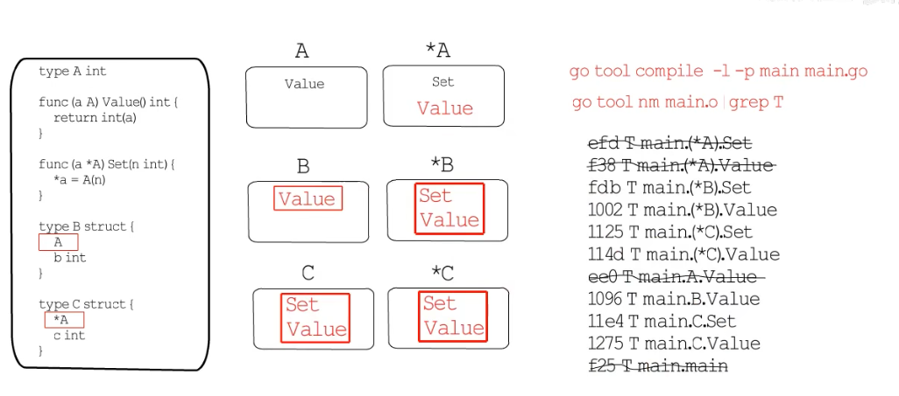
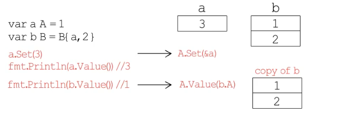
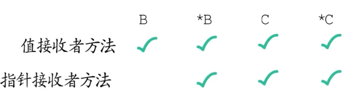

> go tool compile -l -p main main.go
> go tool nm main.o | grep ' T ' | grep People

通过上面的命令: 只编译不链接,排除掉编译器内联优化造成的干扰,得到编译后的OBJ文件main.o再借助`go tool nm`命令.就可以查看对应类型的方法列表了.

<br>

> 为什么B类型只继承A类型的方法,没有继承*A类型的方法?



这是因为以B为接收者调用方法时,方法操作的已经是B的副本了,无法获取嵌入的A的原始地址,而*A的方法从语义上来讲,需要操作原始变量,也就是说,对于B而言,它继承\*A的方法时没有意义的.所有编译器并没有给B生成Set方法.
```go
func (b B) Set(n int) {
	b.A.Set(n) //此时b为副本
}
```


结论:

