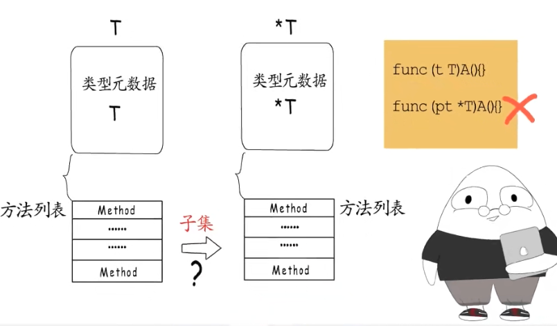
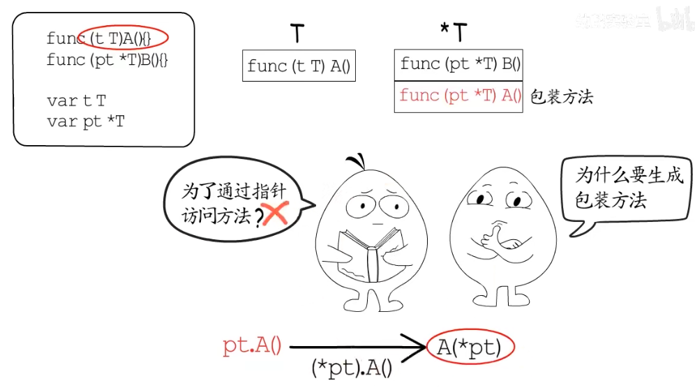
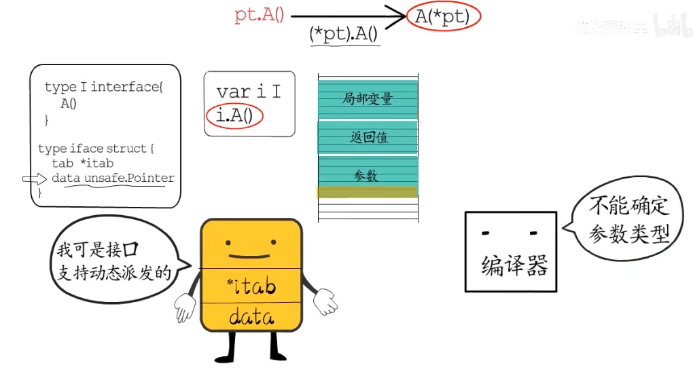
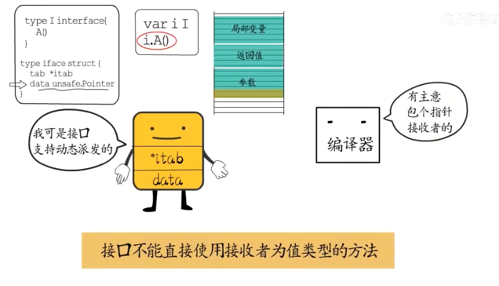
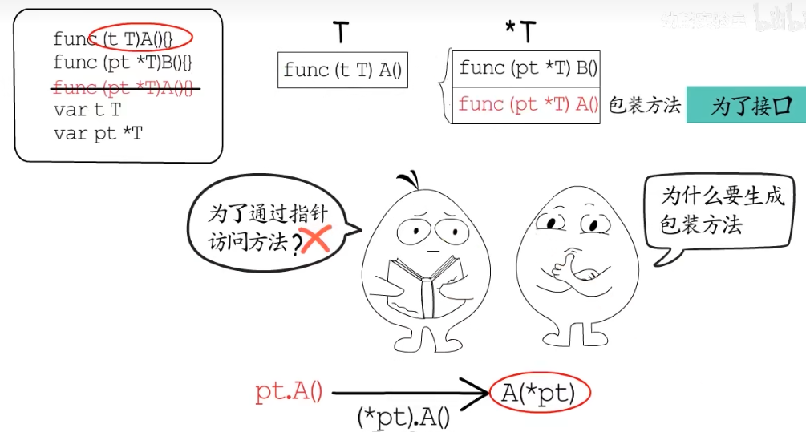
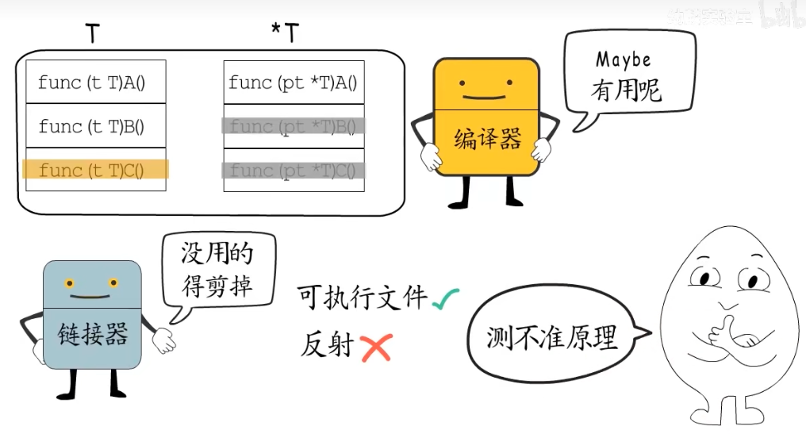

> T和*T的方法集是啥关系?

> 为什么要限制T和*T不能定义同名方法?

基于类型元数据相关知识,T和*T是两种类型,分别有自己的类型元数据,而根据自定义类型的类型元数据,可以找到该类型关联的方法列表.既然T和\*T各有各的方法集.那为什么还要限制T和\*T不能定义同名方法?又怎么会有"*T的方法集包含T的方法集"的说法呢?

首先,可以确定的是,T的方法集中,全部都是有明确定义的,接收者为T类型的方法,而*T的方法集里,除了有明确定义接受者为\*T的方法以外,还会有编译器生成的一些"包装方法". 这些包装方法,是对接收者为T类型的同名方法的"包装".为什么编译器要为接收者为T的方法,包装一个接收者为\*T的同名方法呢?

这里首先要明确一点,通过\*T类型的变量直接调用T类型接收者的方法,只是一种语法糖,经验证这种调用方式,编译器会在调用端进行指针解引用,并不会用到这里的包装方法.

实际上编译器生成包装方法,主要是为了支持接口,还记得接口的数据结构吗? 涉及到方法的自然是非空接口,它只包含两个指针,一个和类型元数据相关,一个和接口装载的数据相关.虽然有数据指针,但却不能像语法糖那样,通过指针解引用来调用值接收者的方法,至于原因: 方法的接收者是方法调用时隐含的第一个参数,go语言中函数参数是通过栈来传递的.如果参数是指针类型,那就很好实现,平台确定了,指针大小就确定了,但如果要解引用为值类型,就要有明确的类型信息,编译器才能确定这个参数要在栈上占用多大空间,而对于接口,编译阶段并不能确定他会装载哪一类数据,所以编译器并不能生成对应的指针来解引用.

总而言之,接口不能直接使用接收者为值类型的方法. 面对这个问题,编译器选择为值接收者的方法,生成指针接收者的"同名"包装方法这一解决方法,也正因为如此,如果我们再给T和*T定义同名方法,就有可能和编译器生成的包装方法发生冲突,所以go语言干脆不允许为T和\*T定义同名方法.

至于,\*T的方法集包含T的方法集的所有方法,这种说法可以这样理解,虽然"编译器"会为所有的接收者为T的方法,生成接收者为*T的包装方法,但是"链接器"会把程序中确定不会用到的方法都裁剪掉,所以如果去分析可执行文件的话,就会发现不只是这些包装方法,就连我们明确定义的方法,也不一定会存在于可执行文件中.
