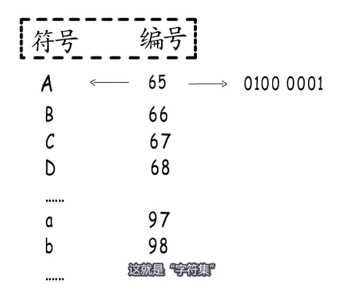
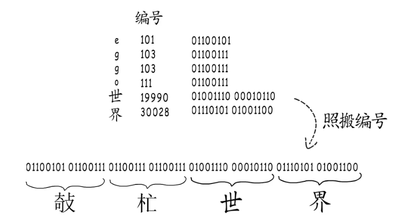
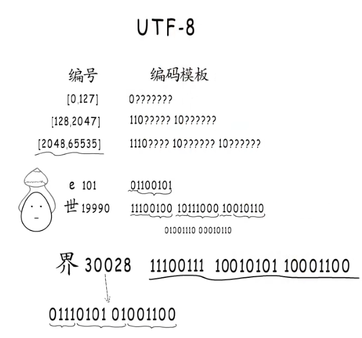

> go 中字符咋存?

> utf8咋编码?

> go 中 string啥结构?

一个比特可以是0,或者是1,8个比特组成一个字节,全为0时代表数字0,全为1时代表数字255.一个字节可以表示256个数字.两个字节可以表示65536个数字.更多的字节可以有更多的组合,就可以表达更大的数值范围.整数可以这样存,那字符呢? 一堆二进制的0和1,怎么也算不出字母A吧?不能直接表示,那么通过数字中转一下.只要给字符指定一个数值编码,要存储字符时,就存储这个数值.要读取时,按照映射关系找到这个字符.像这样收录许多字符然后给它们一一编号,得到一个字符编号对照表.这就是字符集!

ASCII字符集只收录了128个字符,其扩展字符集也只有256个,没有汉字咋行!所以出现了GB2313,繁体字也不行呀!因此又出现了BIG5..等等 与其不断推出收录更多字符的字符集,莫不如本着全球化统一标准的目的,制作一个通用字符集,unicode学术学会就是这样做的!这样unicdeo字符集就诞生了.它实现了跨语言,跨平台的文本转换与处理.

字符集促成了字符与二进制的合作,但是有了字符集就行了吗?那怎么存储这个内容(eggo世界)呢?

直接的想法是找到每个字符对应的编号存成二进制.如果使用unicode字符集,拿到它们的编号.
直接组合会得到这样一大串二进制位,问题出现了,你怎么知道这一长串内容要怎样划分呢?

所以照搬编号的方式行不通!

既然主要问题是划分字符边界.那就可以这样,不管编号多大多小,统一按最长的来,位数不够高位补零!这就是定长编码.但是它很浪费内存!而且字符串收录的字符越多,编号跨度就越大,定长编码造成的浪费就越显著!

既然定长编码不行,那就"变长编码"! 来看看utf8编码.

 
所以想要存储字符要通过字符集配合编码才行!