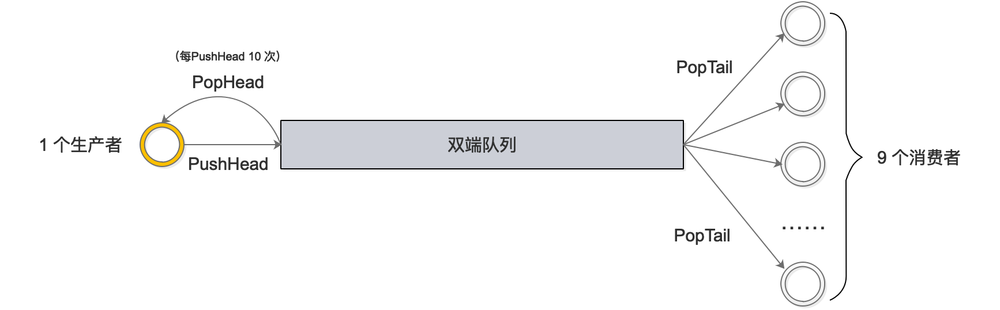
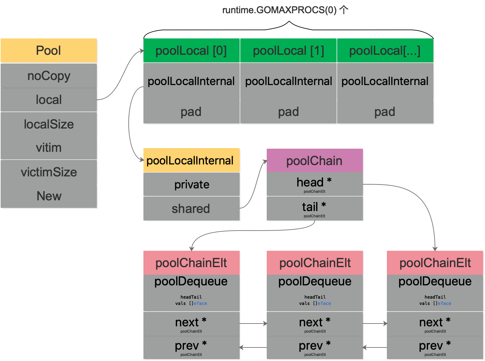
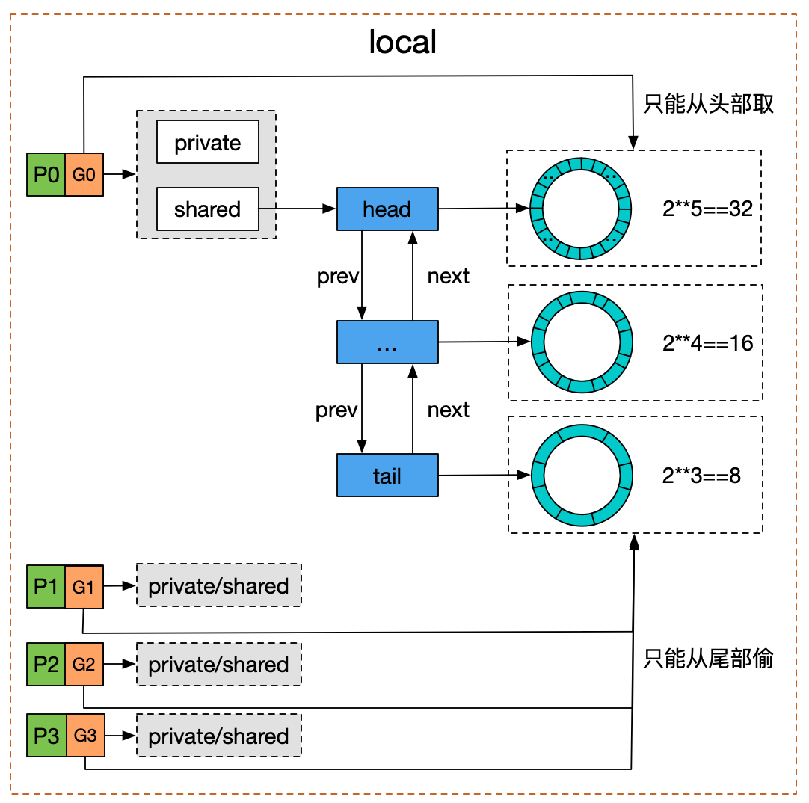

[TOC]

# sync.Pool 

## 是什么?
`sync.Pool` 是 `sync` 包下的一个组件，可以作为`保存临时取还对象的一个“池子”`。个人觉得它的名字有一定的误导性，因为 Pool 里装的对象可以`被无通知地被回收`，可能 `sync.Cache` 是一个更合适的名字。

## 有什么用?

对于很多需要重复分配、回收内存的地方，`sync.Pool` 是一个很好的选择。频繁地分配、回收内存会给 GC 带来一定的负担，严重的时候会引起 CPU 的毛刺，而 `sync.Pool` 可以将暂时不用的对象缓存起来，待下次需要的时候直接使用，不用再次经过内存分配，复用对象的内存，减轻 GC 的压力，提升系统的性能。

## 怎么用?

首先，`sync.Pool` 是协程安全的，这对于使用者来说是极其方便的。使用前，设置好对象的 `New` 函数，用于在 `Pool` 里没有缓存的对象时，创建一个。之后，在程序的任何地方、任何时候仅通过 `Get()、Put()` 方法就可以取、还对象了。


《Go 夜读》上关于 sync.Pool 的分享，关于适用场景：
> 当多个 goroutine 都需要创建同⼀个对象的时候，如果 goroutine 数过多，导致对象的创建数⽬剧增，进⽽导致 GC 压⼒增大。形成 “并发⼤－占⽤内存⼤－GC 缓慢－处理并发能⼒降低－并发更⼤”这样的恶性循环。
> 
> 在这个时候，需要有⼀个对象池，每个 goroutine 不再⾃⼰单独创建对象，⽽是从对象池中获取出⼀个对象（如果池中已经有的话）。

因此关键思想就是对象的复用，避免重复创建、销毁，下面我们来看看如何使用。

### 简单的例子

```go
var spool *sync.Pool

type Person struct {
	Name string
}

func initPool() {
	spool = &sync.Pool{
		New: func() any {
			fmt.Println("creating a new Person")
			return new(Person)
		},
	}
}

func main() {
	initPool()
	p := spool.Get().(*Person)
	fmt.Println("首次从 pool 里获取：", p)

	p.Name = "first"
	fmt.Printf("设置 p.Name = %s\n", p.Name)

	spool.Put(p)

	fmt.Println("Pool 里已有一个对象：&{first}，调用 Get: ", spool.Get().(*Person))
	fmt.Println("Pool 没有对象了，调用 Get: ", spool.Get().(*Person))
}
```
运行结果：
```go
creating a new Person
首次从 pool 里获取： &{}
设置 p.Name = first
Pool 里已有一个对象：&{first}，调用 Get:  &{first}
creating a new Person
Pool 没有对象了，调用 Get:  &{}
```
首先，需要初始化 Pool，唯一需要的就是设置好 New 函数。当调用 Get 方法时，如果池子里缓存了对象，就直接返回缓存的对象。如果没有存货，则调用 New 函数创建一个新的对象。

另外，我们发现 Get 方法取出来的对象和上次 Put 进去的对象实际上是同一个，Pool 没有做任何“清空”的处理。但我们不应当对此有任何假设，因为在实际的并发使用场景中，无法保证这种顺序，`最好的做法是在 Put 前，将对象清空`。

### fmt 包如何用的?
这部分主要看 fmt.Printf 如何使用：
```go
func Printf(format string, a ...interface{}) (n int, err error) {
	return Fprintf(os.Stdout, format, a...)
}
```
继续看 Fprintf：
```go
func Fprintf(w io.Writer, format string, a ...interface{}) (n int, err error) {
	p := newPrinter()
	p.doPrintf(format, a)
	n, err = w.Write(p.buf)
	p.free()
	return
}
```
Fprintf 函数的参数是一个 io.Writer，Printf 传的是 os.Stdout，相当于直接输出到标准输出。这里的 newPrinter 用的就是 Pool：
```go
// newPrinter allocates a new pp struct or grabs a cached one.
func newPrinter() *pp {
	p := ppFree.Get().(*pp)
	p.panicking = false
	p.erroring = false
	p.wrapErrs = false
	p.fmt.init(&p.buf)
	return p
}

var ppFree = sync.Pool{
	New: func() interface{} { return new(pp) },
}
```
回到 Fprintf 函数，拿到 pp 指针后，会做一些 format 的操作，并且将 p.buf 里面的内容写入 w。最后，调用 free 函数，将 pp 指针归还到 Pool 中：
```go
// free saves used pp structs in ppFree; avoids an allocation per invocation.
func (p *pp) free() {
	if cap(p.buf) > 64<<10 {
		return
	}

	p.buf = p.buf[:0]
	p.arg = nil
	p.value = reflect.Value{}
	p.wrappedErr = nil
	ppFree.Put(p)
}
```
`归还到 Pool 前将对象的一些字段清零`，这样，通过 Get 拿到缓存的对象时，就可以安全地使用了。


### pool_test文件

通过 test 文件学习源码是一个很好的途径，因为它代表了“官方”的用法。更重要的是，测试用例会故意测试一些“坑”，学习这些坑，也会让自己在使用的时候就能学会避免。

`pool_test` 文件里共有 7 个测试，4 个 BechMark。

`TestPool` 和 `TestPoolNew` 比较简单，主要是测试 Get/Put 的功能。我们来看下 `TestPoolNew`：
```go
func TestPoolNew(t *testing.T) {
	// disable GC so we can control when it happens.
	defer debug.SetGCPercent(debug.SetGCPercent(-1))

	i := 0
	p := Pool{
		New: func() interface{} {
			i++
			return i
		},
	}
	if v := p.Get(); v != 1 {
		t.Fatalf("got %v; want 1", v)
	}
	if v := p.Get(); v != 2 {
		t.Fatalf("got %v; want 2", v)
	}

	// Make sure that the goroutine doesn't migrate to another P
	// between Put and Get calls.
	Runtime_procPin()
	p.Put(42)
	if v := p.Get(); v != 42 {
		t.Fatalf("got %v; want 42", v)
	}
	Runtime_procUnpin()

	if v := p.Get(); v != 3 {
		t.Fatalf("got %v; want 3", v)
	}
}
```
首先设置了 `GC=-1`，作用就是`停止 GC`.那为啥要用 defer？函数都跑完了，还要 defer 干啥。注意到，`debug.SetGCPercent` 这个函数被调用了两次，而且`这个函数返回的是上一次 GC 的值`。因此，defer 在这里的用途是还原到调用此函数之前的 GC 设置，也就是恢复现场。

接着，调置了 Pool 的 New 函数：直接返回一个 int，变且每次调用 New，都会自增 1。然后，连续调用了两次 Get 函数，因为这个时候 Pool 里没有缓存的对象，因此每次都会调用 New 创建一个，所以第一次返回 1，第二次返回 2。

然后，调用 `Runtime_procPin()` 防止 `goroutine` 被强占，目的是保护接下来的一次 Put 和 Get 操作，使得它们操作的对象都是同一个 P 的“池子”。并且，这次调用 Get 的时候并没有调用 New，因为之前有一次 Put 的操作。

最后，再次调用 Get 操作，因为没有“存货”，因此还是会再次调用 New 创建一个对象。

`TestPoolGC` 和 `TestPoolRelease` 则主要测试 GC 对 Pool 里对象的影响。这里用了一个函数，用于计数有多少对象会被 GC 回收：
```go
runtime.SetFinalizer(v, func(vv *string) {
	atomic.AddUint32(&fin, 1)
})
```
当垃圾回收检测到 v 是一个不可达的对象时，并且 v 又有一个关联的 Finalizer，就会另起一个 goroutine 调用设置的 finalizer 函数，也就是上面代码里的参数 func。这样，就会让对象 v 重新可达，从而在这次 GC 过程中不被回收。之后，解绑对象 v 和它所关联的 Finalizer，当下次 GC 再次检测到对象 v 不可达时，才会被回收。

`TestPoolStress 从名字看，主要是想测一下“压力”，具体操作就是起了 10 个 goroutine 不断地向 Pool 里 Put 对象，然后又 Get 对象，看是否会出错。

`TestPoolDequeue` 和 `TestPoolChain`，都调用了 `testPoolDequeue`，这是具体干活的。它需要传入一个 `PoolDequeue` 接口：
```go
// poolDequeue testing.
type PoolDequeue interface {
	PushHead(val interface{}) bool
	PopHead() (interface{}, bool)
	PopTail() (interface{}, bool)
}
```
`PoolDequeue` 是一个双端队列，可以从头部入队元素，从头部和尾部出队元素。调用函数时，前者传入 `NewPoolDequeue(16)`，后者传入 `NewPoolChain()`，底层其实都是 `poolDequeue` 这个结构体。具体来看 `testPoolDequeue` 做了什么：


总共起了 10 个 goroutine：1 个生产者，9 个消费者。生产者不断地从队列头 pushHead 元素到双端队列里去，并且每 push 10 次，就 popHead 一次；消费者则一直从队列尾取元素。不论是从队列头还是从队列尾取元素，都会在 map 里做标记，最后检验每个元素是不是只被取出过一次。

剩下的就是 Benchmark 测试了。第一个 BenchmarkPool 比较简单，就是不停地 Put/Get，测试性能。

BenchmarkPoolSTW 函数会先关掉 GC，再向 pool 里 put 10 个对象，然后强制触发 GC，记录 GC 的停顿时间，并且做一个排序，计算 P50 和 P95 的 STW 时间。这个函数可以加入个人的代码库了：
```go
func BenchmarkPoolSTW(b *testing.B) {
	// Take control of GC.
	defer debug.SetGCPercent(debug.SetGCPercent(-1))

	var mstats runtime.MemStats
	var pauses []uint64

	var p Pool
	for i := 0; i < b.N; i++ {
		// Put a large number of items into a pool.
		const N = 100000
		var item interface{} = 42
		for i := 0; i < N; i++ {
			p.Put(item)
		}
		// Do a GC.
		runtime.GC()
		// Record pause time.
		runtime.ReadMemStats(&mstats)
		pauses = append(pauses, mstats.PauseNs[(mstats.NumGC+255)%256])
	}

	// Get pause time stats.
	sort.Slice(pauses, func(i, j int) bool { return pauses[i] < pauses[j] })
	var total uint64
	for _, ns := range pauses {
		total += ns
	}
	// ns/op for this benchmark is average STW time.
	b.ReportMetric(float64(total)/float64(b.N), "ns/op")
	b.ReportMetric(float64(pauses[len(pauses)*95/100]), "p95-ns/STW")
	b.ReportMetric(float64(pauses[len(pauses)*50/100]), "p50-ns/STW")
}
```
输出:
```go
goos: darwin
goarch: arm64
pkg: sync
BenchmarkPoolSTW
BenchmarkPoolSTW-8   	     552	     16232 ns/op	     16708 p50-ns/STW	     17917 p95-ns/STW	 2098755 B/op	      30 allocs/op
PASS
ok  	sync	1.687s
```
最后一个 BenchmarkPoolExpensiveNew 测试当 New 的代价很高时，Pool 的表现。也可以加入个人的代码库。

### 其他
标准库中 `encoding/json` 也用到了 `sync.Pool` 来提升性能。著名的 `gin` 框架，对 `context` 取用也到了 sync.Pool。
```go
engine.pool.New = func() interface{} {
	return engine.allocateContext()
}

func (engine *Engine) allocateContext() *Context {
	return &Context{engine: engine, KeysMutex: &sync.RWMutex{}}
}
```
使用:
```go
// ServeHTTP conforms to the http.Handler interface.
func (engine *Engine) ServeHTTP(w http.ResponseWriter, req *http.Request) {
	c := engine.pool.Get().(*Context)
	c.writermem.reset(w)
	c.Request = req
	c.reset()

	engine.handleHTTPRequest(c)

	engine.pool.Put(c)
}
```
先调用 `Get` 取出来缓存的对象，然后会做一些 reset 操作，再执行 handleHTTPRequest，最后再 Put 回 Pool。

另外，Echo 框架也使⽤了 sync.Pool 来管理 context，并且⼏乎达到了零堆内存分配：
> It leverages sync pool to reuse memory and achieve zero dynamic memory allocation with no GC overhead.


## 源码分析

### sync.Pool结构体
```go
// A Pool must not be copied after first use.
type Pool struct {
	noCopy noCopy

    // 每个 P 的本地队列，实际类型为 [P]poolLocal
	local     unsafe.Pointer // local fixed-size per-P pool, actual type is [P]poolLocal
	// [P]poolLocal的大小
	localSize uintptr        // size of the local array

	victim     unsafe.Pointer // local from previous cycle
	victimSize uintptr        // size of victims array

	// 自定义的对象创建回调函数，当 pool 中无可用对象时会调用此函数
	New func() interface{}
}
```
因为 Pool 不希望被复制，所以结构体里有一个 `noCopy` 的字段，使用 `go vet` 工具可以检测到用户代码是否复制了 Pool。

> noCopy 是 go1.7 开始引入的一个静态检查机制。它不仅仅工作在运行时或标准库，同时也对用户代码有效。

> 用户只需实现这样的不消耗内存、仅用于静态分析的结构，来保证一个对象在第一次使用后不会发生复制。

实现非常简单：
```go
// noCopy 用于嵌入一个结构体中来保证其第一次使用后不会被复制
//
// 见 https://golang.org/issues/8005#issuecomment-190753527
type noCopy struct{}

// Lock 是一个空操作用来给 `go vet` 的 -copylocks 静态分析
func (*noCopy) Lock()   {}
func (*noCopy) Unlock() {}
```

local 字段存储指向 [P]poolLocal 数组（严格来说，它是一个切片）的指针，localSize 则表示 local 数组的大小。访问时，P 的 id 对应 [P]poolLocal 下标索引。通过这样的设计，多个 goroutine 使用同一个 Pool 时，减少了竞争，提升了性能。

在一轮 GC 到来时，victim 和 victimSize 会分别“接管” local 和 localSize。victim 的机制用于减少 GC 后冷启动导致的性能抖动，让分配对象更平滑。

> Victim Cache 本来是计算机架构里面的一个概念，是 CPU 硬件处理缓存的一种技术，sync.Pool 引入的意图在于降低 GC 压力的同时提高命中率。

当 Pool 没有缓存的对象时，调用 New 方法生成一个新的对象。
```go
type poolLocal struct {
	poolLocalInternal

	// 将 poolLocal 补齐至两个缓存行的倍数，防止 false sharing,
	// 每个缓存行具有 64 bytes，即 512 bit
	// 目前我们的处理器一般拥有 32 * 1024 / 64 = 512 条缓存行
	// 伪共享，仅占位用，防止在 cache line 上分配多个 poolLocalInternal
	pad [128 - unsafe.Sizeof(poolLocalInternal{})%128]byte
}

// Local per-P Pool appendix.
type poolLocalInternal struct {
    // P 的私有缓存区，使用时无需要加锁
	private interface{}
	// 公共缓存区。本地 P 可以 pushHead/popHead；其他 P 则只能 popTail
	shared  poolChain
}
```
字段 pad 主要是防止 false sharing，董大的《什么是 cpu cache》里讲得比较好：
> 现代 cpu 中，cache 都划分成以 cache line (cache block) 为单位，在 x86_64 体系下一般都是 64 字节，cache line 是操作的最小单元。

> 程序即使只想读内存中的 1 个字节数据，也要同时把附近 63 节字加载到 cache 中，如果读取超个 64 字节，那么就要加载到多个 cache line 中。

简单来说，如果没有 pad 字段，那么当需要访问 0 号索引的 poolLocal 时，CPU 同时会把 0 号和 1 号索引同时加载到 cpu cache。在只修改 0 号索引的情况下，会让 1 号索引的 poolLocal 失效。这样，当其他线程想要读取 1 号索引时，发生 cache miss，还得重新再加载，对性能有损。增加一个 pad，补齐缓存行，让相关的字段能独立地加载到缓存行就不会出现 false sharding 了。

`poolChain` 是一个双端队列的实现：
```go
type poolChain struct {
	// 只有生产者会 push to，不用加锁
	head *poolChainElt

	// 读写需要原子控制。 pop from
	tail *poolChainElt
}

type poolChainElt struct {
	poolDequeue

	// next 被 producer 写，consumer 读。所以只会从 nil 变成 non-nil
	// prev 被 consumer 写，producer 读。所以只会从 non-nil 变成 nil
	next, prev *poolChainElt
}

type poolDequeue struct {
	// The head index is stored in the most-significant bits so
	// that we can atomically add to it and the overflow is
	// harmless.
	// headTail 包含一个 32 位的 head 和一个 32 位的 tail 指针。这两个值都和 len(vals)-1 取模过。
	// tail 是队列中最老的数据，head 指向下一个将要填充的 slot
    // slots 的有效范围是 [tail, head)，由 consumers 持有。
	headTail uint64

	// vals 是一个存储 interface{} 的环形队列，它的 size 必须是 2 的幂
	// 如果 slot 为空，则 vals[i].typ 为空；否则，非空。
	// 一个 slot 在这时宣告无效：tail 不指向它了，vals[i].typ 为 nil
	// 由 consumer 设置成 nil，由 producer 读
	vals []eface
}
```
> poolDequeue 被实现为单生产者、多消费者的固定大小的无锁（atomic 实现） Ring 式队列（底层存储使用数组，使用两个指针标记 head、tail）。生产者可以从 head 插入、head 删除，而消费者仅可从 tail 删除。

> headTail 指向队列的头和尾，通过位运算将 head 和 tail 存入 headTail 变量中。

我们用一幅图来完整地描述 Pool 结构体：


结合木白的技术私厨的《请问sync.Pool有什么缺点?》里的一张图，对于双端队列的理解会更容易一些：


我们看到 `Pool` 并没有直接使用 `poolDequeue`，原因是它的大小是固定的，而 `Pool` 的大小是没有限制的。因此，在 `poolDequeue` 之上包装了一下，变成了一个 `poolChainElt` 的双向链表，可以动态增长。


### Get()
```go
func (p *Pool) Get() interface{} {
    // ......
	l, pid := p.pin()
	x := l.private
	l.private = nil
	if x == nil {
		x, _ = l.shared.popHead()
		if x == nil {
			x = p.getSlow(pid)
		}
	}
	runtime_procUnpin()
    // ......
	if x == nil && p.New != nil {
		x = p.New()
	}
	return x
}
```
省略号的内容是 `race` 相关的，属于阅读源码过程中的一些噪音，暂时注释掉。这样，Get 的整个过程就非常清晰了：
1. 首先，调用 p.pin() 函数将当前的 goroutine 和 P 绑定，禁止被抢占，返回当前 P 对应的 poolLocal，以及 pid。

2. 然后直接取 l.private，赋值给 x，并置 l.private 为 nil。

3. 判断 x 是否为空，若为空，则尝试从 l.shared 的头部 pop 一个对象出来，同时赋值给 x。

4. 如果 x 仍然为空，则调用 getSlow 尝试从其他 P 的 shared 双端队列尾部“偷”一个对象出来。

5. Pool 的相关操作做完了，调用 runtime_procUnpin() 解除非抢占。

6. 最后如果还是没有取到缓存的对象，那就直接调用预先设置好的 New 函数，创建一个出来。


// ...


## 总结

关于 `sync.Pool` 的要点：
1. 关键思想是对象的复用，避免重复创建、销毁。将暂时不用的对象缓存起来，待下次需要的时候直接使用，不用再次经过内存分配，复用对象的内存，减轻 GC 的压力。

2. sync.Pool 是协程安全的，使用起来非常方便。设置好 New 函数后，调用 Get 获取，调用 Put 归还对象。

3. Go 语言内置的 fmt 包，encoding/json 包都可以看到 sync.Pool 的身影；gin，Echo 等框架也都使用了 sync.Pool。

4. 不要对 Get 得到的对象有任何假设，更好的做法是归还对象时，将对象“清空”。

5. Pool 里对象的生命周期受 GC 影响，不适合于做连接池，因为连接池需要自己管理对象的生命周期。

6. Pool 不可以指定⼤⼩，⼤⼩只受制于 GC 临界值。

7. procPin 将 G 和 P 绑定，防止 G 被抢占。在绑定期间，GC 无法清理缓存的对象。

8. 在加入 victim(受害者) 机制前，sync.Pool 里对象的最⼤缓存时间是一个 GC 周期，当 GC 开始时，没有被引⽤的对象都会被清理掉；加入 victim 机制后，最大缓存时间为两个 GC 周期。

9. Victim Cache 本来是计算机架构里面的一个概念，是 CPU 硬件处理缓存的一种技术，sync.Pool 引入的意图在于降低 GC 压力的同时提高命中率。

10. sync.Pool 的最底层使用切片加链表来实现双端队列，并将缓存的对象存储在切片中。


## 参考资料
【深度解密 Go 语言之 sync.Pool】https://www.cnblogs.com/qcrao-2018/p/12736031.html#%E6%98%AF%E4%BB%80%E4%B9%88

【欧神 源码分析】https://changkun.us/archives/2018/09/256/

【Go 夜读】https://reading.hidevops.io/reading/20180817/2018-08-17-sync-pool-reading.pdf

【夜读第 14 期视频】https://www.youtube.com/watch?v=jaepwn2PWPk&list=PLe5svQwVF1L5bNxB0smO8gNfAZQYWdIpI

【源码分析，伪共享】https://juejin.im/post/5d4087276fb9a06adb7fbe4a

【golang的对象池sync.pool源码解读】https://zhuanlan.zhihu.com/p/99710992

【理解 Go 1.13 中 sync.Pool 的设计与实现】https://zhuanlan.zhihu.com/p/110140126

【优缺点，图】http://cbsheng.github.io/posts/golang标准库sync.pool原理及源码简析/

【xiaorui 优化锁竞争】http://xiaorui.cc/archives/5878

【性能优化之路，自定义多种规格的缓存】https://blog.cyeam.com/golang/2017/02/08/go-optimize-slice-pool

【sync.Pool 有什么缺点】https://mp.weixin.qq.com/s?__biz=MzA4ODg0NDkzOA==&mid=2247487149&idx=1&sn=f38f2d72fd7112e19e97d5a2cd304430&source=41#wechat_redirect

【1.12 和 1.13 的演变】https://github.com/watermelo/dailyTrans/blob/master/golang/sync_pool_understand.md

【董泽润 演进】https://www.jianshu.com/p/2e08332481c5

【noCopy】https://github.com/golang/go/issues/8005#issuecomment-190753527

【董泽润 cpu cache】https://www.jianshu.com/p/dc4b5562aad2

【gomemcache 例子】https://docs.kilvn.com/The-Golang-Standard-Library-by-Example/chapter16/16.01.html

【鸟窝 1.13 优化】https://colobu.com/2019/10/08/how-is-sync-Pool-improved-in-Go-1-13/

【A journey with go】https://medium.com/a-journey-with-go/go-understand-the-design-of-sync-pool-2dde3024e277

【封装了一个计数组件】https://www.akshaydeo.com/blog/2017/12/23/How-did-I-improve-latency-by-700-percent-using-syncPool/

【伪共享】http://ifeve.com/falsesharing/
