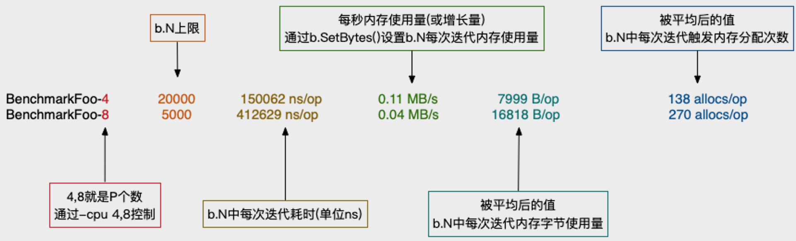
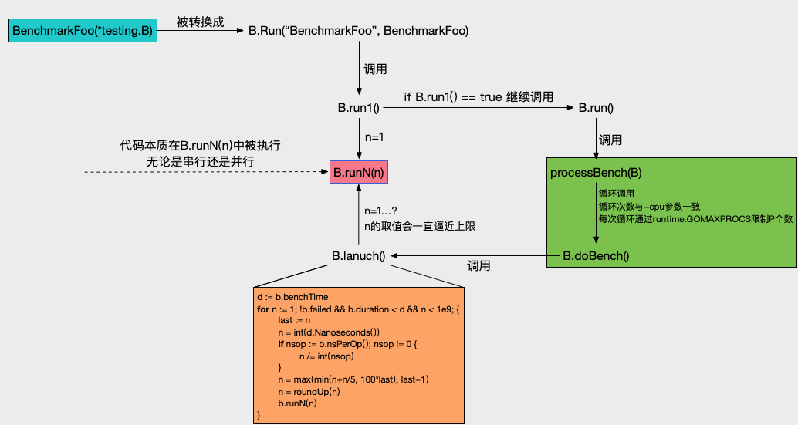

[TOC]

# Benchmark 基准测试

go自带的benchmark是利器，有了它，开发者可以方便快捷地在测试一个函数方法在串行或并行环境下的基准表现。指定一个时间（默认是1秒），看测试对象在达到或超过时间上限时，最多能被执行多少次和在此期间测试对象内存分配情况。

基准测试就是在一定的工作负载之下检测程序性能的一种方法。

基准测试用例的定义如下
```go
func BenchmarkName(b *testing.B){
    // ...
}
```
- 函数名必须以 `Benchmark` 开头，后面一般跟待测试的函数名
- 基准测试并不会默认执行,需要添加 `-bench` 参数。

基准测试必须要执行`b.N`次，这样的测试才有对照性，b.N的值是系统根据实际情况去调整的，从而保证测试的稳定性。

`testing.B`拥有的方法如下：
```go
func (b *B) Cleanup(f func()) 
func (b *B) Setenv(key, value string) 
func (b *B) Error(args ...interface{})
func (b *B) Errorf(format string, args ...interface{})
func (b *B) Fail()
func (b *B) FailNow()
func (b *B) Failed() bool
func (b *B) Fatal(args ...interface{})
func (b *B) Fatalf(format string, args ...interface{})
func (b *B) Log(args ...interface{})
func (b *B) Logf(format string, args ...interface{})
func (b *B) Name() string
func (b *B) Run(name string, f func(b *B)) bool
func (b *B) Skip(args ...interface{})
func (b *B) SkipNow()
func (b *B) Skipf(format string, args ...interface{})
func (b *B) Skipped() bool


func (b *B) RunParallel(body func(*PB))

func (b *B) ReportAllocs() //就是打上标记，在benchmark执行完毕后，输出信息会包括B/op和allocs/op这两项信息。

func (b *B) ReportMetric(n float64, unit string)  
// Extra metrics collected by ReportMetric.通过ReportMetric收集额外指标
func (b *B) SetBytes(n int64)

func (b *B) SetParallelism(p int)
// SetParallelism将RunParallel使用的goroutine数量设置为p*GOMAXPROCS。
// 对于CPU-bound benchmarks，通常不需要调用SetParallelism。如果p小于1，此调用将无效。

func (b *B) ResetTimer() // 重置计时器
// ResetTimer 将经过的基准测试时间和内存分配计数器归零，并删除用户报告的指标。 它不影响定时器是否运行。
func (b *B) StartTimer() // 开始计时器
// StartTimer开始计时测试。此函数在基准测试开始之前自动调用，但它也可以用于在调用StopTimer后恢复计时。
func (b *B) StopTimer() // 暂停计时器
// StopTimer停止计时测试。这可用于暂停计时器，同时执行您不想测量的复杂初始化。
```
`Split函数`
```go
func Split(s, sep string) (result []string) {
	result = make([]string, 0, strings.Count(s, sep)+1)
	i := strings.Index(s, sep)
	for i > -1 {
		result = append(result, s[:i])
		s = s[i+len(sep):] // 这里使用len(sep)获取sep的长度
		i = strings.Index(s, sep)
	}
	result = append(result, s)
	return
}
```


我们为split包中的`Split函数`编写基准测试如下：
```go
func BenchmarkSplit(b *testing.B) { 
	for i := 0; i < b.N; i++ { //串行用法
		Split("沙河有沙又有河", "沙")
	}
}
```

基准测试并不会默认执行，需要增加`-bench`参数，所以我们通过执行`go test -bench=Split`命令执行基准测试，输出结果如下：

```go
split $ go test -bench=Split
goos: darwin
goarch: amd64
pkg: github.com/Q1mi/studygo/code_demo/test_demo/split
BenchmarkSplit-8        10000000               203 ns/op
PASS
ok      github.com/Q1mi/studygo/code_demo/test_demo/split       2.255s
```
其中`BenchmarkSplit-8`表示对`Split`函数进行基准测试，`数字8`表示`GOMAXPROCS`的值，这个对于并发基准测试很重要。`10000000`和`203ns/op`表示`每次调用Split函数耗时203ns`，这个结果是10000000次调用的平均值。

我们还可以为基准测试添加`-benchmem`参数，来获得内存分配的统计数据。
```go
split $ go test -bench=Split -benchmem
goos: darwin
goarch: amd64
pkg: github.com/Q1mi/studygo/code_demo/test_demo/split
BenchmarkSplit-8        10000000               215 ns/op             112 B/op          3 allocs/op
PASS
ok      github.com/Q1mi/studygo/code_demo/test_demo/split       2.394s
```
其中，`112 B/op`表示`每次操作内存分配了112字节`，`3 allocs/op`则表示`每次操作进行了3次内存分配`。


<br>
<br>

## 性能比较函数

上面的基准测试只能得到给定操作的绝对耗时，但是在很多性能问题是发生在两个不同操作之间的相对耗时，比如同一个函数处理1000个元素的耗时与处理1万甚至100万个元素的耗时的差别是多少？再或者对于同一个任务究竟使用哪种算法性能最佳？我们通常需要对两个不同算法的实现使用相同的输入来进行基准比较测试

性能比较函数通常是一个带有参数的函数，被多个不同的Benchmark函数传入不同的值来调用。举个例子如下：
```go
func benchmark(b *testing.B, size int){/* ... */}
func Benchmark10(b *testing.B){ benchmark(b, 10) }
func Benchmark100(b *testing.B){ benchmark(b, 100) }
func Benchmark1000(b *testing.B){ benchmark(b, 1000) }
```
例如我们编写了一个计算斐波那契数列的函数如下：
```go
// fib.go

// Fib 是一个计算第n个斐波那契数的函数
func Fib(n int) int {
	if n < 2 {
		return n
	}
	return Fib(n-1) + Fib(n-2)
}
```

我们编写的性能比较函数如下：
```go
// fib_test.go
func benchmarkFib(b *testing.B, n int) {
	for i := 0; i < b.N; i++ {//串行用法
		Fib(n)
	}
}

func BenchmarkFib1(b *testing.B)  { benchmarkFib(b, 1) }
func BenchmarkFib2(b *testing.B)  { benchmarkFib(b, 2) }
func BenchmarkFib3(b *testing.B)  { benchmarkFib(b, 3) }
func BenchmarkFib10(b *testing.B) { benchmarkFib(b, 10) }
func BenchmarkFib20(b *testing.B) { benchmarkFib(b, 20) }
func BenchmarkFib40(b *testing.B) { benchmarkFib(b, 40) }
```

运行基准测试：
```go
split $ go test -bench=.
goos: darwin
goarch: amd64
pkg: github.com/Q1mi/studygo/code_demo/test_demo/fib
BenchmarkFib1-8         1000000000               2.03 ns/op
BenchmarkFib2-8         300000000                5.39 ns/op
BenchmarkFib3-8         200000000                9.71 ns/op
BenchmarkFib10-8         5000000               325 ns/op
BenchmarkFib20-8           30000             42460 ns/op
BenchmarkFib40-8               2         638524980 ns/op
PASS
ok      github.com/Q1mi/studygo/code_demo/test_demo/fib 12.944s
```
这里需要注意的是，默认情况下，每个基准测试至少运行1秒。如果在Benchmark函数返回时没有到1秒，则b.N的值会按1,2,5,10,20,50，…增加，并且函数再次运行。

最终的BenchmarkFib40只运行了两次，每次运行的平均值只有不到一秒。像这种情况下我们应该可以使用`-benchtime标志增加最小基准时间`，以产生更准确的结果。例如：
```go
split $ go test -bench=Fib40 -benchtime=20s
goos: darwin
goarch: amd64
pkg: github.com/Q1mi/studygo/code_demo/test_demo/fib
BenchmarkFib40-8              50         663205114 ns/op
PASS
ok      github.com/Q1mi/studygo/code_demo/test_demo/fib 33.849s
```
这一次BenchmarkFib40函数运行了50次，结果就会更准确一些了。

<br>
<br>

## 重置时间
`b.ResetTimer`之前的处理不会放到执行时间里，也不会输出到报告中，所以可以在之前做一些不计划作为测试报告的操作。例如：
```go
func BenchmarkSplit(b *testing.B) {
	time.Sleep(5 * time.Second) // 假设需要做一些耗时的无关操作
	b.ResetTimer()              // 重置计时器
	for i := 0; i < b.N; i++ {  //串行用法
		Split("沙河有沙又有河", "沙")
	}
}
```

>  Start/Stop/ResetTimer()

这三个都是对 计时器 和 内存分配计数器 操作。

benchmark中难免有一些初始化的工作，这些工作耗时不希望被计算进benchmark结果中。

通常做法是
```go
// 串行情况在for循环之前调用
init() // 初始化工作
b.ResetTimer()
for i:=0; i<b.N; i++ { dosomething() }

// 并行情况在b.RunParallel()之前调用
init() // 初始化工作
b.ResetTimer()
b.RunParallel(func(pb *testing.PB) { dosomething() })
```

剩下的StopTimer()和ResetTimer()呢？可以这样用：
```go
init(); // 初始化工作
b.ResetTimer()
for i:=0; i<b.N; i++ { dosomething1() }
b.StopTimer()
otherWork(); // 例如做一些转换工作
b.StartTimer()
for i:=0; i<b.N; i++ { dosomething2() }
```
或者
```go
init(); // 初始化工作
b.ResetTimer()
for i:=0; i<b.N; i++ {
  flag := dosomething()
  if flag {
    b.StopTimer()
  } else {
    b.StartTimer()
  }
}
```

理解好这三个方法本质后灵活运用
```go
func (b *B) StartTimer() {
	if !b.timerOn {
		// 记录当前时间为开始时间 和 内存分配情况
		b.timerOn = true
	}
}
func (b *B) StopTimer() {
	if b.timerOn {
		// 累计记录执行的时间（当前时间 - 记录的开始时间）
        // 累计记录内存分配次数和分配字节数
		b.timerOn = false
	}
}
func (b *B) ResetTimer() {
	if b.timerOn {
		// 记录当前时间为开始时间 和 内存分配情况
	}
	// 清空所有的累计变量
}
```

<br>
<br>

## 并行测试

`func (b *B) RunParallel(body func(*PB))`会以并行的方式执行给定的基准测试。

RunParallel会创建出`多个goroutine`，并将`b.N分配给这些goroutine执行`， 其中`goroutine数量的默认值为GOMAXPROCS`。用户如果想要增加`非CPU受限（non-CPU-bound）基准测试的并行性`， 那么可以在RunParallel之前调用`SetParallelism` 。`RunParallel`通常会与`-cpu`标志一同使用。

```go
 func BenchmarkSplitParallel(b *testing.B) {
	// b.SetParallelism(2) // 设置使用的gorortine数
	b.RunParallel(func(pb *testing.PB) {
		for pb.Next() {
            // 所有 goroutine 一起，循环一共执行 b.N 次
			Split("沙河有沙又有河", "沙")
		}
	})
}
```
执行一下基准测试：
```go
split $ go test -bench=.
goos: darwin
goarch: amd64
pkg: github.com/Q1mi/studygo/code_demo/test_demo/split
BenchmarkSplit-8                10000000               131 ns/op
BenchmarkSplitParallel-8        50000000                36.1 ns/op
PASS
ok      github.com/Q1mi/studygo/code_demo/test_demo/split       3.308s
```
还可以通过在测试命令后添加`-cpu`参数如`go test -bench=. -cpu 1`来指定使用的CPU数量。

<br>
<br>


## testing.Benchmark()

默认benchmark时间(benchtime)上限是1秒，可以通过-test.benchtime来改变:
`flag.Var(&benchTime, "test.benchtime", "run each benchmark for duration `d`")`

不论你写的benchmark运行停止时耗时是1s、1.1s还是60s，benchmark输出结果都是*/op形式，而不是以时间维度的。所以不能认为1秒最多可执行b.N次。

因此想定制benchmark输出的话，那么使用testing.Benchmark()就是最好的方式。例如想看达到b.N时，究竟花了多长时间。

<br>
<br>

## benchmark输出项含义



<br>
<br>

## 原理
以单个Benchmark举例串起流程分析下原理。



如上图，浅蓝色部分就是开发者自行编写的benchmark方法，调用逻辑按箭头方向依次递进。

B.run1()的作用是先尝试跑一次，在这次尝试中要做 `竟态检查` 和 `当前benchmark是否被skip了`​。目的检查当前benchmark是否有必要继续执行。

go test 命令有`-cpu` 参数，用于控制benchmark分别在不同的P数量下执行。这里就对应上图绿色部分，每次通过runtime.GOMAXPROCS(n)更新P个数，然后调用B.doBench()。

核心方法是红色部分的B.runN(n)。形参n值就是b.N值，由外部传进。n不断被逼近上限，逼近策略不能过快，过快可能引起benchmark执行超时。

橙色部分就是逼近策略。先通过n/=int(nsop)来估算b.N的上限，然后再通过n=max(min(n+n/5, 100*last), last+1)计算最后的b.N。benchmark可能是CPU型或IO型，若直接使用第一次估算的b.N值会过于粗暴，可能使结果不准确，所以需要做进一步的约束来逼近。