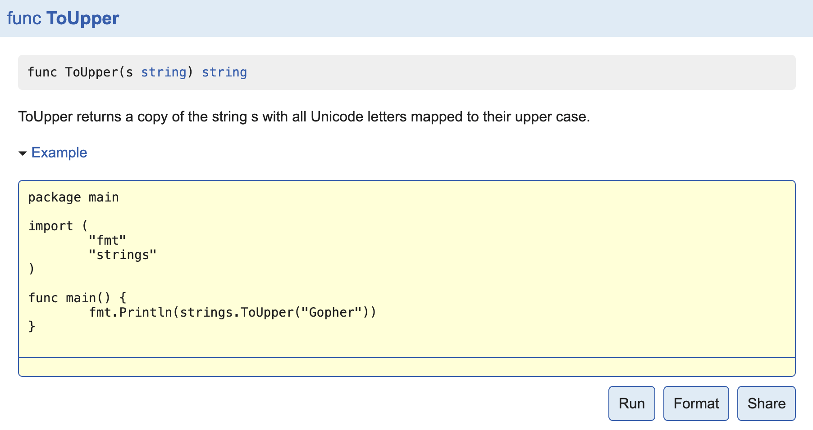

# test
testing 包的工作原理：
	在执行 go test 时会编译每个包和所有后缀匹配 *_test.go 命名的文件（这些测试文件包括一些单元测试和基准测试），
		链接和执行生成的二进制程序, 然后打印每一个测试函数的输出日志。

go test
	当go test以包列表模式运行时，go test会缓存成功的包的测试结果以避免不必要的重复测试。
		当然，有时候我们测试的时候并不喜欢有缓存，我们可以手动禁用缓存。可以通过下列方式禁用缓存：

		1. 带上-count=1参数禁用缓存。
			如，执行下面命令测试，便会禁用缓存测试结果
			go test -v -count=1 filename_test.go

		2. 手动清除测试缓存
			除了在执行测试命令的时候加上禁用缓存参数，我们还可以执行下面的命令手动清除缓存，
				需要注意的是，每次都得清除，不然下次执行的还是上次的结果。
			go clean -testcache

	vscode设置方法:
		在settings.json中 写入 "go.testFlags": ["-v","-count=1"] 项.

## 示例函数
被go test特殊对待的第三种函数就是示例函数，它们的函数名以Example为前缀。它们既没有参数也没有返回值。标准格式如下：
```go
func ExampleName() {
    // ...
}
```

> 示例函数示例

为Split函数编写的一个示例函数：
```go
func ExampleSplit() {
	fmt.Println(split.Split("a:b:c", ":"))
	fmt.Println(split.Split("沙河有沙又有河", "沙"))
	// Output:
	// [a b c]
	// [ 河有 又有河]
}
```

为你的代码编写示例代码有如下三个用处：

1. 示例函数能够作为文档直接使用，例如基于web的godoc中能把示例函数与对应的函数或包相关联。

2. 示例函数只要包含了// Output:也是可以通过go test运行的可执行测试。
```shell
split $ go test -run Example
PASS
ok      github.com/Q1mi/studygo/code_demo/test_demo/split       0.006s
```
3. 示例函数提供了可以直接运行的示例代码，可以直接在golang.org的godoc文档服务器上使用Go Playground运行示例代码。下图为strings.ToUpper函数在Playground的示例函数效果。
