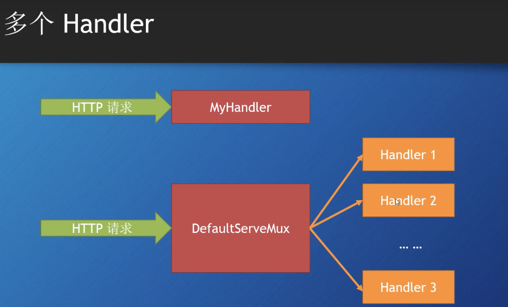

- 如何处理(handle) Web 请求
  - http.Handle函数
  - http.HandleFunc函数


- 创建Web Server
  - http.ListenAndServer()
    - 第一个参数:网络地址.如果为"",那么就是":80"
    - 第二个参数:handler,如果为nil,那么就是DefaultServeMux.


- http.Server是一个struct
  - Addr字段:表示网络地址
  - Handler字段:如果为nil,那么就是DefaultServeMux
  - ListenAndServe()函数


```go
func main() {
server := http.Server{
Addr: ":8080",
}

	log.Println(server.ListenAndServe())
}
```

- Https
  - http.ListenAndSeverTLS()
  - server.ListenAndServerTLS()


- http.Handler 是一个接口.
  - Handler定义了一个方法ServeHTTP(ResponseWriter, *Request).
  - 任何类型只要实现了Handler接口,那么它就是一个Handler.


- DefaultServeMux 是一个multiplexer(多路复用器,可以看做是路由器),它也是一个Handler.


- 多个Handler

- 方式一:
  - 不指定Server struct 里面的Handler字段值.
  - 可以使用http.Handle()将某个handler附加到(注册到)DefaultServeMux.
    - http包有一个Handle函数.
    - ServerMux struct 也有一个Handle方法.
  - 如果调用http.Handle(),实际上调用的是DefaultServeMux上的Handle方法.
    - DefaultServeMux是 ServerMux 的一个指针变量.
- 方式二: 
  - http.HandlerFunc 是一个函数类型,它的声明如下:
```go
// The HandlerFunc type is an adapter to allow the use of
// ordinary functions as HTTP handlers. If f is a function
// with the appropriate signature, HandlerFunc(f) is a
// Handler that calls f.
type HandlerFunc func(ResponseWriter, *Request)

// ServeHTTP calls f(w, r).
func (f HandlerFunc) ServeHTTP(w ResponseWriter, r *Request) {
    f(w, r)
}
 ```
  - http.HandlerFunc 类型是一个适配器,可以让(函数签名与ServeHTTP签名一样)的哪些函数直接作为HTTP handler.
  - 原理:
```go
func myHandlerFunc(w ResponseWriter, r *Request) {}

http.HandleFunc("/",myHandlerFunc)

// http.HandleFunc 函数内部调用DefaultServeMux.HandleFunc().
// DefaultServeMux.HandleFunc 方法内部,将myHandlerFunc函数转换为,http.HanderFunc类型
// http.HandlerFunc 类型实现了http.handler接口.
// DefaultServeMux.HandleFunc 方法最后还是调用了,DefaultServeMux.Handle方法.
```


## go标准库的五个内置的handler

- http.NotFoundHandler()
```go
// NotFound replies to the request with an HTTP 404 not found error.
func NotFound(w ResponseWriter, r *Request) { Error(w, "404 page not found", StatusNotFound) }

// NotFoundHandler returns a simple request handler
// that replies to each request with a “404 page not found” reply.
func NotFoundHandler() Handler { return HandlerFunc(NotFound) }
```
- http.RedirectHandler()
  - 它把每个请求使用给定的状态码跳转到指定的URL.
```go
func RedirectHandler(url string, code int) Handler {
	return &redirectHandler{url, code}
}
```
- http.StripPrefix()
  - 它从请求URL中去掉指定的前缀,然后在调用传进来的那个Handler.
  - 如果请求的URL与提供的前缀不符,那么会返回http.NotFoundHandler()
  - 略像中间件,它修饰了另一个handler.
```go
func StripPrefix(prefix string, h Handler) Handler {
    if prefix == "" {
        return h
    }
    return HandlerFunc(func(w ResponseWriter, r *Request) {
        p := strings.TrimPrefix(r.URL.Path, prefix)
        rp := strings.TrimPrefix(r.URL.RawPath, prefix)
        if len(p) < len(r.URL.Path) && (r.URL.RawPath == "" || len(rp) < len(r.URL.RawPath)) {
            r2 := new(Request)
            *r2 = *r
            r2.URL = new(url.URL)
            *r2.URL = *r.URL
            r2.URL.Path = p
            r2.URL.RawPath = rp
            h.ServeHTTP(w, r2)
        } else {
            NotFound(w, r)
        }
    })
}
```
- http.TimeoutHandler()
  - 它用来在指定时间内运行传入的handler.也相当于是一个修饰器
  - dt: 传入handler允许的处理时间.
  - msg: 如果超时,那么就把msg返回给请求.
```go
func TimeoutHandler(h Handler, dt time.Duration, msg string) Handler {
	return &timeoutHandler{
		handler: h,
		body:    msg,
		dt:      dt,
	}
}
```
- FileServer
  - 返回一个handler,使用基于root的文件系统啦响应请求.
```go
// FileServer returns a handler that serves HTTP requests
// with the contents of the file system rooted at root.
//
// As a special case, the returned file server redirects any request
// ending in "/index.html" to the same path, without the final
// "index.html".
//
// To use the operating system's file system implementation,
// use http.Dir:
//
//	http.Handle("/", http.FileServer(http.Dir("/tmp")))
//
// To use an fs.FS implementation, use http.FS to convert it:
//
//	http.Handle("/", http.FileServer(http.FS(fsys)))
func FileServer(root FileSystem) Handler {
	return &fileHandler{root}
}

type FileSystem interface {
    Open(name string) (File, error)
}
```
  - 使用时需要用到操作系统的文件系统,所以可以委托给:
    - `type Dir string`,它实现了FileSystem接口.