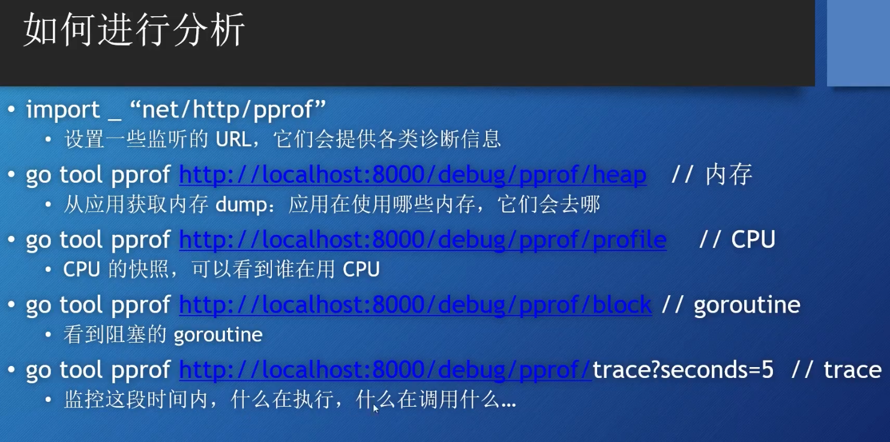

- 如何处理(handle) Web 请求
  - http.Handle函数
  - http.HandleFunc函数


- 创建Web Server
  - http.ListenAndServer()
    - 第一个参数:网络地址.如果为"",那么就是":80"
    - 第二个参数:handler,如果为nil,那么就是DefaultServeMux.


- http.Server是一个struct
  - Addr字段:表示网络地址
  - Handler字段:如果为nil,那么就是DefaultServeMux
  - ListenAndServe()函数


```go
func main() {
server := http.Server{
Addr: ":8080",
}

	log.Println(server.ListenAndServe())
}
```

- Https
  - http.ListenAndSeverTLS()
  - server.ListenAndServerTLS()


- http.Handler 是一个接口.
  - Handler定义了一个方法ServeHTTP(ResponseWriter, *Request).
  - 任何类型只要实现了Handler接口,那么它就是一个Handler.


- DefaultServeMux 是一个multiplexer(多路复用器,可以看做是路由器),它也是一个Handler.


- 多个Handler

- 方式一:
  - 不指定Server struct 里面的Handler字段值.
  - 可以使用http.Handle()将某个handler附加到(注册到)DefaultServeMux.
    - http包有一个Handle函数.
    - ServerMux struct 也有一个Handle方法.
  - 如果调用http.Handle(),实际上调用的是DefaultServeMux上的Handle方法.
    - DefaultServeMux是 ServerMux 的一个指针变量.
- 方式二: 
  - http.HandlerFunc 是一个函数类型,它的声明如下:
```go
// The HandlerFunc type is an adapter to allow the use of
// ordinary functions as HTTP handlers. If f is a function
// with the appropriate signature, HandlerFunc(f) is a
// Handler that calls f.
type HandlerFunc func(ResponseWriter, *Request)

// ServeHTTP calls f(w, r).
func (f HandlerFunc) ServeHTTP(w ResponseWriter, r *Request) {
    f(w, r)
}
 ```
  - http.HandlerFunc 类型是一个适配器,可以让(函数签名与ServeHTTP签名一样)的哪些函数直接作为HTTP handler.
  - 原理:
```go
func myHandlerFunc(w ResponseWriter, r *Request) {}

http.HandleFunc("/",myHandlerFunc)

// http.HandleFunc 函数内部调用DefaultServeMux.HandleFunc().
// DefaultServeMux.HandleFunc 方法内部,将myHandlerFunc函数转换为,http.HanderFunc类型
// http.HandlerFunc 类型实现了http.handler接口.
// DefaultServeMux.HandleFunc 方法最后还是调用了,DefaultServeMux.Handle方法.
```


## go标准库的五个内置的handler

- http.NotFoundHandler()
```go
// NotFound replies to the request with an HTTP 404 not found error.
func NotFound(w ResponseWriter, r *Request) { Error(w, "404 page not found", StatusNotFound) }

// NotFoundHandler returns a simple request handler
// that replies to each request with a “404 page not found” reply.
func NotFoundHandler() Handler { return HandlerFunc(NotFound) }
```
- http.RedirectHandler()
  - 它把每个请求使用给定的状态码跳转到指定的URL.
```go
func RedirectHandler(url string, code int) Handler {
	return &redirectHandler{url, code}
}
```
- http.StripPrefix()
  - 它从请求URL中去掉指定的前缀,然后在调用传进来的那个Handler.
  - 如果请求的URL与提供的前缀不符,那么会返回http.NotFoundHandler()
  - 略像中间件,它修饰了另一个handler.
```go
func StripPrefix(prefix string, h Handler) Handler {
    if prefix == "" {
        return h
    }
    return HandlerFunc(func(w ResponseWriter, r *Request) {
        p := strings.TrimPrefix(r.URL.Path, prefix)
        rp := strings.TrimPrefix(r.URL.RawPath, prefix)
        if len(p) < len(r.URL.Path) && (r.URL.RawPath == "" || len(rp) < len(r.URL.RawPath)) {
            r2 := new(Request)
            *r2 = *r
            r2.URL = new(url.URL)
            *r2.URL = *r.URL
            r2.URL.Path = p
            r2.URL.RawPath = rp
            h.ServeHTTP(w, r2)
        } else {
            NotFound(w, r)
        }
    })
}
```
- http.TimeoutHandler()
  - 它用来在指定时间内运行传入的handler.也相当于是一个修饰器
  - dt: 传入handler允许的处理时间.
  - msg: 如果超时,那么就把msg返回给请求.
```go
func TimeoutHandler(h Handler, dt time.Duration, msg string) Handler {
	return &timeoutHandler{
		handler: h,
		body:    msg,
		dt:      dt,
	}
}
```
- FileServer
  - 返回一个handler,使用基于root的文件系统啦响应请求.
```go
// FileServer returns a handler that serves HTTP requests
// with the contents of the file system rooted at root.
//
// As a special case, the returned file server redirects any request
// ending in "/index.gohtml" to the same path, without the final
// "index.gohtml".
//
// To use the operating system's file system implementation,
// use http.Dir:
//
//	http.Handle("/", http.FileServer(http.Dir("/tmp")))
//
// To use an fs.FS implementation, use http.FS to convert it:
//
//	http.Handle("/", http.FileServer(http.FS(fsys)))
func FileServer(root FileSystem) Handler {
	return &fileHandler{root}
}

type FileSystem interface {
    Open(name string) (File, error)
}
```
  - 使用时需要用到操作系统的文件系统,所以可以委托给:
    - `type Dir string`,它实现了FileSystem接口.
  - 示例代码: `demo2/main.go`


## HTTP消息

- `net/http` 包提供了用于表示HTTP消息的结构.

### 请求(Request)

- Request(是个struct),代表了客户端发送的http请求消息.
  - 重要的字段:
    - URL:代表了请求行(请求信息第一行)里面的部分内容.
      - 它是指向url.URL类型的一个指针,url.URL是一个struct.
    - Header
    - Body
    - Form,PostForm,MultipartForm
- 也可以通过Request的方法 访问请求中的Cookie,URL,User Agent等等消息.
- Request类型代表一个服务端接收到的或者客户端发送出去的HTTP请求.
- Request各字段的意义和用途在服务端和客户端是不同的.


- url.URL
```go
// A URL represents a parsed URL (technically, a URI reference).
//
// The general form represented is:
//
//	[scheme:][//[userinfo@]host][/]path[?query][#fragment]
//
// URLs that do not start with a slash after the scheme are interpreted as:
//
//	scheme:opaque[?query][#fragment]
//
// Note that the Path field is stored in decoded form: /%47%6f%2f becomes /Go/.
// A consequence is that it is impossible to tell which slashes in the Path were
// slashes in the raw URL and which were %2f. This distinction is rarely important,
// but when it is, the code should use RawPath, an optional field which only gets
// set if the default encoding is different from Path.
//
// URL's String method uses the EscapedPath method to obtain the path. See the
// EscapedPath method for more details.
type URL struct {
	Scheme      string
	Opaque      string    // encoded opaque data
	User        *Userinfo // username and password information
	Host        string    // host or host:port
	Path        string    // path (relative paths may omit leading slash)
	RawPath     string    // encoded path hint (see EscapedPath method)
	OmitHost    bool      // do not emit empty host (authority)
	ForceQuery  bool      // append a query ('?') even if RawQuery is empty
	RawQuery    string    // encoded query values, without '?'
	Fragment    string    // fragment for references, without '#'
	RawFragment string    // encoded fragment hint (see EscapedFragment method)
}
```

- URL Query
  - RawQuery会提供实际查询的字符串.
    - 例如:`http://www.example.com/post?id=123&thread_id=456`
      - 它的RawQuery的值就是 `id=123&thread_id=456`
  - 还有一个简便方法可以得到key-value对:`通过Request的Form字段`.


- 查询参数 (Query Parameters)
  - r.URL.Query(),会提供查询字符串对应的map[string][]string
```go
r := &http.Request{}
url := r.URL
query := url.Query() // url.Values,底层 map[string][]string
id := query["id"] // []string{"123"}
tId := query.Get("thread_id") // "456" 返回key对应的第一个值.
```


- URL Fragment
  - 例如: `http://www.example.com/post?id=123&thread_id=456#print`
    - 它的fragment就是#后面的部分.
  - 如果从浏览器发出的请求,那么你无法提取出Fragment字段的值.
    - 浏览器在发送请求时会把fragment部分去掉.
  - 但不是所有的请求都是从浏览器发出的(例如从HTTP客户端包),它的发出的请求可能不会把fragment部分去掉.

- Request Header
  - 请求和响应(request,response)的headers是通过Header类型来描述的,Header的底层是map类型,用来表述HTTP Header里的Key-value对.
  - Header map 的key是string类型,value是[]string类型.
  - 设置key时会创建一个空的[]string作为value,value里面第一个元素就是新header的值.
  - 为指定key添加一个新的header值,执行append操作即可.
  - r.Header 返回 一个map
  - r.Header["Accept-Encoding"] 返回一个[]string: [gzip,deflate]
  - r.Header.Get("Accept-Encoding) 返回一个string: "gzip,deflate"


- Request Body
  - 请求和响应的Bodies都是使用`Body字段`来表示的.
  - `Body字段`是一个`io.ReadCloser接口`
    - `io.ReadCloser`是一个由`io.Reader`和`io.Closer`接口组成.
      - `io.Reader`接口定义了一个`Read`方法: `Read(p []byte) (n int, err error)`
      - `io.Closer`接口定义了一个`Close`方法: `Close() error`
  - 想要读取请求Body的内容,可以调用Body的Read方法.


### 如何处理表单类的数据


- Request的 Form字段
  - Request上的函数允许我们从URL或Body(和Body)中提取数据,通过这些字段:
    - Form
    - PostForm
    - MultipartForm
  - Form的类型是url.Values,其实就是map[string][]string
    - 通过的做法是:
      - 先调用ParseForm或ParseMultipartForm来解析Request.
      - 然后相应的访问Form,PostForm或MultipartForm字段.
        - r.Form["first_name"]
        - r.Form.Get("first_name")

- PostForm字段
  - 如果表单和URL例有同样的key,那么它们都会放在一个slice里:表单的值靠前,URL的值靠后.
  - 如果只想要表单的key-value对,不要url的,可以使用PostForm字段.
  - PostForm字段的类型也是url.Values.
  - Form和PostForm字段只支持表单的enctype的值为"application/x-www-form-urlencoded"的请求.
    - 不支持表单的enctype的值为"multipart/form-data"的请求.
  
  
- 想要得到multipart key-value对,必须使用`MultipartForm字段`.
  - 想要使用MultipartForm字段,首先需要调用ParseMultipartForm这个方法.
    - 该方法会在不要时调用ParseForm方法.
    - 参数是需要读取数据的长度(字节数). 
  - MultipartForm字段只包含表单的key-value对.
  - 返回类型是一个`*multipart.Form` struct而不是map.
```go
type Form struct {
    Value map[string][]string
    File  map[string][]*FileHeader
}
```
- `*multipart.Form`中有两个map:
  - 第一个map: key是string,value是[]string.
  - 第二个map: key是string,value是[]*FileHeader,一个`FileHeader`代表一个文件.
    - 用来上传文件.


- FormValue 和PostFormValue方法
  - FormValue方法会返回Form字段中指定key对应的第一个value.
    - 无需调用ParseForm或ParseMultipartForm.
  - PostFormValue方法也一样,但只能读取PostForm字段
  - FormValue和PostFormValue都会调用ParseMultipartForm方法.
  - 但如果表单的enctype设为multipart/form-data,那么即使你调用ParseMultipartForm方法,也无法通过FormValue获得想要的值.


- Forms - 通过r.MultipartReader() 读取Form的值.
  - 如果是multipart/form-data或multipart混合的POST请求:
    - MultipartReader返回一个MIME multipart reader
    - 否则返回nil和一个错误.
  - **可以使用该函数代替ParseMultipartForm来把请求的body作为Stream进行处理.**
    - 之前的方式都是把表单作为一个对象来处理的.该函数不是把表单作为一个对象来处理的,不是一次性获得整个map.
    - 它是逐个检查来自表单的值,然后每次处理一个.
```go
// MultipartReader returns a MIME multipart reader if this is a
// multipart/form-data or a multipart/mixed POST request, else returns nil and an error.
// Use this function instead of ParseMultipartForm to
// process the request body as a stream.
func (r *Request) MultipartReader() (*multipart.Reader, error) 
```

### 上传文件

- multipart/form-data 最常见的应用场景就是上传文件.
- 代码案例:`demo3/main.go  `

- FormFile()方法: 返回指定key对应的第一个value.
  - 无需调用ParseMultipartForm方法.
  - 通过返回File和FileHeader,以及错误信息.
  - 如果只上传一个文件,那么这种方式会快一些.
```go
// FormFile returns the first file for the provided form key.
// FormFile calls ParseMultipartForm and ParseForm if necessary.
func (r *Request) FormFile(key string) (multipart.File, *multipart.FileHeader, error)
```


### POST请求-JSON Body


## ResponseWriter

- 从服务器向客户端返回响应需要使用ResponseWriter.
- ResponseWriter是一个接口,handler用它来返回响应.
- 真正支撑ResponseWriter的幕后struct是一个非导出的`http.response`.
- ResponseWriter接口的Write方法接收一个byte切片作为参数,然后把它写入到HTTP响应的Body里面.
- 如果在Write方法被调用时,header里面没有设定Content-Type,那么数据的前512个字节就会被用来检测Content-Type.
- WriterHeader方法接收一个整数类型(HTTP状态码)作为参数,并把它作为HTTP响应的状态码返回.
  - 如果该方法没有显式调用,那么在第一次调用Write方法前,会隐式的调用WriteHeader(http.StatusOK)
  - 所有WriteHeader主要用来发送错误类的HTTP状态码.
- 调用完WriterHeader方法之后,然后可以写入到ResponseWriter,**但无法再修改header了**.
- Header方法返回headers的map,可以进行修改(Set),增加(Add),删除(Del),查询(Get).
  - 修改后的headers将会体现在返回给客户端的HTTP响应里.

### 内置的Response

- NotFound函数:包装一个404状态码和一个错误信息.
- ServeFile函数:从文件系统提供文件,返回给请求者.
- ServeContent函数: 它可以把实现了io.ReadSeeker接口的任意类型中的内容返回个请求者.
  - 还可以出来Range请求(范围请求),如果只请求了资源的一部分内容,那么ServeContent就可以如此响应.而ServeFile或io.Copy则不行.
- Redirect函数:告诉客户端重定向到另一个URL


## 模版与模版引擎


- 案例一:`demo4/main.go`


> 解析模版
- template.ParseFiles()函数
  - 先把模版文件中的内容,读成字符串,
  - 然后再使用模版的文件名,不包含路径,来创建一个新的模版
  - 然后再调用模版Template上的Parse方法来解析模版中的字符串.
```go
// t, err := template.ParseFiles("tmpl.gohtml")

// 这段代码和上面的效果是一样的.
t := template.New("tmpl.gohtml")
t, _ := t.ParseFiles("tmpl.gohtml")  
```


- template.ParseGlob()函数:使用模式匹配来解析特定的文件.
  - `template.ParseGlob("*.html")`
  - 将当前目录下面所有的.html文件都进行解析.
    - 它的模版名是:所找到的文件中,第一个文件的文件名


- t.Parse()方法:可以解析字符串模版,其他方法最终都会调用t.Parse().


> 其他函数

- Lookup方法: 通过模版名来寻找模版,如果没找到就返回nil.
```go
// Lookup returns the template with the given name that is associated with t.
// It returns nil if there is no such template or the template has no definition.
func (t *Template) Lookup(name string) *Template {
    if t.common == nil {
        return nil
    }
    t.muTmpl.RLock()
    defer t.muTmpl.RUnlock()
    return t.tmpl[name]
}
```


- Must函数: 可以包裹一个返回模版的指针和错误的函数
  - 如果错误不为nil,那么panic.
```go
// Must is a helper that wraps a call to a function returning (*Template, error)
// and panics if the error is non-nil. It is intended for use in variable
// initializations such as
//
//	var t = template.Must(template.New("name").Parse("text"))
func Must(t *Template, err error) *Template {
  if err != nil {
    panic(err)
  }
  return t
}
```

<br>

> 执行模版


<br>

> Demo 模版解析与执行. demo5/main.go

<br>

> 模版-Action


<br>

> 函数与管道


<br>

> 模版 - 模版组合


- 代码案例: `demo6/main.go`


- 代码案例: `demo6/main.go`

> 逻辑运算符


## 路由


## JSON 与GO struct


## 中间件


- 示例代码: `demo7`


## 请求上下文

- 示例代码: `demo7`


## https


- 示例代码: `demo8`

## http/2


## 对go web 应用进行测试


## Profiling 性能分析



