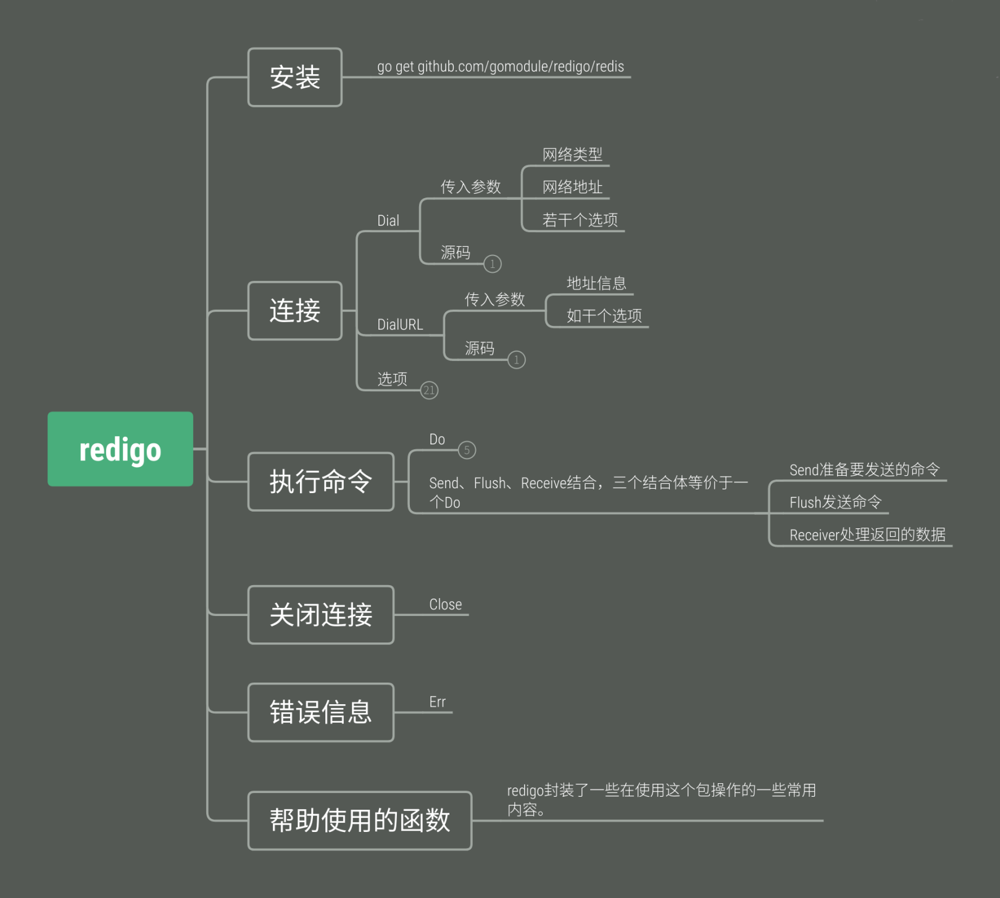

# go 操作redis

## redigo库

- 基本特点：
    - 简单的API调用，并支持所有的redis命令。
    - 支持管道、事务、订阅以及连接池。

项目首页：https://github.com/garyburd/redigo/

官方文档：https://godoc.org/github.com/garyburd/redigo/redis

安装：`go get github.com/garyburd/redigo/redis`

### 基本使用方法

- 连接和关闭

使用Dail方法来连接服务：
```go
func Dial(network, address string, options ...DialOption) (Conn, error) {}
```
`network`表示网络类型，`address`是服务地址，`options`是一些可选的选项，如果连接成功将返回一个`redis.Conn`对象，在连接使用完毕后，使用`Close()`关闭。

```go
coon, err := redis.Dial("tcp", ":6379")
if err != nil{
    log.Error(err)
    return
}
defer coon.Close()
```
<br>

- 执行命令

执行redis命令使用Do()方法：
```go
Do(commandName string, args ...interface{}) (reply interface{}, err error)
```
`commandName`是redis命令，后面接参数，例如执行一个`SET`命令：

```go
rs, err := gCoon.Do("SET", "xxx", "hello")
if err != nil{
    log.Error(err)
    return
}
log.Debug(rs)
```
要注意的是不能使用类似`Do("SET", "xxx hello")`的命令，因为系统会把这个命令解析成`set`一个名为`xxx hello`的键，它的值为空。

运行后将返回一个`reply`对象和错误标志`err`，如果`err != nil`则reply中保存redis服务的响应。reply是一个接口对象，根据命令的不同返回的形式也不同，它将会根据值的类型做如下转换：

```text
Redis type              Go type
error                   redis.Error  //错误类型
integer                 int64  // 整形
simple string           string  //简单的字符串将会转成string类型，如OK等
bulk string             []byte or nil if value not present.  //[]byte，一般是数据返回
array                   []interface{} or nil if value not present.  // 数组
```
在获取到返回值后可以使用断言来转换数据类型，或者使用库中自带的`Reply Helpers`进行转换。

<br>

- Reply Helpers

`Reply Helpers`是库里提供的类型转换功能，可以把`replay`从`interface{}`转换成我们想要的类型，包里提供了很多类型转换函数，如：
```go
func Strings(reply interface{}, err error) ([]string, error)
```
可以把Do函数返回的数据类型转换成[]string类型，相同的函数还有Float64，Int64等等。
```go
rs, err := redis.Strings(gCoon.Do("keys", "*"))
if err != nil{
    log.Error(err)
    return
}
log.Debug(rs)
```
<br>

- 管道

管道的使用方法设计到三个函数：
```go
c.Send()
c.Flush()
c.Receive()
```

`send()`方法把命令写到输出缓冲区，`Flush()`把缓冲区的命令刷新到redis服务器，`Receive()`函数接收redis给予的响应，三个操作共同完成一套命令流程：
```go
c.Send("SET", "foo", "bar")
c.Send("GET", "foo")
c.Flush()
c.Receive() // reply from SET
v, err = c.Receive() // reply from GET
```
合并这三个操作就成了Do()函数，官方对Do()的描述为：

```
The Do method combines the functionality of the Send, Flush and Receive methods. The Do method starts by writing the command and flushing the output buffer. Next, the Do method receives all pending replies including the reply for the command just sent by Do. If any of the received replies is an error, then Do returns the error. If there are no errors, then Do returns the last reply. If the command argument to the Do method is "", then the Do method will flush the output buffer and receive pending replies without sending a command.
```

<br>

- 操作示例

```go
package main
 
import (
    "github.com/garyburd/redigo/redis"
    "fmt"
)
 
var gCoon redis.Conn
 
func main(){
    var err error
    //连接redis
    gCoon, err = redis.Dial("tcp", ":6379")
    if err != nil{
        fmt.Println(err)  
        return
    }
    defer gCoon.Close()
    SetAndGet()
    Keys()
}
 
func Keys(){
    //使用Reply Helper转换类型
    rs, err := redis.Strings(gCoon.Do("keys", "*"))
    if err != nil{
        fmt.Println(err)  // [xxx]
        return
    }
    fmt.Println(rs)
}
 
 
func SetAndGet(){
    //设置键值
    rs, err := gCoon.Do("SET", "xxx", "hello")
    if err != nil{
        fmt.Println(err)
        return
    }
    fmt.Println(rs)  // OK
 
    //获取键值
    rs, err = gCoon.Do("GET", "xxx")
    if err != nil{
        fmt.Println(err)
        return
    }
    fmt.Println(rs)  //[104 101 108 108 111] 获取到的是[]byte类型
}
```

<br>

- 并发问题

`redigo`官方的文档描述中，`Receive()`方法是`不支持多并发`的，原文为：
```
Connections support one concurrent caller to the Receive method and one concurrent caller to the Send and Flush methods. No other concurrency is supported including concurrent calls to the Do method.
```

而`Do()`方法是间接调用了`Receive()`方法，所以`Do()`方法也是`不支持多并发`的。我们可以用一段代码来验证这一点：
```go
func incr(i int) {
    fmt.Println("Start thread", i)
    err := gCoon.Send("incrby", "nKey", fmt.Sprintf("%d", i))
    checkErr(err)
 
    err = gCoon.Flush()
    checkErr(err)
 
    time.Sleep(time.Second * time.Duration(i))
 
    rs, err := redis.Int(gCoon.Receive())
    checkErr(err)
 
    fmt.Printf("Thread %d Incr success, result is %d", i, rs)
}
```

这里是一个函数，完成了一个简单的`INCRBY`命令，实现`nKey + i`功能，和正常情况不同的是在`Send()`和`Flush()`后不会立刻使用`Receive()`来获取结果，而是让线程休眠一段时间再来获取。

主函数中开启两个gorutine运行这段代码：
```go
go incr(5)
go incr(1)
```
运行结果：
```go
Start thread 5
Start thread 1
Thread 1 Incr success, result is 5
Thread 5 Incr success, result is 6
```
可以看到，`线程5`先运行，然后`线程1`运行，由于`线程1`休眠时间短，所以它会先读取输入缓冲区的返回数据，按照预期，`线程1`读到的结果应该是`1`，因为它只是执行了`incr nKey 1`。而实际上，它读到的却是`线程5`的结果。

从这里我们可以很明显看出这一过程是线程不安全的，即它是不支持多并发的。那么如果要实现并发应该怎么做呢，官方也提出了解决方法，使用`线程安全的连接池来`解决这个问题：
```
For full concurrent access to Redis, use the thread-safe Pool to get, use and release a connection from within a goroutine. Connections returned from a Pool have the concurrency restrictions described in the previous paragraph.
```
<br>

- 连接池

`redigo中`的线程池是一个结构体：
```go
type Pool struct {
    Dial func() (Conn, error) // 连接redis的函数
    TestOnBorrow func(c Conn, t time.Time) error  // 测试空闲线程是否正常运行的函数
    MaxIdle int  //最大的空闲连接数，可以看作是最大连接数
    MaxActive int  //最大的活跃连接数，默认为0不限制
    IdleTimeout time.Duration  //连接超时时间，默认为0表示不做超时限制
    Wait bool  //当连接超出数量先之后，是否等待到空闲连接释放
}
```

一个连接池创建的示例为：

```go
func newPool(addr string) *redis.Pool {
  return &redis.Pool{
    MaxIdle: 3,
    IdleTimeout: 240 * time.Second,
    Dial: func () (redis.Conn, error) { return redis.Dial("tcp", addr) },
  }
}
 
var (
  pool *redis.Pool
  redisServer = flag.String("redisServer", ":6379", "")
)
 
func main() {
  flag.Parse()
  pool = newPool(*redisServer)
  ...
}
```

当连接池创建完毕之后，如果需要使用连接时调用`pool.Get()`方法即可获得一个可用的连接，此时再执行`Do()等`方法时就不会被其他并发干扰，要注意的是每获取到一个可用的连接并且在使用完之后，一定要通过`conn.Close()`来主动释放连接，以方便下一个应用调用，不然该连接将会一直被占用。


一个完整的示例代码：

```go
package main
 
import (
    "github.com/garyburd/redigo/redis"
    "fmt"
)
 
//连接池的连接到服务的函数
func newPoolFunc()(redis.Conn, error){
    return redis.Dial("tcp", ":6379")
}
 
//生成一个连接池对象
func newPool()(* redis.Pool){
    return &redis.Pool{
        MaxIdle: 10,
        Dial: newPoolFunc,
        Wait: true,
    }
}
 
//错误检测
func checkErr(err error){
    if err != nil{
        panic(err)
    }
}
 
func main(){
    pool := newPool()
    conn := pool.Get()
    defer conn.Close()
 
    rs, err := redis.Strings(conn.Do("KEYS", "*"))
    checkErr(err)
 
    fmt.Println(rs)  // [nKey]
    fmt.Println(pool.ActiveCount())  // 1
 
    conn.Close()
}
```




<br>

## go-redis库: Redis client for Go

> 使用以下命令下安装 go-redis 库。

If you are using Redis 6, install go-redis/v8:
```
go get github.com/go-redis/redis/v8
```

If you are using Redis 7, install go-redis/v9:
```
go get github.com/go-redis/redis/v9
```

https://www.liwenzhou.com/posts/Go/redis/

<br>

## 2种Go Redis客户端使用对比

go-redis和redigo底层是通过调用的万能 Do 方法实现, 但是

redigo:
- 由于输入是万能类型所以必须记住每个命令的参数和返回值情况, 使用起来非常的不友好，
- 参数类型是万能类型导致在编译阶段无法检查参数类型,
- 每个命令都需要花时间记录使用方法，参数个数等，使用成本高；

go-redis:

- 细化了redis每个命令的功能, 我们只需记住命令，具体的用法直接查看接口的申请就可以了，使用成本低；
- 其次它对数据类型按照redis底层的类型进行统一，编译时就可以帮助检查参数类型
- 并且它的响应统一采用 Result 的接口返回，确保了返回参数类型的正确性，对用户更加友好；

